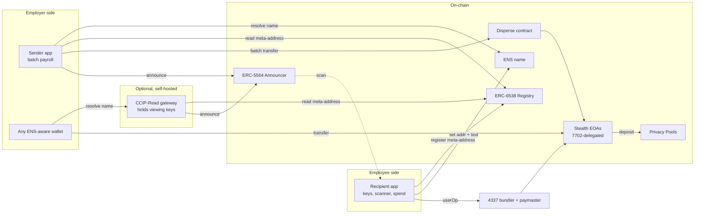
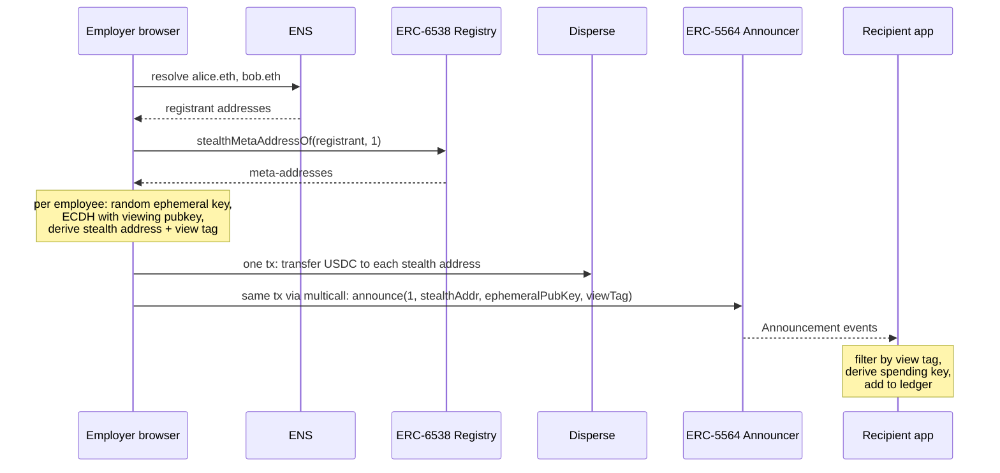
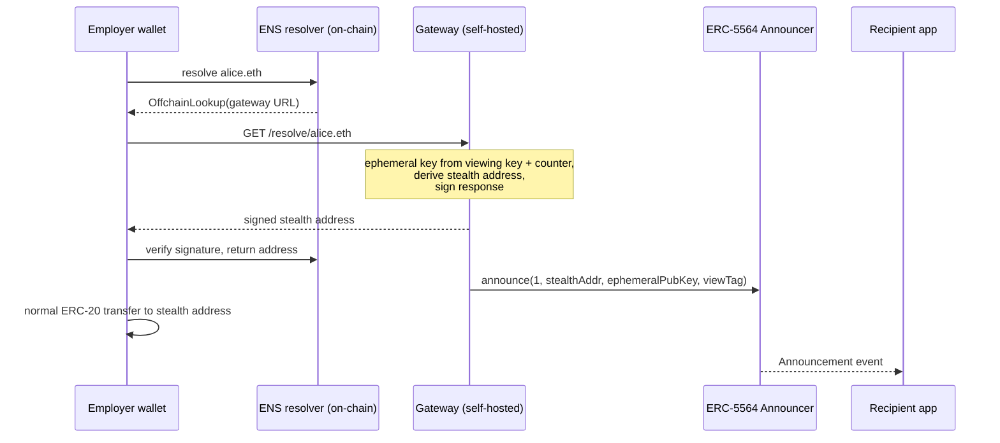
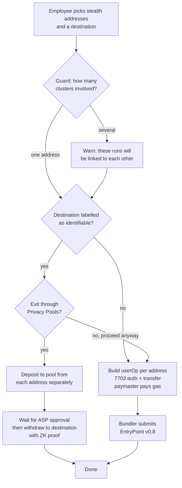

# Soapay PRD

Sep 25, 2026 · Eason Chai

**Soapay: one name, infinite addresses. Get paid on-chain without publishing your bank statement.**

Receiving money on a public chain publishes everything you have ever received. Soapay gives every recipient a static name that lands each payment on a fresh address only they can open, spendable without linking, with a compliant exit when funds must reach somewhere identifiable. First wedge: recurring group payments on Base. Business model is out of scope for this document.

## Problem and positioning

Every address on Ethereum is a public bank statement. The moment someone pays you they can read everything you have ever received, and so can anyone watching them. The leak is worst in group payments, where one batch transaction lists every recipient and every amount side by side: salaries, dividends, contributor payouts, grant rounds.

Demand is validated. Coinbase launched [Base Ledgers](https://www.base.org/ledgers) in June 2026 so enterprises can run payroll and vendor payments without publishing amounts. It is an enterprise product: a permissioned sovereign ledger behind a Portal contract, operated by the institution, with recipients inside its walls. It does nothing for an individual who wants privacy from the people paying alongside them, or for a small team that will never run a ledger.

ERC-5564 and ERC-6538 solve the address half of this for anyone, but no shipped product combines the pieces a real payment flow needs:

| Product | Sender-side derivation | ENS name | Batch payouts | Gas without linking | Consolidation guard | Shielded exit | Open to individuals |
| --- | --- | --- | --- | --- | --- | --- | --- |
| [Fluidkey](https://docs.fluidkey.com/readme/frequently-asked-questions/) | No, gateway only | Yes | No | Yes, Safe + sponsor | No | No | Yes |
| [Umbra v1](https://scopelift.co/blog/progress-update-stealth-address-ercs) | Yes | Yes | In development since 2024 | Relayer withdraw only | No | No | Yes |
| [Kohaku SDK](https://thedefiant.io/news/blockchains/ethereum-foundation-kohaku-sdk-privacy-wallet-integration-bb4t52) | Roadmap | No | No | 4337 relay | No | Yes | Wallet-embedded |
| [Base Ledgers](https://www.base.org/ledgers) | n/a, private ledger | No | Yes | n/a | n/a | Portal contract | No, enterprise only |

Soapay is the missing combination: one recipient app, one sender app, an SDK underneath both, and a gateway that can be self-hosted or hosted by us, all on the finalized ERCs and open to anyone with a wallet.

## Goals and non-goals

Goals for v1:

1. A recipient shares one static identifier, an ENS name, and never touches it again.
2. Every incoming payment lands on a fresh stealth address that no third party can link to the recipient or to earlier payments.
3. The recipient spends from those addresses without funding them from a known wallet.
4. Derivation mode is the sender's choice: client-side in our sender app, or through a gateway that the recipient self-hosts or that we host.
5. The recipient app warns before an action would link addresses to an identifiable destination, and offers a compliant shielded exit.
6. Group payments work first: one sender, many recipients, one transaction, repeated on a schedule.
7. Everything the apps do is reachable through an SDK, so wallets and later agents can embed it.

Non-goals for v1:

- Hiding amounts inside a batch beyond denominated payouts. Full amount privacy is the v2 shielded rail.
- Hiding the sender's wallet or the fact that a payment happened.
- Privacy against the sender. They know what they paid and to which stealth address.
- Fiat on/off ramps, tax reporting, streaming payments.
- Agent-to-agent payments. On the roadmap as the MCP server and SDK milestone, not in v1.
- Business model, pricing, and go-to-market.

## Use cases and wedge

Group payments go first because the batch itself is the anonymity set and the sender is one party we can equip. Everything else rides the same rail later.

| Tier | Use case | Why it fits | Caveat |
| --- | --- | --- | --- |
| 1, v1 wedge | Salaries and contractor payouts | Repeat sender, monthly batch, clear pain | Amounts visible; denominated payouts |
| 1, v1 wedge | DAO contributor and grant payouts | Same shape, larger batches, senders already use multisend tools | Multisig senders need the sender app to produce Safe transactions |
| 2, after M3 | Dividends and revenue share | Very large batches, strongest anonymity set | Distribution contracts must resolve names per run |
| 2, after M3 | Invoices and freelancers | Client pays once by name, no tooling change with gateway mode | Anonymity set of one; privacy comes only from the fresh address |
| 3, roadmap | Friends, tips, donations | Best story, simplest onboarding | Fluidkey's home turf; amounts fully visible |
| 3, roadmap | Agent-to-agent payments | Pay-by-name fits agents; identity via ERC-8004 | Needs the SDK and an MCP server; no UI |

The sender app is built for tier 1. Tier 2 arrives with the hosted gateway, because those senders will not install anything. Tier 3 needs no new protocol work, only distribution.

## Users and threat model

Four roles, one of which may be us.

| Role | What they hold | What they do |
| --- | --- | --- |
| Recipient | Spending key, viewing key, ENS name | Registers keys once, scans for payments, spends |
| Sender | Payment wallet, list of names and amounts | Runs a batch each period, or pays one name from any wallet |
| Self-hosted gateway operator | Their own viewing key, CCIP-Read signer key | Resolves their own name to fresh addresses for wallets that cannot derive |
| Hosted gateway operator (us) | Viewing keys of opted-in recipients, one signer key in KMS | Same as above, multi-tenant, for recipients who will not run a server |

Who must not learn what:

| Observer | Must not learn | Achieved by |
| --- | --- | --- |
| Co-recipient reading the batch | Which line is mine, my other addresses, my balance | Fresh stealth address per payment, no on-chain link between payments |
| Chain analyst | Link between payments, link to my main wallet | Paymaster gas, consolidation guard, shielded exit |
| Self-hosted gateway | Nothing beyond the viewing key it already holds | Signer cannot spend; runs on the recipient's own box |
| Hosted gateway (us) | Anything beyond incoming payment metadata | Signer cannot spend; recipient app audits every resolved address against its own derivation counter; one-click migration to self-host or client-side |
| Sender | My main wallet, my balance, what others pay me | Meta-address is public keys, not an address |

The hosted gateway has the same trust profile as Fluidkey and we say so plainly in the product. What differs is the exit: the recipient can leave at any time by re-pointing their resolver, and every address it ever issued is replayable from the seed without us.

Out of scope: a co-recipient inferring my line from the amount alone in a small batch. See Amount privacy.

## System architecture

Three apps sit on top of two canonical singleton contracts, ENS, a 4337 bundler with paymaster, and an optional shielded pool. Nothing custom holds funds.

The sender app and the gateway do the same derivation; the only difference is who holds the ephemeral key at the moment of resolution. In client-side mode no gateway is involved. In gateway mode the recipient chooses between running the image themselves and our hosted service. v1 targets Base for every component except the Privacy Pools exit, which runs on Ethereum mainnet.

## Components

Five components, three of them apps. Contracts are the canonical deployments, never forks.

| Component | Runs where | Owns | Built from |
| --- | --- | --- | --- |
| Recipient app | Employee's browser or desktop | Spending key, viewing key, address ledger, cluster graph | [@scopelift/stealth-address-sdk](https://github.com/ScopeLift/stealth-address-sdk), viem, a 7702-capable smart account client |
| Sender app | Employer's browser | Payroll list, per-run ephemeral keys (discarded after announce) | Same SDK, viem, disperse contract ABI |
| Gateway (optional) | Self-hosted docker image, or our hosted multi-tenant service | Viewing keys of enrolled employees, CCIP-Read signer key, derivation counter | EIP-3668 gateway pattern as in Fluidkey's open resolver |
| Scanner | Inside the recipient app, or a headless worker | Nothing secret beyond the viewing key | Announcement event log reader with view-tag filter |
| Contracts | Ethereum, Base, Arbitrum, Optimism, Polygon, Gnosis, Scroll | Nothing, stateless | [ERC5564Announcer and ERC6538Registry](https://github.com/ScopeLift/stealth-address-erc-contracts), canonical addresses `0x5564...5564` and `0x6538...6538` on every listed chain |

The disperse contract is any existing multisend. The 7702 delegate is an existing audited 4337 account implementation that supports EntryPoint v0.8's 7702 path; no account contract is written for this product.

The registrant address in ERC-6538 is a throwaway key created during onboarding. It is the one address the ENS name points to and it must never be the employee's main wallet.

## Flow 1: onboarding and key registration

One-time, about five minutes, and the employee's main wallet never signs anything public.

1. Recipient app derives a spending keypair and a viewing keypair from a single seed the employee backs up. Meta-address = `st:eth:0x` + compressed spending pubkey + compressed viewing pubkey (scheme id 1).
2. App creates a throwaway registrant EOA. This is the only address that will ever be tied to the ENS name.
3. App calls `registerKeysOnBehalf` on ERC-6538 with the registrant's EIP-712 signature, gas paid by the app's paymaster, so the registrant needs no ETH and no funding link.
4. App sets the ENS `addr` record to the registrant, and the `stealth` text record to the meta-address, on a name the employee owns or a subname the platform issues.
5. If the employee enables gateway mode, the app uploads the viewing private key to the chosen gateway and points the name's resolver at the gateway's CCIP-Read resolver. Client-side mode skips this step.
6. Employee sends the employer one string: the ENS name.

Key handling rules:

- The spending private key never leaves the client. It signs 7702 authorizations and userOps locally.
- The viewing private key lives on the client and, in gateway mode only, on the gateway.
- Both are recoverable from the seed, so the platform can disappear and the employee can still find and spend every payment with the open-source SDK.

## Flow 2: pay run, client-side derivation

The employer opens the sender app, pastes names and amounts, and signs one transaction. Ephemeral keys are generated in the browser and discarded after the announcement.

Batch and announcements go in one multicall so a payment can never land without its announcement. The employer's tool must re-resolve every run; a cached address would repeat.

What the employer sees afterwards is the same list they would see with disperse.app, with stealth addresses in place of wallets. What colleagues see is a list of never-before-seen addresses and amounts.

## Flow 3: pay run, gateway derivation

For employers who will not leave their existing wallet, the name resolves through a self-hosted CCIP-Read gateway that does the derivation. Same contracts, same scanner, one extra trust assumption.

The gateway announces at resolution time, before the payment, so a resolved-but-unpaid address is an empty announcement and harmless. The gateway signer key is the one thing that can redirect a payment; it lives in the employee's or team's own infrastructure, never with the platform.

Derivation is deterministic from the viewing key and a counter, as in Fluidkey's scheme, so the recipient app can replay every address the gateway ever issued without the gateway.

Hosted service: we run the same image multi-tenant for recipients who will not operate a server. It holds their viewing key and signs with one KMS-backed key. This is Fluidkey's trust model and the product says so. Two things keep it honest: the recipient app recomputes every address the service issues and flags any it cannot reproduce, and leaving is one resolver change with no address lost.

## Flow 4: spending, consolidation guard, shielded exit

Each stealth address stays a plain EOA until first spend, then delegates to an audited 4337 account via EIP-7702 in the same userOp, with a paymaster paying gas in the token being sent. No ETH ever flows from a known wallet to a stealth address.

Guard rules the recipient app enforces locally:

- Every stealth address starts in its own cluster. Spending from several in one userOp or to one fresh destination merges their clusters.
- A destination is identifiable when the employee labels it (main wallet, exchange deposit) or when it already appears in a merged cluster that touched a labelled address.
- Merging clusters is allowed with a warning. Sending a cluster to an identifiable destination is blocked behind the Privacy Pools option, with an explicit override.

Privacy Pools by 0xbow runs on Ethereum mainnet and Gnosis with ETH and major stablecoins, gated by an association set provider that screens deposits ([0xbow getting started](https://0xbow.io/blog/getting-started-with-privacy-pools), [EthCC interview, May 2026](https://medium.com/@crypto.diva/ethcc9-interview-with-0xbow-privacy-pools-compliant-onchain-privacy-cfec581d39a9)). It is not on Base as of September 2026, so the v1 exit bridges each stealth address separately to a fresh mainnet address via CCTP, deposits from there, and withdraws with a relayer to the destination. The pool sees unlinked inputs; the withdrawal proves membership without revealing which deposit. Mainnet gas makes this a deliberate action, not a default.

## Amount privacy

Stealth addresses hide who received a line, not the number on it. In a small team the number alone identifies the person, so v1 ships denominated payouts and v2 adds a shielded rail.

Denominated payouts (v1): the sender app splits each salary into fixed chunks, for example 500 USDC, and derives a separate stealth address for every chunk. The batch then reads as N identical transfers to N unrelated addresses. A colleague learns the total payroll and the chunk size, not who got how many. The remainder chunk is the only distinctive line; the app rounds it to the nearest denomination and carries the difference to the next run. Cost is one extra transfer per chunk, negligible on an L2.

Shielded rail (v2): the employer deposits total payroll into a shielded pool once, then pays each employee inside the pool. Railgun supports batched private ERC-20 transfers today and the Kohaku SDK wraps it for wallets; Privacy Pools v2's multi-asset pool is the other candidate. This removes the amount leak entirely but requires the employer to hold a shielded balance, so it is opt-in.

| Option | Hides recipient | Hides amount | Employer change | Ships in |
| --- | --- | --- | --- | --- |
| Stealth batch | Yes | No | Use sender app or gateway | v1 |
| Denominated payouts | Yes | Mostly, chunk count hidden | Same, one toggle | v1 |
| Shielded rail | Yes | Yes | Hold a shielded balance | v2 |

## Data model

On-chain state is only what the ERCs already define. Everything else is local to the client, encrypted with the seed, and rebuildable from the chain plus the seed.

| Store | Where | Fields | Rebuildable from |
| --- | --- | --- | --- |
| Meta-address registration | ERC-6538 Registry | registrant, schemeId=1, stealthMetaAddress | Seed |
| Name records | ENS | addr=registrant, text `stealth`=meta-address, resolver (gateway mode) | Seed + name ownership |
| Announcements | ERC-5564 Announcer events | schemeId, stealthAddress, caller, ephemeralPubKey, metadata[0]=viewTag | Chain |
| Address ledger | Recipient client, encrypted | stealthAddress, ephemeralPubKey, derived spending key, token, amount, txHash, chainId, clusterId, delegated (bool) | Chain scan + seed |
| Cluster graph | Recipient client | clusterId, member addresses, labelled destinations touched | Ledger + local labels |
| Labels | Recipient client | address, label (main wallet, exchange, other), added date | User input only |
| Payroll list | Sender client, encrypted | ensName, amount, token, denomination toggle | Employer input only |
| Gateway state (gateway mode) | Gateway DB | ensName, viewing private key, counter, signer key | Employee re-upload |

Nothing custom is deployed on-chain in v1. The platform can shut down and every employee keeps access to every address using the seed and the public SDK.

## Product requirements

P0 is the v1 cut that lets one sender pay one group on Base and every recipient spend. P1 completes the four milestones. P2 is roadmap.

Recipient app:

| Requirement | Priority |
| --- | --- |
| Create spending and viewing keys from one seed; show backup once | P0 |
| Register meta-address on ERC-6538 via throwaway registrant, gasless | P0 |
| Issue or link an ENS name; write addr and stealth text record | P0 |
| Scan Announcer events by view tag; ledger of every payment with token, amount, tx | P0 |
| Spend from any stealth address: 7702 delegation + userOp + USDC paymaster in one action | P0 |
| Single-balance view that picks addresses to spend and shows which clusters merge | P1 |
| Labels and cluster graph; warning on merge; block behind exit on identifiable destination | P1 |
| Gateway audit: recompute every resolved address from viewing key + counter and flag mismatches | P1 |
| Privacy Pools exit: bridge each address to mainnet separately, deposit, withdraw with relayer | P2 |

Sender app:

| Requirement | Priority |
| --- | --- |
| Paste names and amounts; resolve every name on every run, never cached | P0 |
| Client-side derivation per recipient; ephemeral keys discarded after announce | P0 |
| One transaction: multisend transfers + announce for every recipient, atomic | P0 |
| Denominated payouts toggle with chunk size and carry-over of remainder | P1 |
| Safe transaction output for multisig senders | P1 |
| Saved recipient groups and scheduled runs | P2 |

Gateway:

| Requirement | Priority |
| --- | --- |
| CCIP-Read resolver contract + gateway that derives from viewing key and counter, signs response, announces before returning | P1 |
| Self-host distribution: one docker image, one config file, resolver deploy script | P1 |
| Hosted multi-tenant service: viewing keys encrypted at rest, signer in KMS, per-tenant counters | P1 |
| Migration: re-point resolver to self-host or drop gateway mode without losing any address | P1 |
| Compatibility check that tells a recipient whether a given sender wallet performs CCIP-Read | P2 |

SDK:

| Requirement | Priority |
| --- | --- |
| TypeScript package wrapping key derivation, registry, announce, scan, 7702 spend | P0 |
| Both apps and the gateway consume only the SDK; no private code paths | P0 |
| Cluster graph and guard as a pure library so wallets can embed it | P1 |
| MCP server exposing resolve, pay, scan, spend as tools for agents | P2 |
| ERC-8004 agent identity to meta-address binding | P2 |

## Non-functional requirements

Privacy invariants, each one a test in CI:

1. No stealth address is ever returned twice by any resolution path.
2. No transaction from a labelled address ever funds a stealth address.
3. Every payment has an announcement in the same transaction (sender app) or before the payment (gateway).
4. The recipient app rebuilds the full ledger from seed plus chain alone, with every gateway offline.
5. A gateway-issued address that the recipient app cannot reproduce from its own counter is flagged within one scan.

Security:

- Spending keys never leave the client; they sign 7702 authorizations and userOps locally.
- Hosted gateway: viewing keys encrypted at rest with per-tenant keys, signer key in KMS, signed responses carry an expiry, rate limiting per name.
- Only canonical ERC-5564 and ERC-6538 deployments, an audited 4337 account as the 7702 delegate, and an existing multisend. No custom contract holds funds in v1.
- Third-party audit of the SDK derivation path before the hosted gateway takes real viewing keys.

Recovery: seed alone recovers keys, ledger, and every gateway-issued address using the public SDK. Losing the seed loses the funds; the product says so at backup time.

Performance on Base: scanning one year of Announcer events with view-tag filtering completes in under 10 seconds on a laptop; a 100-recipient batch fits in one transaction; a first spend including 7702 delegation confirms in one block with paymaster.

Availability: the hosted gateway fails closed. If it cannot sign a fresh address it returns an error, never a cached one, and the recipient app shows resolution failures so they can switch mode.

Compliance: the only mixing the product performs is through Privacy Pools' association-set-gated withdrawal. No unscreened pool is integrated.

## Success metrics

v1 is working when one sender pays one group monthly and the recipients spend without linking.

| Metric | v1 target |
| --- | --- |
| Senders running a batch at least monthly | 5 |
| Recipients with at least one spend from a stealth address | 50 |
| Payments through client-side derivation vs gateway | Tracked, no target |
| Address reuse incidents | 0 |
| Guard warnings acted on (user chose exit or cancelled) | Over 50% |
| Ledger rebuild from seed with gateway offline | Passes in every release |

## Risks and open questions

The cryptography is settled; the risks are in tooling compatibility and the amount leak.

| Risk | Impact | Mitigation |
| --- | --- | --- |
| Employer's wallet does not do CCIP-Read, or caches the resolved address | Gateway mode silently reuses one address | Sender app is the default; gateway mode ships with a compatibility check and a resolve-count alert in the recipient app |
| Umbra v2 ships batch send first | Sender app loses its differentiator | Gateway mode, consolidation guard and denominated payouts remain unique; build sender app on the same SDK so switching is cheap |
| 7702 delegate or paymaster not available on the payroll chain | Gas funding links addresses | Fall back to Umbra-style relayer withdrawal on that chain |
| Privacy Pools not on the payroll chain (Base unconfirmed) | No shielded exit | Bridge to Ethereum from each stealth address separately, or use Railgun where it exists |
| Small team, distinctive salary | Colleague infers line from the amount | Denominated payouts in v1, shielded rail in v2 |
| Gateway breach | Viewing keys and one signer key leak | Signer cannot spend; rotate signer, re-derive from seed; keep gateway per-employee where possible |
| Regulatory pressure on privacy tooling | Shielded exit provider delists a jurisdiction | Stealth batch and denominated payouts need no pool and keep working |
| Hosted gateway becomes the default and the trustless story erodes | We hold most viewing keys, same profile as Fluidkey | Sender app is the default path in onboarding; audit mode and one-click migration ship with the hosted service, not after |
| Base Ledgers extends to individuals | Coinbase-distributed private payroll on the same chain | Stay permissionless and non-custodial, work with any sender wallet, and target senders outside Coinbase's enterprise funnel |

Verification tasks before build:

- [ ] Confirm disperse.app and the employer's actual wallet perform CCIP-Read on every resolve, on the payroll chain
- [ ] Confirm EntryPoint v0.8 7702 support and a USDC paymaster on the payroll chain
- [ ] Confirm Privacy Pools asset and chain list from 0xbow's current docs, not from press
- [ ] Check Umbra v2 repo activity and any batch-send release
- [ ] Confirm the ENS text record key convention for meta-addresses, or settle on ERC-6538 lookup only
- [ ] Read the deployed Announcer and Registry ABIs before writing the sender app

## Roadmap

Five milestones, each usable on its own. M1 already replaces a multisend tool for a willing sender.

| Milestone | Delivers | Depends on |
| --- | --- | --- |
| M1 SDK + sender + scanner | SDK package, recipient onboarding, ERC-6538 registration, sender app with batch and announce in one tx, scanner and ledger, on Base | Canonical contracts, ScopeLift SDK |
| M2 Spend | 7702 delegation, USDC paymaster, single-balance view, cluster graph and guard with labels | M1, EntryPoint v0.8 and a paymaster on Base |
| M3 Gateway | CCIP-Read resolver and gateway, self-host image, hosted multi-tenant service, audit mode, compatibility check | M1, SDK audit before hosted launch |
| M4 Exits and amounts | Denominated payouts, CCTP bridge per address, Privacy Pools deposit and withdraw flow | M2, pool availability |
| M5 Agents | MCP server over the SDK (resolve, pay, scan, spend), ERC-8004 identity binding, pay-by-name for agents | M3 |

After M5: shielded payroll rail via Railgun or Privacy Pools v2, Arbitrum and Optimism, per-dapp stealth addresses via Kohaku, multisig recipients.

Sources: [ERC-5564](https://eips.ethereum.org/EIPS/eip-5564), [ERC-6538](https://eips.ethereum.org/EIPS/eip-6538), [ScopeLift contracts and canonical addresses](https://github.com/ScopeLift/stealth-address-erc-contracts), [ScopeLift SDK](https://github.com/ScopeLift/stealth-address-sdk), [Fluidkey ENS offchain resolver](https://docs.fluidkey.com/technical-documentation/ens-offchain-resolver), [Fluidkey FAQ](https://docs.fluidkey.com/readme/frequently-asked-questions/), [Umbra progress update](https://scopelift.co/blog/progress-update-stealth-address-ercs), [Kohaku SDK release](https://thedefiant.io/news/blockchains/ethereum-foundation-kohaku-sdk-privacy-wallet-integration-bb4t52), [0xbow Privacy Pools interview, May 2026](https://medium.com/@crypto.diva/ethcc9-interview-with-0xbow-privacy-pools-compliant-onchain-privacy-cfec581d39a9)

Also: [Base Ledgers](https://www.base.org/ledgers), [Coinbase Developer Platform launch post, June 2026](https://x.com/CoinbaseDev/status/2066992742094483718), [EIP-7702](https://eips.ethereum.org/EIPS/eip-7702), [ERC-3668 CCIP-Read](https://eips.ethereum.org/EIPS/eip-3668).
