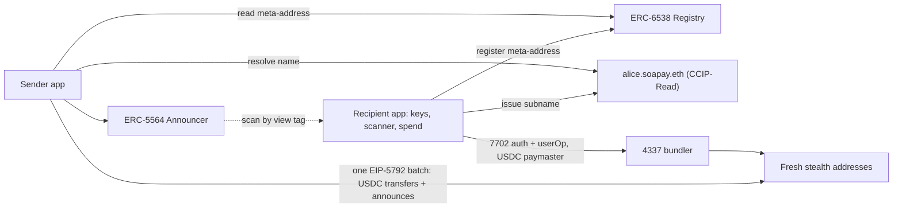

# Soapay: one name, infinite addresses

[](https://basescan.org/address/0x55649E01B5Df198D18D95b5cc5051630cfD45564)
[](https://eips.ethereum.org/EIPS/eip-5564)
[](https://eips.ethereum.org/EIPS/eip-6538)
[](https://eips.ethereum.org/EIPS/eip-7702)
[](https://eips.ethereum.org/EIPS/eip-5792)
[](#roadmap)

**Soapay lets you get paid on-chain without publishing your bank statement.** A recipient shares one ENS name. Each payment to it lands on a fresh stealth address that only the recipient can open and spend from, and that no one else can link to their other payments or their main wallet.

Our first use case is **recurring group payments on Base**: salaries, contractor payouts and DAO grants. Today one batch transaction shows every recipient and every amount next to each other. With Soapay, co-recipients see a list of never-before-seen addresses.

**Navigate:** [PRD](PRD.md) · [PRD analysis and decisions](docs/prd-analysis.md) · [How it works](#how-it-works) · [Privacy guarantees](#privacy-guarantees) · [Roadmap](#roadmap) · [Getting started](#getting-started) · [Repository](#repository)

## What's here

This is the monorepo scaffold, before M1:

- **`@soapay/sdk`** with Base as the chain, the canonical ERC-5564 Announcer and ERC-6538 Registry addresses, and USDC on Base. A round-trip test proves that the sender derives an address, the recipient detects it by view tag, and the recipient recovers the key that controls exactly that address.
- **Recipient and sender apps** as static Vite + React apps, set up for wagmi and viem.
- **Gateway** as a Hono service stub. It will serve CCIP-Read name resolution.
- **Shared Claude memory** in [`.claude/memory`](.claude/memory), loaded by [`CLAUDE.md`](CLAUDE.md).

## How it works



- **Onboard once.** The recipient app derives spending and viewing keys from one seed. It registers the meta-address through a throwaway registrant, never the main wallet, and issues an off-chain subname.
- **Pay in one transaction.** The sender app looks up every name again on every run. It derives a fresh address per recipient in the browser, then sends the USDC transfers and their announcements as one atomic batch.
- **Find payments.** The scanner reads Announcer events, filters them by view tag, and recovers each address's spending key locally.
- **Spend without linking.** Each stealth address delegates to an audited 4337 account through EIP-7702 on its first spend. A paymaster takes gas in USDC, so no ETH ever comes from a known wallet.
- **Nothing custom holds funds.** Soapay uses only the canonical ERC contracts, an existing audited account implementation, and ENS.

## Privacy guarantees

| Observer | Must not learn | How |
| --- | --- | --- |
| Co-recipient reading the batch | Which line is mine, my other addresses, my balance | A fresh stealth address per payment |
| Chain analyst | Links between payments, a link to my main wallet | Paymaster gas, consolidation guard, shielded exit |
| Gateway (self-hosted or hosted) | Anything beyond incoming payment metadata | The gateway's signing key can't spend, and the recipient app checks every address it issues |
| Sender | My main wallet, my balance, what others pay me | The meta-address is public keys, not an address |

**Not hidden in v1:** amounts (denominated payouts reduce this; a shielded rail comes in v2), the sender's wallet, and anything the sender already knows about what they paid.

Each privacy invariant in the PRD becomes a CI test when its code lands. For example: no stealth address is ever returned twice, and every payment has an announcement.

## Roadmap

| Milestone | Delivers | Status |
| --- | --- | --- |
| **M1** SDK + sender + scanner | Key derivation, ERC-6538 registration, subnames, batch pay runs with announcements, scanner and ledger | Scaffolded |
| **M2** Spend | 7702 delegation, USDC paymaster, single-balance view, cluster graph and consolidation guard | Planned |
| **M3** Gateway | CCIP-Read gateway, self-host image, hosted multi-tenant service, audit mode | Planned |
| **M4** Exits and amounts | Denominated payouts, per-address CCTP bridge, Privacy Pools exit | Planned |
| **M5** Agents | MCP server over the SDK, ERC-8004 identity binding | Planned |

## Known gaps

Open questions from the [PRD analysis](docs/prd-analysis.md), still to settle with the PRD author:

- **Seed format:** a BIP-39 mnemonic is assumed but not confirmed.
- **Gateway announcements share a caller:** a self-hosted gateway announces every address from one account, which links them. M3 must mitigate this.
- **Denominated payouts:** carrying the rounding remainder over pays wages unevenly across months, and large batches may exceed the per-transaction gas cap.
- **Scanner speed:** scanning a year of Base history in under 10 seconds needs an indexer that serves all announcements.

## Getting started

Needs Node 24 and pnpm 9:

```bash
nvm use
pnpm install
pnpm build && pnpm test
pnpm dev          # recipient :5173 · sender :5174 · gateway :8787
```

One package at a time:

```bash
pnpm --filter @soapay/sdk test
pnpm --filter @soapay/gateway dev
```

> [!NOTE]
> `@scopelift/stealth-address-sdk` can't be loaded by plain Node. The apps bundle it with Vite, the tests inline it in Vitest, and the gateway bundles it with esbuild. Bundle any new Node entrypoint the same way.

## Contracts

Canonical singletons on Base, chain `8453`. We never fork or redeploy them.

| Contract | Address |
| --- | --- |
| ERC-5564 Announcer | [`0x5564…5564`](https://basescan.org/address/0x55649E01B5Df198D18D95b5cc5051630cfD45564) |
| ERC-6538 Registry | [`0x6538…6538`](https://basescan.org/address/0x6538E6bf4B0eBd30A8Ea093027Ac2422ce5d6538) |
| USDC | [`0x8335…2913`](https://basescan.org/address/0x833589fCD6eDb6E08f4c7C32D4f71b54bdA02913) |

## Repository

| Looking for | Go to |
| --- | --- |
| Product requirements | [`PRD.md`](PRD.md) |
| PRD review, decisions, open questions | [`docs/prd-analysis.md`](docs/prd-analysis.md) |
| Contributor and agent rules | [`CLAUDE.md`](CLAUDE.md) |
| Shared decision memory | [`.claude/memory/MEMORY.md`](.claude/memory/MEMORY.md) |
| Chain and contract constants | [`packages/sdk/src/constants.ts`](packages/sdk/src/constants.ts) |

```text
apps/recipient    Recipient app: keys, onboarding, scanner, ledger, spend
apps/sender       Sender app: pay runs as one atomic EIP-5792 batch
apps/gateway      CCIP-Read gateway: static subnames now, derivation in M3
packages/sdk      @soapay/sdk: derivation, registry, announce, scan, spend
docs              PRD analysis and design notes
.claude/memory    Shared Claude memory, committed
```
