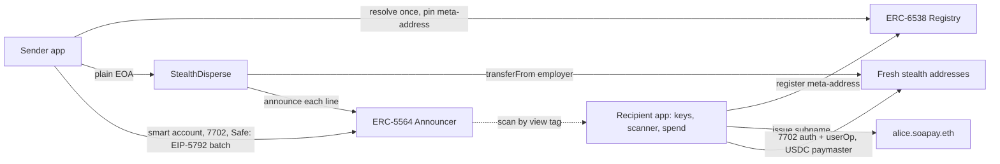

# Soapay: one name, infinite addresses

[](https://basescan.org/address/0x55649E01B5Df198D18D95b5cc5051630cfD45564)
[](https://eips.ethereum.org/EIPS/eip-5564)
[](https://eips.ethereum.org/EIPS/eip-6538)
[](https://eips.ethereum.org/EIPS/eip-7702)
[](https://eips.ethereum.org/EIPS/eip-5792)
[](contracts/PLAN.md#test-matrix-forge-test--vv)
[](#roadmap)

**Soapay lets you get paid on-chain without publishing your bank statement.** An employee shares one ENS name. Every salary payment lands on a fresh stealth address that only they can open and spend from, and a coworker reading the same payroll batch can't tell which line is theirs.

Our first use case is **recurring payroll on Base**. Today one batch transaction shows every recipient and every amount next to each other. With Soapay, coworkers see a list of never-before-seen addresses.

**Navigate:** [PRD](PRD.md) · [Threat model](#threat-model) · [How it works](#how-it-works) · [Uniswap](#uniswap-integration) · [StealthDisperse plan](contracts/PLAN.md) · [PRD analysis](docs/prd-analysis.md) · [Roadmap](#roadmap) · [Getting started](#getting-started) · [Repository](#repository)

## What's here

This is the monorepo before M1:

- **`StealthDisperse`**: one contract that pays a whole batch of stealth addresses and announces each one in the same transaction. It holds no funds, keeps no state and has no owner. It has 27 unit, fuzz and gas tests, and 4 fork tests against real Base USDC and the real Announcer.
- **`@soapay/sdk`**: Base as the chain, the canonical ERC-5564 Announcer and ERC-6538 Registry addresses, and USDC on Base. A round-trip test covers derive, detect by view tag, and recover the spending key.
- **Recipient and sender apps**: static Vite + React apps, set up for wagmi and viem.
- **Test-vector tool**: `contracts/tools/derive.ts` turns meta-addresses into sorted `Payment` lines, and with `--demo` checks that each recipient can find and spend its line.
- **Shared Claude memory** in [`.claude/memory`](.claude/memory), loaded by [`CLAUDE.md`](CLAUDE.md).

## Threat model

The team's agreed model. Where it differs from the PRD, this model wins ([`CLAUDE.md`](CLAUDE.md#agreed-threat-model-overrides-prdmd-where-they-differ)).

| Party | Trusted? | What they must not learn |
| --- | --- | --- |
| **Coworker** in the same batch | No, the only adversary | Which line is mine, my other stealth addresses, my balance |
| **Employer**, payroll admins, Safe signers | Yes | Nothing. They may know name → stealth address → amount |
| **ENS** | Reference only | The sender pins each ERC-6538 meta-address at enrollment and alerts the employer if it changes |

**Out of scope for v1:** chain analysts, RPC and bundler linkage, gateway mode, the Privacy Pools exit. Amounts stay visible, and in small teams they can identify people ([open issues](CLAUDE.md#open-issues-from-the-prd-review)).

## How it works



- **Onboard once.** The recipient app derives spending and viewing keys from one seed. It registers the meta-address through a throwaway registrant and issues an off-chain subname.
- **Pay in one transaction.** The sender app derives a fresh stealth address for every line, sorts them in ascending order, and pays and announces them atomically:
  - a **plain EOA** employer goes through `StealthDisperse`;
  - a **smart account, 7702 or Safe** employer sends a contract-less EIP-5792 batch of `[USDC.transfer, Announcer.announce] × N`.
- **Big runs.** A run is cut into transactions of at most 350 lines, after sorting globally. It is never split by employee, because per-transaction totals would reveal salaries.
- **Find payments.** The scanner filters Announcer events by view tag, recomputes each stealth address, and reads the real balance. It never trusts the token or amount in the metadata.
- **Spend without linking.** A stealth address delegates to an audited 4337 account through EIP-7702 on its first spend, and a USDC paymaster pays the gas.

## Uniswap integration

**Convert salary in place.** An employee can turn part of a stealth address's USDC into WETH or ETH **inside that same address**. Moving funds to a "swap wallet" would link the two addresses, and a coworker who spots the link can tie a salary line to a person. So the swap runs where the money already is, and nothing leaves the address.

- **One userOp per address.** The stealth address delegates to `Simple7702Account` (EIP-7702) on first use and runs one batch: exact `USDC.approve(Permit2)`, then exact `Permit2.approve(UniversalRouter)`, then the Universal Router swap, then a `BALANCE_CHECK_ERC20` floor. Both allowances end at zero.
- **Gas in USDC.** The Circle Paymaster takes gas from the same USDC balance, so the address never needs ETH, which would itself have to come from somewhere linkable.
- **Quotes** come from the Uniswap Trading API (`/quote` then `/swap`, AMM routes only, Universal Router 2.1.2). Without a key, the SDK falls back to direct Universal Router calldata priced by QuoterV2.
- **Nothing pays a third party.** The SDK decodes every Universal Router command, v4 actions included, and refuses to sign if any output could go anywhere but the stealth address: a transfer, a fee portion, or a different recipient.
- **Preferences stay local.** The conversion preference lives only in the recipient app, never in a public record ([spec §6](docs/mvp-spec.md#6-uniswap-convert-salary-in-place)).

| What | Code |
| --- | --- |
| `quoteSwapInPlace`, `swapInPlace`, Trading API client, calldata checks | [`packages/sdk/src/swap.ts`](packages/sdk/src/swap.ts) (Trading API [L563-L644](packages/sdk/src/swap.ts#L563-L644), in-place checks [L314-L458](packages/sdk/src/swap.ts#L314-L458)) |
| `executeFromStealth`: one 7702 userOp, any calls, gas in USDC | [`packages/sdk/src/spend.ts` L414-L497](packages/sdk/src/spend.ts#L414-L497) |
| Base mainnet fork E2E | [`packages/sdk/test/fork.e2e.test.ts`](packages/sdk/test/fork.e2e.test.ts) |
| Developer feedback for Uniswap | [`FEEDBACK.md`](FEEDBACK.md) |

The fork E2E starts its own anvil fork of Base and plays the bundler, so it needs [Foundry](https://getfoundry.sh) but no keys. It runs a first spend (delegation plus USDC gas), USDC to WETH in place, and USDC to native ETH in place:

```bash
FORK_E2E=1 pnpm --filter @soapay/sdk vitest run test/fork.e2e.test.ts
# optional: FORK_RPC_URL=<Base RPC>, default https://mainnet.base.org
```

The Trading API path is covered by mocked tests only so far (`pnpm --filter @soapay/sdk test`), because we have no API key yet. Keep the key server-side: pass `apiUrl` pointing at a backend proxy that adds `x-api-key`.

## Roadmap

| Milestone | Delivers | Status |
| --- | --- | --- |
| **M1** SDK + sender + scanner | Key derivation, ERC-6538 registration, subnames, `StealthDisperse` + EIP-5792 pay runs, scanner and ledger | Contract done, apps scaffolded |
| **M2** Spend | 7702 delegation, USDC paymaster, single-balance view, cluster graph and consolidation guard | Planned |
| **M3** Gateway | CCIP-Read gateway, self-host image, hosted service | Proposed cut under the threat model |
| **M4** Exits and amounts | Denominated payouts, CCTP bridge, Privacy Pools exit | Denominations planned; exit proposed cut |
| **M5** Agents | MCP server over the SDK, ERC-8004 identity binding | Planned |

## Known gaps

- **Amounts are the main remaining leak.** A coworker who knows a colleague's salary finds their line. Denominated payouts help, but consolidating chunks at spend time reveals the total again.
- **Unconfirmed decisions:** the two pay-run paths, the seed format (BIP-39 assumed), and whether scanners require a known payer by default.
- **`StealthDisperse` is a USDC-blacklist chokepoint** for the EOA path. It is immutable, so moving to a redeployed address is only a config change.
- **Not deployed yet.** The deploy is a deterministic CREATE2 script ([deploy steps](contracts/PLAN.md#deploy)).

## Getting started

Needs Node 24, pnpm 9 and [Foundry](https://getfoundry.sh):

```bash
git submodule update --init --recursive
nvm use
pnpm install
pnpm build && pnpm test      # SDK tests + forge test
pnpm dev                     # recipient :5173 · sender :5174 · api :8787
```

Contracts:

```bash
pnpm --filter @soapay/contracts test
BASE_RPC_URL=https://mainnet.base.org pnpm --filter @soapay/contracts test:fork
pnpm --filter @soapay/contracts gas
cd contracts && pnpm derive --demo 5     # sorted Payment lines + a cast tuple
```

> [!NOTE]
> `@scopelift/stealth-address-sdk` can't be loaded by plain Node. The apps bundle it with Vite, the tests inline it in Vitest, the gateway bundles it with esbuild, and `derive.ts` runs under tsx.

## Contracts

Base, chain `8453`.

| Contract | Address |
| --- | --- |
| `StealthDisperse` (ours) | Not deployed. CREATE2 salt `keccak256("soapay.StealthDisperse.v1")` |
| ERC-5564 Announcer (canonical) | [`0x5564…5564`](https://basescan.org/address/0x55649E01B5Df198D18D95b5cc5051630cfD45564) |
| ERC-6538 Registry (canonical) | [`0x6538…6538`](https://basescan.org/address/0x6538E6bf4B0eBd30A8Ea093027Ac2422ce5d6538) |
| USDC | [`0x8335…2913`](https://basescan.org/address/0x833589fCD6eDb6E08f4c7C32D4f71b54bdA02913) |

## Repository

| Looking for | Go to |
| --- | --- |
| Product requirements | [`PRD.md`](PRD.md) |
| Threat model, design decisions, sender-app invariants | [`CLAUDE.md`](CLAUDE.md) |
| `StealthDisperse` spec, invariants, test matrix, deploy | [`contracts/PLAN.md`](contracts/PLAN.md) |
| PRD review and open questions | [`docs/prd-analysis.md`](docs/prd-analysis.md) |
| Shared decision memory | [`.claude/memory/MEMORY.md`](.claude/memory/MEMORY.md) |
| Chain and contract constants | [`packages/sdk/src/constants.ts`](packages/sdk/src/constants.ts) |

```text
apps/recipient    Recipient app: keys, onboarding, scanner, ledger, spend
apps/sender       Sender app: pay runs via StealthDisperse or an EIP-5792 batch
apps/api          Registration relayer, ENSv2 subname issuer, World ID checks, announcement indexer
packages/sdk      @soapay/sdk: derivation, registry, announce, scan, spend
contracts         @soapay/contracts: Foundry, StealthDisperse, tools/derive.ts
docs              PRD analysis
.claude/memory    Shared Claude memory, committed
```
