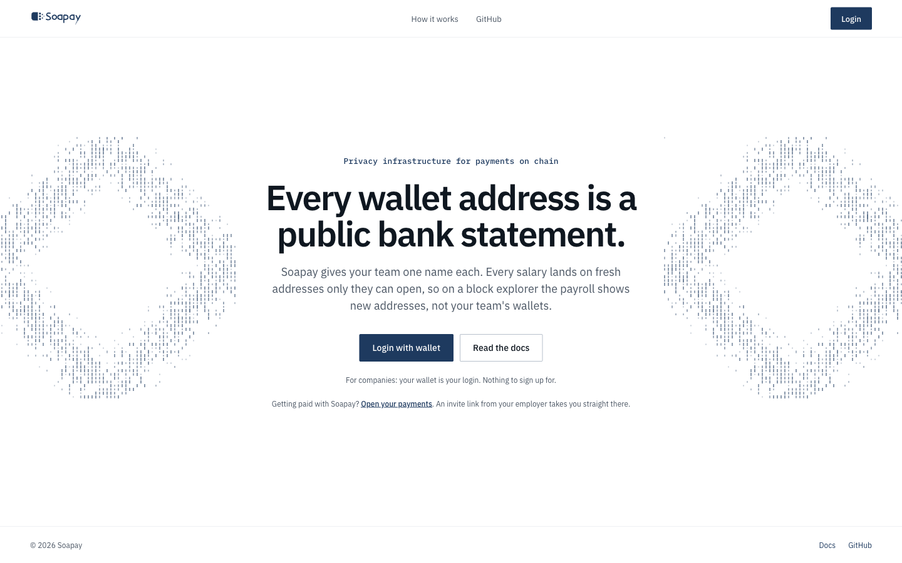
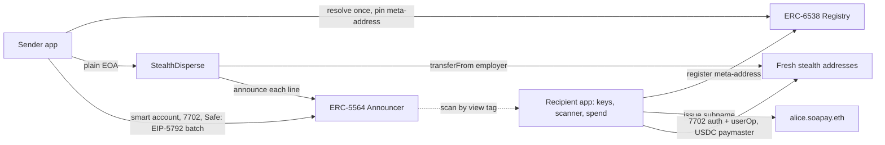
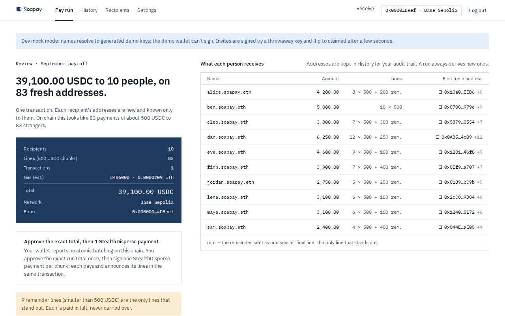
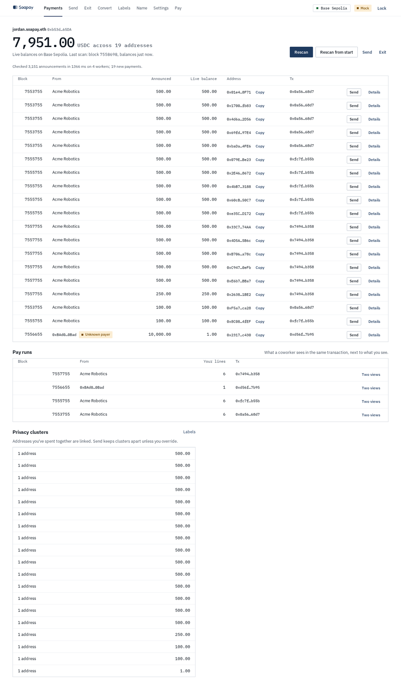

# Soapay: privacy infrastructure for payments on chain

[](https://basescan.org/address/0x55649E01B5Df198D18D95b5cc5051630cfD45564)
[](https://eips.ethereum.org/EIPS/eip-5564)
[](https://eips.ethereum.org/EIPS/eip-6538)
[](https://eips.ethereum.org/EIPS/eip-7702)
[](https://eips.ethereum.org/EIPS/eip-5792)
[](#tests)
[](https://soapay.up.railway.app/)

[](https://soapay.up.railway.app/)

**Live demo:** [soapay.up.railway.app](https://soapay.up.railway.app/) (company app) · [soapay.up.railway.app/app/](https://soapay.up.railway.app/app/) (employee app), on Base Sepolia.

> [!NOTE]
> **Testnet notes (D-52).** On Base Sepolia the apps pay in **Soapay's mock USDC** ([`0x028D…14Bb`](https://sepolia.basescan.org/address/0x028D969c20b740582428f5043954c380686214Bb)), not Circle's, so you don't need a faucet: the first time a wallet opens the company app it gets **1,000,000 test USDC** once. Stealth spends are **gas-sponsored** (on mainnet the Circle Paymaster takes gas in USDC), and smart-wallet employers paying by EIP-5792 batch are sponsored too; a plain EOA employer still needs a little Base Sepolia ETH. The compliant **exit is hidden** on the testnet build, because CCTP only bridges Circle USDC. Details: [docs/testnet-deployment.md](docs/testnet-deployment.md).

**Soapay is privacy infrastructure for payments on chain**: every payment lands on a fresh address that only you can open, and you can spend it without it ever linking back to you. A recipient shares one ENS name. Each payment to it goes to a new ERC-5564 stealth address, so a coworker reading the same payroll batch sees a list of never-before-seen addresses and can't tell which line is theirs.

## Who sees what you earn?

On a public chain, everyone with a browser: one payroll batch on Base shows every recipient and every amount next to each other, readable forever. Your colleagues too: at Gitcoin DAO a contributor started from their own pay address and put names to fifteen salaries. So companies walk away, and the fixes built for them (Base Ledgers, Tempo Zones, Toku on Aleo) are private ledgers for enterprises: not for everyone, since you apply for access, and not fully private, since every payment goes through the company running them, which sees it and decides what you can withdraw. Everyone else still pays in public.

Soapay fixes both on the public chain itself. Nothing sits between payer and recipient: the sender's browser derives a fresh stealth address for every line, pays it directly on Base and throws the ephemeral key away. Only you can open that address and spend from it, so nobody but the payer and you sees the payment, and nobody decides what you can withdraw. There is nothing to apply for either: share an ENS name and you can be paid, with no account at Soapay and no server of ours in the loop. The money lands in a wallet only you control, and it all runs on open standards with a public SDK. Nothing of ours holds money, and the one contract we wrote keeps no state and has no owner.

## Built for payroll. Ready for any payout.

Payroll is the first use case because it is where public payments hurt most: one payer, many recipients who know each other, every month. But nothing in the rail is specific to salaries. Any payment that goes from one place to many names works the same way today: resolve the names, derive a fresh address per line, pay and announce in one transaction.

- Dividends and revenue share
- Token and equity allocations: vesting unlocks, stock and option settlements, investor distributions
- Vendor and supplier payments
- Grants and bounties
- Prizes and airdrops
- Tips, donations and creator payouts
- Agents paying agents by name ([Agents](#agents-mcp))

The SDK already treats these as one thing. [`packages/sdk/src/distribute.ts`](packages/sdk/src/distribute.ts) plans any distribution from a payer and a list of recipients, with presets for `payroll`, `dividend` (pro rata by largest remainder, so the allocations sum exactly to the total) and `grant` (checked against a budget), with `vesting` as a kind planned the same way. [`soapay distribute`](apps/cli) runs one from a CSV, dry run by default, and [`examples/dividend-run.ts`](examples/dividend-run.ts) and [`examples/grant-round.ts`](examples/grant-round.ts) show the same rail paying a cap table and a grant round.

## Not another stealth wallet

Fluidkey and Umbra use the same ERC-5564 and ERC-6538 standards, and both hide your wallet from strangers. They are wallets for an individual receiving payments: a server derives your addresses at name resolution and holds your viewing key, so it sees every payment you receive, and it never touches the batch, which is where a coworker reads your salary. Soapay is the rail for the payer side of the same standards. The sender's browser derives every address and throws the ephemeral key away, only you hold your viewing key, and nothing of ours sees more than public chain data. One transaction pays and announces every recipient, amounts are chunked and sorted so per-transaction totals never leak, a consolidation guard and a timing queue keep spends from linking your addresses, a compliant exit through Privacy Pools lets you cash out, and everything rebuilds from your seed with the public SDK. It is also permissionless: no account with us, any ENS name that carries the stealth records can be paid, and the one contract we wrote has no owner. Row by row: [Compared with Fluidkey](#compared-with-fluidkey).

## Contents

**The product**
- [Who sees what you earn?](#who-sees-what-you-earn)
- [Built for payroll. Ready for any payout.](#built-for-payroll-ready-for-any-payout)
- [Not another stealth wallet](#not-another-stealth-wallet)
- [Screens](#screens)
- [Compared with Fluidkey](#compared-with-fluidkey)

**How it's built**
- [What's here](#whats-here)
- [Threat model](#threat-model)
- [How it works](#how-it-works)
- [Contracts](#contracts)
- [Repository](#repository)

**Integrations**
- [Uniswap: convert salary in place (SDK and MCP)](#uniswap-integration)
- [ENSv2: names and key rotation](#ensv2-integration)
- [Agents (MCP)](#agents-mcp)
- [World ID: attested recovery](#world-id-integration)

**Status**
- [Tests](#tests)
- [Roadmap](#roadmap)
- [Known gaps](#known-gaps)
- [Getting started](#getting-started)

**Team**
- [Who we are](#team)

**Documents**
- [Pitch](pitch/README.md) · [PRD](PRD.md) · [Design brief](DESIGN_BRIEF.md) · [Privacy model](docs/privacy-model.md) · [Demo flow with screenshots](docs/demo-flow.md)
- [StealthDisperse plan](contracts/PLAN.md) · [MVP spec](docs/mvp-spec.md) · [PRD analysis](docs/prd-analysis.md) · [Decision log](docs/decision-log.md) · [Testnet deployment](docs/testnet-deployment.md)

## What's here

This is the monorepo before M1:

- **`StealthDisperse`**: one contract that pays a whole batch of stealth addresses and announces each one in the same transaction. It holds no funds, keeps no state and has no owner. It has 27 unit, fuzz and gas tests, and 4 fork tests against real Base USDC and the real Announcer.
- **`@soapay/sdk`**: Base as the chain, the canonical ERC-5564 Announcer and ERC-6538 Registry addresses, and USDC on Base. A round-trip test covers derive, detect by view tag, and recover the spending key.
- **Recipient and sender apps**: static Vite + React apps, set up for wagmi and viem.
- **Test-vector tool**: `contracts/tools/derive.ts` turns meta-addresses into sorted `Payment` lines, and with `--demo` checks that each recipient can find and spend its line.
- **Shared Claude memory** in [`.claude/memory`](.claude/memory), loaded by [`CLAUDE.md`](CLAUDE.md).

## Threat model

The team's agreed model. Where it differs from the PRD, this model wins ([`CLAUDE.md`](CLAUDE.md#agreed-threat-model-overrides-prdmd-where-they-differ)). Who sees what, and what is and isn't guaranteed: [`docs/privacy-model.md`](docs/privacy-model.md).

| Party | Trusted? | What they must not learn |
| --- | --- | --- |
| **Coworker** in the same batch | No, the only adversary | Which line is mine, my other stealth addresses, my balance |
| **Employer**, payroll admins, Safe signers | Yes | Nothing. They may know name → stealth address → amount |
| **ENS** | Reference only | The sender pins each ERC-6538 meta-address at enrollment and alerts the employer if it changes |

**Out of scope for v1:** chain analysts, RPC and bundler linkage, gateway mode. The compliant exit through Privacy Pools is in scope. Amounts stay visible, and in small teams they can identify people ([open issues](CLAUDE.md#open-issues-from-the-prd-review)).

## How it works

The full picture, with every flow and where ENS, World ID and Uniswap come in, is in [docs/architecture.md](docs/architecture.md).



- **Onboard once.** The recipient app derives spending and viewing keys from one seed. It registers the meta-address through a throwaway registrant, and the API issues an on-chain ENSv2 subname under `soapay.eth`.
- **Pay in one transaction.** The sender app derives a fresh stealth address for every line, sorts them in ascending order, and pays and announces them atomically:
  - a **plain EOA** employer goes through `StealthDisperse`;
  - a **smart account, 7702 or Safe** employer sends a contract-less EIP-5792 batch of `[USDC.transfer, Announcer.announce] × N`.
- **Big runs.** A run is cut into transactions of at most 350 lines, after sorting globally. It is never split by employee, because per-transaction totals would reveal salaries.
- **Find payments.** The scanner filters Announcer events by view tag, recomputes each stealth address, and reads the real balance. It never trusts the token or amount in the metadata.
- **Spend without linking.** A stealth address delegates to an audited 4337 account through EIP-7702 on its first spend, and a USDC paymaster pays the gas.

## Screens

The company app reviews a pay run before signing. With denominated payouts on, six salaries become 56 lines of 500 USDC to 56 fresh addresses, so the batch reads as identical transfers to strangers:



The employee app scans the Announcer, finds only its own lines, and shows live balances across every fresh address, with a gasless Send from each one:



Every screen of both apps, in demo order: [`docs/demo-flow.md`](docs/demo-flow.md) and [`docs/demo-screens`](docs/demo-screens).

## Compared with Fluidkey

Both are built on ERC-5564 and ERC-6538, and both hide your wallet from strangers. The difference is the batch and the server. Fluidkey never touches the payroll batch, which is where a coworker reads your salary, and it has to see every payment you receive to work. Soapay hides the salary from the coworker, and nobody but you can see what you receive.

| | [Fluidkey](https://docs.fluidkey.com/readme/frequently-asked-questions/) | Soapay |
| --- | --- | --- |
| Who it's for | Individuals receiving payments | Teams paying groups: payroll, contributors, grants |
| Hides your wallet from strangers | Yes | Yes |
| Hides your salary from a coworker in the same batch | No | Yes |
| Who derives your stealth address | Fluidkey's server, at name resolution | The sender's browser; the ephemeral key is thrown away |
| Who holds your viewing key | Fluidkey | Only you |
| What the company's server can see | Every payment you receive | Nothing beyond public chain data |
| Account with the company | Required: a Fluidkey name, resolved by Fluidkey's off-chain resolver | None: any ENS name that carries the stealth records, with no server of ours in the loop |
| What your employer learns | n/a | Name → stealth address → amount, never your main wallet |
| Batch payments | No | One transaction, N recipients, pays and announces atomically |
| Amounts in the batch | Visible per person | Split into identical chunks, sorted so per-tx totals never leak |
| Spending | Stealth Safes with sponsored gas | Plain EOA, EIP-7702 on first spend, gas in USDC via the Circle Paymaster |
| Receivable from any wallet by name | Yes | In the sender app; gateway mode for other wallets is on the roadmap |
| Consolidation guard | No | Cluster graph, labels, block on identifiable destinations, timing queue |
| Compliant exit | No | Privacy Pools via CCTP, screened by an association set |
| Swap without linking | No | In place, inside the stealth address, placeholder quote |
| Key rotation | Not documented | World ID attested; the employer's app accepts it automatically |
| Recovery without the company | Addresses | Everything: addresses, ledger, pool secrets, from the seed and the public SDK |
| Agents | No | MCP server, `.soapay.eth` names with ENSIP-26 records |
| Chains | 7 mainnets plus a Near intents bridge | Base Sepolia today, Base first |
| Fiat ramps | Yes | No |

## Tests

**907 tests, all passing** (`pnpm test`, 2026-09-26). Every privacy invariant in the PRD is a test in one of these packages.

| Package | Tests | Skipped | Runner |
| --- | --- | --- | --- |
| `@soapay/sdk` | 350 | 18 fork and live tests, need `FORK_E2E=1` or keys | vitest |
| `@soapay/recipient` | 138 | | vitest |
| `@soapay/sender` | 151 | | vitest |
| `@soapay/api` | 146 | | vitest |
| `@soapay/mcp` | 61 | | vitest |
| `@soapay/contracts` | 44 | 2 fork tests, need `BASE_RPC_URL` | forge |
| `@soapay/cli` | 17 | | vitest |

The skipped tests are the Base and Sepolia fork end-to-ends (a full payroll run, gasless 7702 spend, in-place swap, Privacy Pools exit). They pass with a fork RPC set; see [Getting started](#getting-started).

## Uniswap integration

> [!NOTE]
> Since D-53 the employee **web app has no Convert tab** (the Uniswap bounty is no longer targeted). Swap in place lives on in the SDK and the MCP server's `swap_in_place` tool.

**Convert salary in place.** An employee can turn part of a stealth address's USDC into WETH or ETH **inside that same address**. Moving funds to a "swap wallet" would link the two addresses, and a coworker who spots the link can tie a salary line to a person. So the swap runs where the money already is, and nothing leaves the address.

- **One userOp per address.** The stealth address delegates to `Simple7702Account` (EIP-7702) on first use and runs one batch: exact `USDC.approve(Permit2)`, then exact `Permit2.approve(UniversalRouter)`, then the Universal Router swap, then a `BALANCE_CHECK_ERC20` floor. Both allowances end at zero.
- **Gas in USDC.** The Circle Paymaster takes gas from the same USDC balance, so the address never needs ETH, which would itself have to come from somewhere linkable. (On the Base Sepolia demo the gas is sponsored instead, D-52.)
- **Quotes never reveal the address** (D-27). On Base mainnet the SDK asks the Uniswap Trading API `/quote` for a **random placeholder swapper**, then re-encodes the quoted V2/V3 route itself as Universal Router 2.1.2 commands paying the stealth address; it never calls `/swap`, and a guard refuses any request containing the stealth address. On Base Sepolia (where the API times out), or without a key, it quotes on-chain with QuoterV2.
- **Nothing pays a third party.** The SDK decodes every Universal Router command, v4 actions included, and refuses to sign if any output could go anywhere but the stealth address: a transfer, a fee portion, or a different recipient.
- **Preferences stay local.** The conversion preference lives only in the recipient app, never in a public record ([spec §6](docs/mvp-spec.md#6-uniswap-convert-salary-in-place)).

| What | Code |
| --- | --- |
| `quoteSwapInPlace`, `swapInPlace`, placeholder-swapper Trading API client, calldata checks | [`packages/sdk/src/swap.ts`](packages/sdk/src/swap.ts): Trading API quote with a placeholder swapper and the address guard [L594-L610](packages/sdk/src/swap.ts#L594-L610), re-encoding the quoted V2/V3 route [L645-L726](packages/sdk/src/swap.ts#L645-L726), `/quote`-only client [L727-L830](packages/sdk/src/swap.ts#L727-L830), in-place checks (every output stays at the stealth address) [L350-L499](packages/sdk/src/swap.ts#L350-L499), entry points [L831-L874](packages/sdk/src/swap.ts#L831-L874) |
| `executeFromStealth`: one 7702 userOp, any calls, gas in USDC | [`packages/sdk/src/spend.ts`](packages/sdk/src/spend.ts): the userOp pipeline (session, 7702 authorization, paymaster permit, send) [L216-L498](packages/sdk/src/spend.ts#L216-L498), entry point [L499-L504](packages/sdk/src/spend.ts#L499-L504) |
| Base mainnet fork E2E | [`packages/sdk/test/fork.e2e.test.ts`](packages/sdk/test/fork.e2e.test.ts) |
| Developer feedback for Uniswap | [`FEEDBACK.md`](FEEDBACK.md) |

The fork E2E starts its own anvil fork of Base and plays the bundler, so it needs [Foundry](https://getfoundry.sh) but no keys. It runs a first spend (delegation plus USDC gas), USDC to WETH in place, and USDC to native ETH in place:

```bash
FORK_E2E=1 pnpm --filter @soapay/sdk vitest run test/fork.e2e.test.ts
# optional: FORK_RPC_URL=<Base RPC>, default https://mainnet.base.org
```

With a running API that has a key, the same suite also takes a live Base mainnet `/quote` (placeholder swapper) and executes the locally built swap on the fork: `SWAP_API_URL=http://localhost:8787/uniswap FORK_E2E=1 …`. Keep the key server-side: the API proxies only `POST /uniswap/quote` with `UNISWAP_API_KEY` ([`apps/api/src/routes/uniswap.ts`](apps/api/src/routes/uniswap.ts)), so apps pass `apiUrl: "<api>/uniswap"`. Without a key the proxy answers 503 `uniswap_disabled` and the SDK falls back to the on-chain quote.

## ENSv2 integration

**Employees share a name, not an address.** A salary goes to `alice.soapay.eth`. The name is a real ENSv2 subname on Ethereum Sepolia, and its `stealth` text record holds Alice's stealth meta-address. The sender app resolves the name once, pins the meta-address, and derives a fresh stealth address for every payment. The name has no `addr` record, so a plain wallet can't pay a static address by mistake.

ENSv2 is what makes this work without a trusted gateway. Its per-resource access control (EAC) lets us give each actor exactly one power:

- **The employee controls their own record.** Each subname gets its own `PermissionedResolver`. The registrant key holds `ROLE_SET_TEXT` on the `stealth` key and nothing else, so only the employee can rotate their meta-address. Roles are per text key across the whole resolver, which is why every employee needs a separate resolver.
- **The API can issue names and do nothing else.** Its key holds only `ROLE_REGISTRAR` on the `soapay.eth` subname registry. It can't edit or revoke existing names.
- **Names are non-transferable and revocable.** The subname token carries an empty role bitmap. The company, which owns `soapay.eth`, keeps `ROLE_UNREGISTER`.
- **Records land atomically.** The resolver is deployed through the `VerifiableFactory` with its records and roles set in `initialize`, before the name is registered.
- **Standard resolution.** viem's `getEnsText` through the ENSv2 Universal Resolver, with no custom client code.

A stolen registrant key can rewrite `stealth` but can't redirect pay: the sender app accepts a changed pin only with a World ID re-verification attestation or the employer's approval ([spec §2.1](docs/mvp-spec.md#21-key-rotation-under-option-a-owner-decision-2026-09-25)).

| What | Code |
| --- | --- |
| Addresses, roles, call builders, `createEnsV2NameIssuer` | [`packages/sdk/src/ensv2.ts`](packages/sdk/src/ensv2.ts) |
| Deployment set, role model, exact calls, trust analysis, runbook | [`contracts/ENSV2.md`](contracts/ENSV2.md) |
| Sepolia fork test against the live ENSv2 contracts | [`contracts/test/ENSv2Names.fork.t.sol`](contracts/test/ENSv2Names.fork.t.sol) |
| Scripts: register the parent, set it up, issue and rotate | [`contracts/tools/ensv2-*.ts`](contracts/tools) |

The fork test buys the parent through the real `ETHRegistrar`, issues a name, resolves it through the Universal Resolver, rotates the record as the registrant, checks that a coworker and the issuer can't write it, and revokes it:

```bash
cd contracts
SEPOLIA_RPC_URL=https://ethereum-sepolia-rpc.publicnode.com forge test --match-contract ENSv2 -vv
```

The scripts run against real Sepolia or an anvil fork of it. Use fresh keys: the public anvil keys are 7702-delegated on Sepolia and can't receive ENSv2 names. Full runbook in [`contracts/ENSV2.md` §6](contracts/ENSV2.md#6-team-runbook-real-sepolia).

```bash
cd contracts
export SEPOLIA_RPC_URL=... PARENT_OWNER_PRIVATE_KEY=0x... ISSUER_ADDRESS=0x...
pnpm ensv2:register-parent                           # commit/reveal soapay.eth
pnpm ensv2:setup-parent                              # subname registry + issuer role
ISSUER_PRIVATE_KEY=0x... pnpm ensv2:issue-demo alice # issue, resolve, rotate, resolve
```

## Agents (MCP)

**Agents are namespaces too.** An AI agent gets a Soapay name exactly the way an employee does: `ledger-bot.soapay.eth` is a real ENSv2 subname with its own resolver, a `stealth` record that only the agent's registrant key can rotate, and a meta-address in the ERC-6538 registry. Anyone can pay it privately by name. The agent can pay other names from its own wallet too.

[`apps/mcp`](apps/mcp) is a stdio MCP server over the SDK and API. Add it to Claude Code with `claude mcp add soapay -- node /abs/path/apps/mcp/dist/index.js`:

- `create_agent_identity` registers the agent and claims its name with **ENSIP-26** records: `agent-context` (what the agent does and how to pay it) and `agent-endpoint[mcp|a2a|web]`. The ENSv2 issuer writes them atomically in the resolver's `initialize`, beside `stealth`. The same `agent` field accepts **ENSIP-25** `agent-registration[registry][id]` bindings for when a registry lists the agent.
- `pay`, `scan`, `balance`, `spend` and `swap_in_place` cover the whole flow: pay names through StealthDisperse, find payments, send them on through 7702 + a USDC paymaster, and swap in place through Uniswap.
- **Guardrails:**
  - every value move is a dry run, then a confirm of a single-use plan that expires in 10 minutes;
  - per-call and per-day USDC caps;
  - an optional payee allowlist;
  - pinned meta-addresses;
  - the consolidation guard's `block` can't be overridden;
  - keys never leave the process.

Live on Base Sepolia and ENSv2 Sepolia (2026-09-25): an agent created `mcp-agent-7c1e.soapay.eth` with ENSIP-26 records, received 0.3 USDC through StealthDisperse, found it with `scan`, and spent 0.1 USDC to another name through the bundler and paymaster. Details in [`apps/mcp/README.md`](apps/mcp/README.md).

## World ID integration

**One trust moment: key rotation.** A name's meta-address decides where future salary goes, and the registrant key can change it. When an employee sets up their name, they may create a World ID **session** with the **Proof of Human** credential. To rotate keys later, they prove that same session. The API verifies the proof and signs a `MetaRotation` attestation, and the payer's app then auto-accepts the new meta-address with a "re-verified by World ID" badge. A stolen key alone gets no attestation, so the line is blocked until the employer approves it by hand. There's no World ID gate on onboarding and no Orb requirement.

- **Why Proof of Human:** recovery moves all future salary, the highest-stakes action in the product. World calls Selfie Check a medium-assurance signal, so the strongest same-human proof is proportionate; passport-level identity would collect data we don't need (D-54, [docs/worldid.md](docs/worldid.md)).
- **Where it matters most:** pseudonymous DAO contributors. The payer has no phone number or face on file, so World ID is the only continuity signal, and it never reveals who the contributor is.
- **Rotation also relays** the employee's ERC-6538 re-registration for the new meta-address and tops up their Sepolia gas for their own `setText`.

| What | Code |
| --- | --- |
| Design, sequences (accepted and denied), Portal setup, debrief | [`docs/worldid.md`](docs/worldid.md) |
| Session verification: nonce, signal, credential, environment, replay, Developer Portal | [`apps/api/src/worldid/verifier.ts`](apps/api/src/worldid/verifier.ts), [`portal.ts`](apps/api/src/worldid/portal.ts) |
| Routes: RP context, attach session, rotation + attestation + ERC-6538 relay + top-up | [`apps/api/src/routes/worldid.ts`](apps/api/src/routes/worldid.ts), [`rotation.ts`](apps/api/src/routes/rotation.ts) |
| Typed data (RotationClaim, MetaRotation, AttachSession) and signals | [`packages/sdk/src/rotation.ts`](packages/sdk/src/rotation.ts) |
| `<HumanCheck mode="create-session" \| "rotate">` over `IDKitSessionWidget` | [`packages/worldid-react`](packages/worldid-react) |
| Tests with a mocked Developer Portal | [`apps/api/test/worldid.test.ts`](apps/api/test/worldid.test.ts) |

App `app_0cc7167efe114ac2e0ef7d9827098353`, RP `rp_3ede5fe1cab9af48`, `WORLD_ENV=staging` for the demo. Setup is in [`apps/api/README.md`](apps/api/README.md) and [`apps/api/.env.example`](apps/api/.env.example).

## Roadmap

| Milestone | Delivers | Status |
| --- | --- | --- |
| **M1** SDK + sender + scanner | Key derivation, ERC-6538 registration, subnames, `StealthDisperse` + EIP-5792 pay runs, scanner and ledger | Contract done, apps scaffolded |
| **M2** Spend | 7702 delegation, USDC paymaster, single-balance view, cluster graph and consolidation guard | Planned |
| **M3** Gateway | CCIP-Read gateway, self-host image, hosted service | Proposed cut under the threat model |
| **M4** Exits and amounts | Denominated payouts, CCTP bridge, Privacy Pools exit | Denominations planned; exit proposed cut |
| **M5** Agents | MCP server over the SDK, ERC-8004 identity binding | Planned |

## Known gaps

- **Amounts are the main remaining leak.** A coworker who knows a colleague's salary finds their line. Denominated payouts help, but consolidating chunks at spend time reveals the total again.
- **Unconfirmed decisions:** the two pay-run paths, the seed format (BIP-39 assumed), and whether scanners require a known payer by default.
- **`StealthDisperse` is a USDC-blacklist chokepoint** for the EOA path. It is immutable, so moving to a redeployed address is only a config change.
- **Not deployed yet.** The deploy is a deterministic CREATE2 script ([deploy steps](contracts/PLAN.md#deploy)).

## Getting started

Needs Node 24, pnpm 9 and [Foundry](https://getfoundry.sh):

```bash
git submodule update --init --recursive
nvm use
pnpm install
pnpm build && pnpm test      # SDK tests + forge test
pnpm dev                     # recipient :5173 · sender :5174 · api :8787
```

Contracts:

```bash
pnpm --filter @soapay/contracts test
BASE_RPC_URL=https://mainnet.base.org pnpm --filter @soapay/contracts test:fork
pnpm --filter @soapay/contracts gas
cd contracts && pnpm derive --demo 5     # sorted Payment lines + a cast tuple
```

> [!NOTE]
> `@scopelift/stealth-address-sdk` can't be loaded by plain Node. The apps bundle it with Vite, the tests inline it in Vitest, the MCP server bundles it with esbuild, and `derive.ts` runs under tsx.

## Contracts

Base, chain `8453`.

| Contract | Address |
| --- | --- |
| `StealthDisperse` (ours) | Not deployed. CREATE2 salt `keccak256("soapay.StealthDisperse.v1")` |
| ERC-5564 Announcer (canonical) | [`0x5564…5564`](https://basescan.org/address/0x55649E01B5Df198D18D95b5cc5051630cfD45564) |
| ERC-6538 Registry (canonical) | [`0x6538…6538`](https://basescan.org/address/0x6538E6bf4B0eBd30A8Ea093027Ac2422ce5d6538) |
| USDC | [`0x8335…2913`](https://basescan.org/address/0x833589fCD6eDb6E08f4c7C32D4f71b54bdA02913) |

Base Sepolia, chain `84532` (the live demo; [docs/testnet-deployment.md](docs/testnet-deployment.md)):

| Contract | Address |
| --- | --- |
| `StealthDisperse` (ours) | [`0x6B7a…39CA`](https://sepolia.basescan.org/address/0x6B7a1cC570Af2DDd427DA694351438F0FE8039CA) |
| `MockUSDC` (ours, testnet only: the pay token, minted by the API faucet) | [`0x028D…14Bb`](https://sepolia.basescan.org/address/0x028D969c20b740582428f5043954c380686214Bb) |

## Repository

| Looking for | Go to |
| --- | --- |
| Product requirements | [`PRD.md`](PRD.md) |
| Threat model, design decisions, sender-app invariants | [`CLAUDE.md`](CLAUDE.md) |
| Who sees what; guaranteed vs not guaranteed | [`docs/privacy-model.md`](docs/privacy-model.md) |
| `StealthDisperse` spec, invariants, test matrix, deploy | [`contracts/PLAN.md`](contracts/PLAN.md) |
| PRD review and open questions | [`docs/prd-analysis.md`](docs/prd-analysis.md) |
| Shared decision memory | [`.claude/memory/MEMORY.md`](.claude/memory/MEMORY.md) |
| Chain and contract constants | [`packages/sdk/src/constants.ts`](packages/sdk/src/constants.ts) |

```text
apps/recipient    Recipient app: keys, onboarding, scanner, ledger, spend
apps/sender       Sender app: pay runs via StealthDisperse or an EIP-5792 batch
apps/api          Registration relayer, ENSv2 subname issuer, World ID checks, announcement indexer
packages/sdk      @soapay/sdk: derivation, registry, announce, scan, spend
contracts         @soapay/contracts: Foundry, StealthDisperse, tools/derive.ts
docs              PRD analysis
.claude/memory    Shared Claude memory, committed
```

## Team

Five people, built at ETHGlobal Tokyo 2026.

| Who | Role | Also | GitHub | X |
| --- | --- | --- | --- | --- |
| **Eason Chai** | Founder & CEO, Foresight and ELVTD | Ex-engineer, Gitcoin. Previously contracted for Virtuals Protocol | [@easonchai](https://github.com/easonchai) | [@easonchaiii](https://x.com/easonchaiii) |
| **Yudhishthra** | Co-Founder, Aqua0 | Ex-engineer, Nethermind and Etherscan | [@0xYudhishthra](https://github.com/0xYudhishthra) | [@0xYudhishthra](https://x.com/0xYudhishthra) |
| **Ee Sheng** | Head of Engineering, Thetanuts | Founder, zBase: private payments for agents (Base Batches 003 finalist) | [@goheesheng](https://github.com/goheesheng) | [@goheesheng](https://x.com/goheesheng) |
| **Marcus Tan** | Founding Engineer, Predictefy | ex-engineer, ELVTD | [@Marcussy34](https://github.com/Marcussy34) | [@marcustan1337](https://x.com/marcustan1337) |
| **Cheong Kian** | Founding Engineer, Predictefy | | [@Ckayz](https://github.com/Ckayz) | [@LCKian88](https://x.com/LCKian88) |
