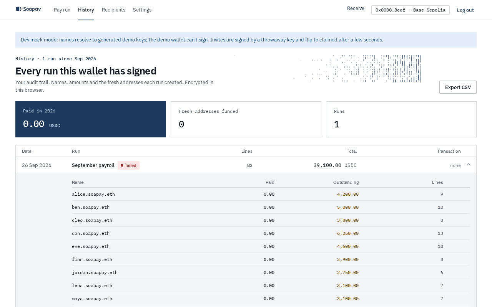

import { Aside } from "@astrojs/starlight/components";

**History** is the encrypted audit trail for the connected company wallet. It keeps the private relationship between names, amounts, and fresh addresses in this browser. Select **Export CSV** when you need a separate record.

## Read the run list

The page summarises **Paid in** the current year, **Fresh addresses funded**, and **Runs**. Each run row shows:

- Date and optional run label.
- Payment path: **Atomic batch (EIP-5792)**, **StealthDisperse**, or **Safe export**.
- Line count, planned total, and a transaction link when one is known.
- State: complete, exported, in progress, needs check, partial, or failed.

Expand a run to see each name, the amount paid, any outstanding amount, and the number of lines. Select **Open run** for the complete attempt record.

## Inspect one run

The run page separates the totals into **Planned**, **Paid**, and **Outstanding**. **Latest attempt** lists the approval step when one exists, followed by every transaction. A step can be pending, signing, confirming, landed, unknown, or failed.

Every line also appears under **Names → amounts**, with its employee, amount, fresh address, and final state. These addresses are audit records only. A retry derives new addresses for unpaid lines instead of using the stored ones.

For a landed transaction, follow its explorer link to inspect the receipt and transfer logs. **Recheck** resolves an unknown state from the wallet or chain. **Retry unpaid lines** is available only when no outcome remains unknown.

## Your view and the coworker view

Your private view contains the name-to-amount mapping because the employer created the run. The **What coworkers see** panel rebuilds the public view from landed transaction logs:

| Your private view | Coworker view |
| --- | --- |
| Employee name, amount, fresh addresses, pin, and run history | The paying account, every fresh address, every transferred amount, and transaction timing |
| Which lines belong to each person | No names and no direct indication of which line belongs to which colleague |
| All attempts and outstanding obligations | Only transactions and logs that reached the chain |

The public lines are sorted by address. Before anything lands, the panel clearly labels the data as a preview. After landing, it reads the lines from the transaction and links to Basescan.

<Aside type="note" title="Amounts are still public">
  Fresh addresses hide ownership, not values. Denominated payouts reduce what one amount reveals, but a small team, an unusual remainder, or later consolidation can still identify someone. See [Threat model](/docs/concepts/threat-model/) and [Denominated payouts](/docs/concepts/denominated-payouts/).
</Aside>

The employee app offers the same transaction as **Coworker view** and **My view**. The employee's viewing key marks only their own lines; all other lines remain anonymous even to them.

Next: [Configure company settings](/docs/company-app/settings/).
