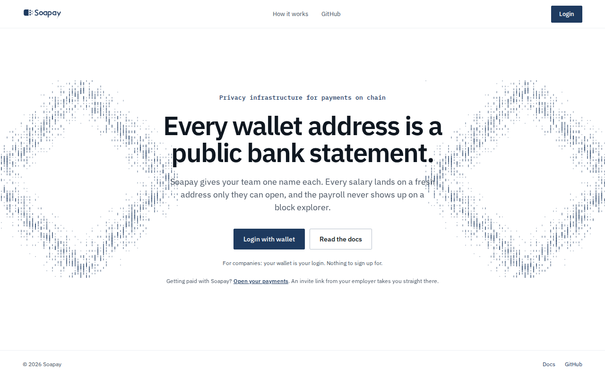
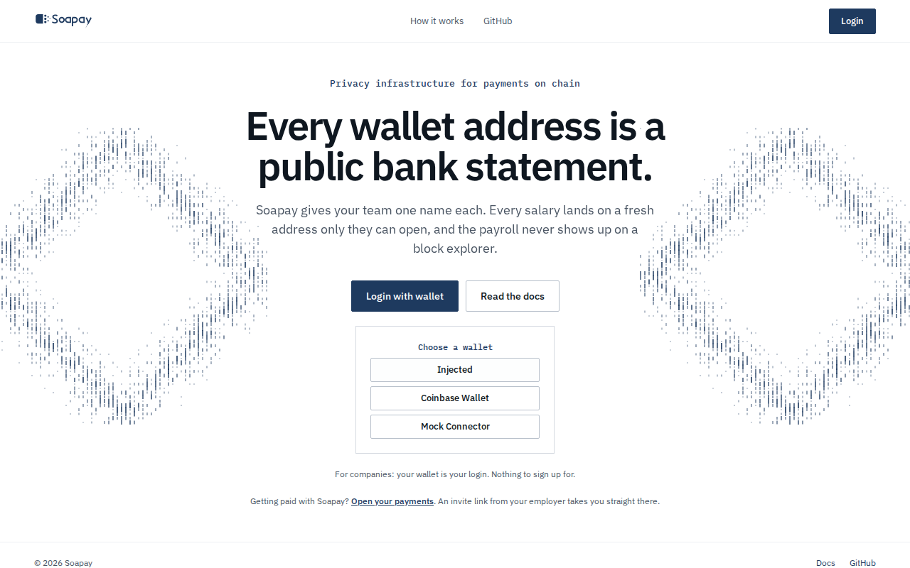
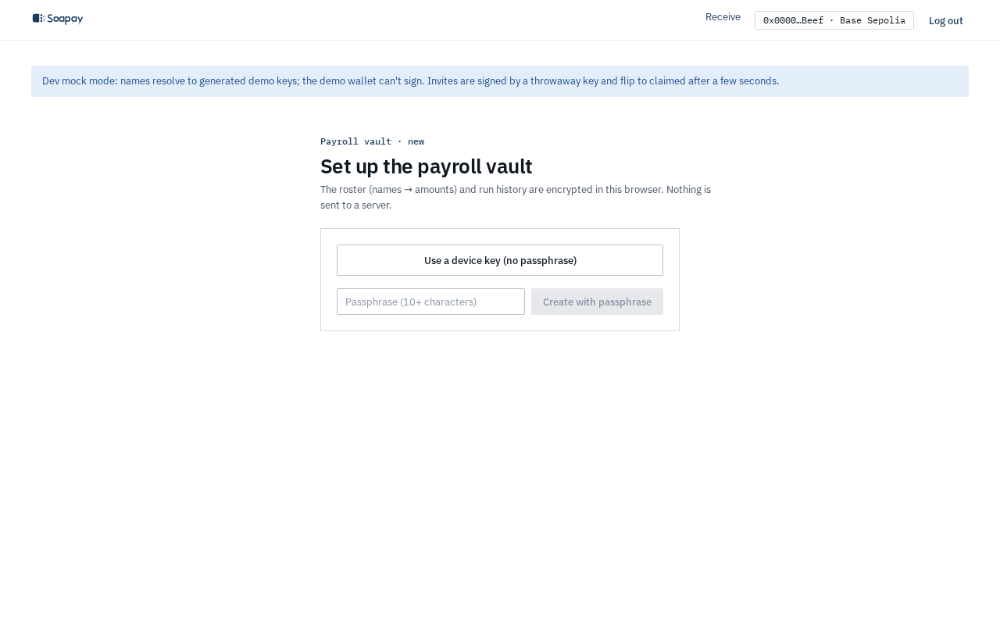
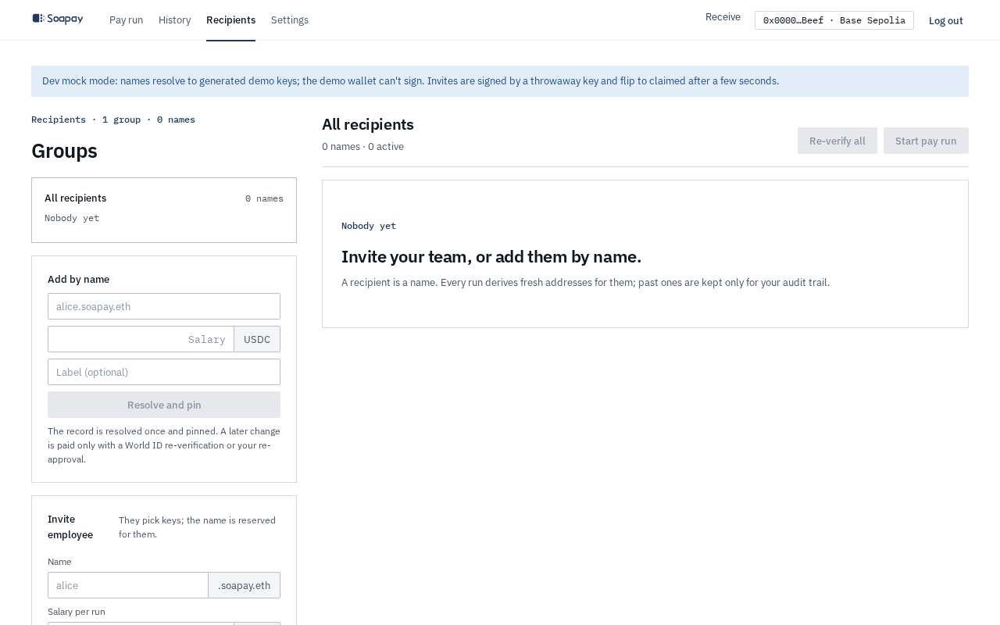

import { Aside, Steps } from "@astrojs/starlight/components";

The [company app](/) is where you keep a recipient roster, prepare pay runs, sign payments, and review past runs. Your wallet is your login. The roster, pending invite codes, and run history stay in an encrypted vault in your browser.

## Log in with a wallet

Select **Login** in the top bar or **Login with wallet** in the page. The **Choose a wallet** panel can show:

- Coinbase Smart Wallet, configured as a smart-wallet-only connector.
- **Browser wallet**, the label used for an injected wallet such as MetaMask or Rabby.
- WalletConnect, when the deployment has a WalletConnect project ID.
- **Demo wallet**, only in demo or development mock mode.

Named wallets appear before **Browser wallet**. The connected account determines how a pay run will be signed later. See [Review and sign](/docs/company-app/review-and-sign/).

## Open the payroll vault

After the wallet connects, the app opens the vault gate. The vault protects the roster, invite codes, and run records. It is encrypted in the browser; with a wallet-signature or passphrase lock an encrypted copy is also kept on the Soapay API, which cannot read it.

<Steps>

1. On **Set up the payroll vault**, choose the protection under **Vault protection**.

2. **Wallet signature (recommended)**: your wallet unlocks the vault and it is backed up encrypted, so logging in with the same wallet restores it in any browser. Your wallet asks you to sign twice when you create it.

3. **Device key** is tied to this browser profile. It is the fastest option, but clearing site data removes the key and it cannot be backed up.

4. **Passphrase** must contain at least 10 characters. It is backed up encrypted, and restoring in another browser asks for the passphrase. Keep it somewhere safe because the app cannot reset it.

5. Select **Create vault**. On a later visit, use **Unlock with wallet** or **Unlock on this device**, or enter the passphrase and select **Unlock**. In a browser that has no vault yet, the app finds your wallet's backup and offers **Restore your payroll**: **Restore with wallet**, or **Restore** with the passphrase.

</Steps>

<Aside type="caution" title="Device-key vaults stay in one browser">
  A device-key vault depends on this browser profile and is never backed up. The wallet-signature and passphrase locks restore from the encrypted backup, so keep the wallet (or the passphrase) your organisation needs for recovery.
</Aside>

## Try the off-chain demo

Open [the demo](/?demo=1) to explore without a real wallet. It loads sample data, mock names, a demo wallet, and an in-memory chain. The API is not called and nothing is sent on chain. The banner says **Demo mode · sample data, nothing on-chain. Balances reset when the tab closes.** Select **Exit demo** to return to the normal app.

The demo faucet button, **Get 10,000 test USDC**, changes only the in-memory demo balance. It is separate from the live Base Sepolia welcome drop.

## Find your way around

Once the vault is open, the top bar contains **Pay run**, **History**, **Recipients**, and **Settings**. **Receive** opens the employee app. The right side also shows a shortened wallet address, the selected chain, and **Log out**. If you saved a company name in Settings, it appears in the top bar and is used as the default organisation on invites.

## Base Sepolia welcome drop

On Base Sepolia, the app requests a welcome drop once for each connected wallet. A successful first claim shows **Welcome: 1,000,000 test USDC sent to your wallet.**, together with **View on Basescan** and **Dismiss**. There is no welcome drop on Base mainnet.

Smart wallets can use sponsored gas on this testnet. A regular wallet still needs a little Base Sepolia ETH to use the StealthDisperse payment path. The **Test USDC** panel shows the connected wallet's balance and links to a Base Sepolia ETH faucet.

Next: [Add recipients and create invites](/docs/company-app/recipients-and-invites/).
