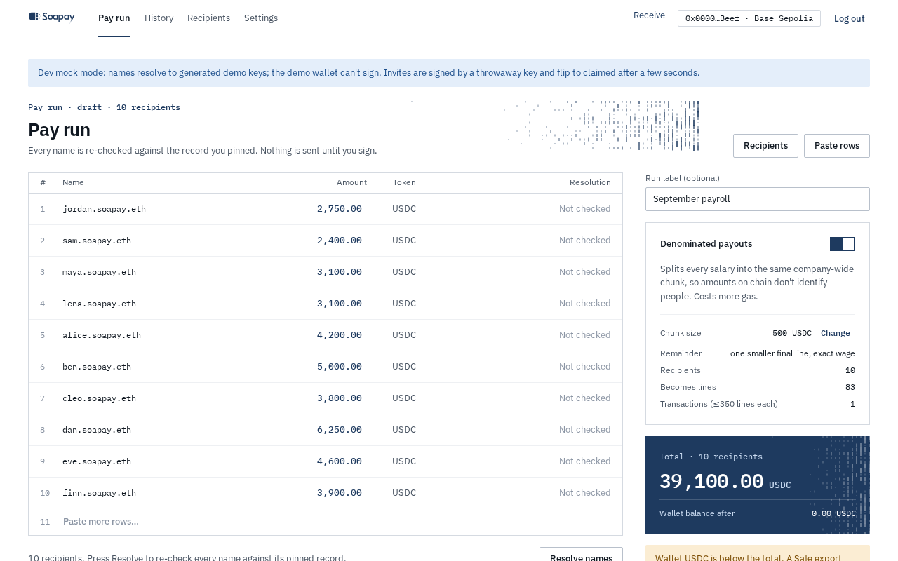
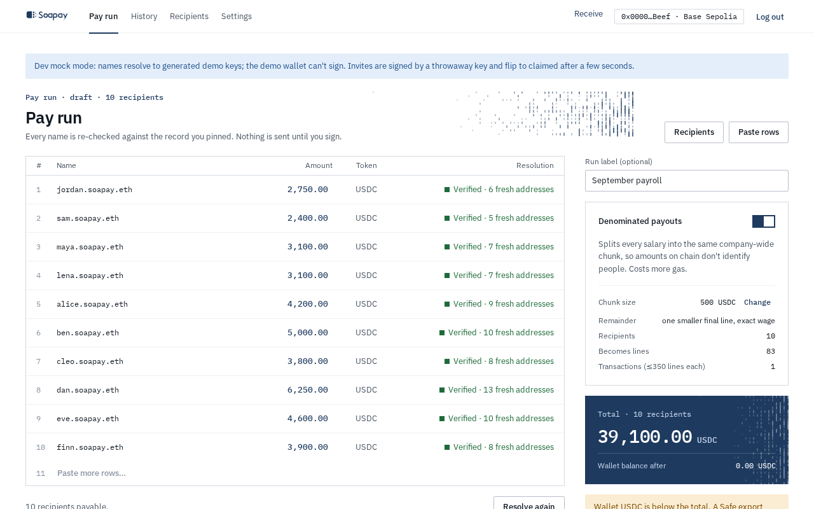

import { Aside, Steps } from "@astrojs/starlight/components";

The **Pay run** page starts from your active roster. Nothing is sent until you resolve the names, review the fresh-address plan, and sign it.

## Paste rows or import CSV

Select **Paste rows** and enter one person per line:

```text
alice.soapay.eth, 12
bram.soapay.eth, 8.5, Bram (design)
```

The columns are `name,amount[,label]`. Select **Resolve and add** to add and pin the valid rows in the roster. You can also select **Import CSV** or download **Template**. A CSV header is optional. Recognised headers are:

| Field | Accepted headers |
| --- | --- |
| Name | `name`, `ens`, `ens name`, `ensname`, `employee` |
| Amount | `amount`, `salary`, `usdc`, `amount (usdc)` |
| Optional label | `label`, `display name`, `note` |

The Base Sepolia template is:

```csv
name,amount,label
alice.soapay.eth,12,Alice (Design)
bob.soapay.eth,8.50,Bob
```

Zero amounts, duplicate names, and malformed rows are reported with their line numbers. Raw stealth meta-addresses and plain `0x` addresses are rejected. Every payee must be a pinned, verified ENS name. Importing updates the roster; it does not bypass enrollment or pin checks.



## Resolve every name

<Steps>

1. Review the active recipients and edit an amount if needed.

2. Select **Resolve names**. The app re-resolves each name and checks it against the pin.

3. A changed record without a valid World ID attestation is left out. Confirm the change with the person first, select **Re-approve**, then resolve again.

4. A name that cannot be resolved is also left out. The summary reports failed names before **Review** becomes available.

</Steps>



## Plan denominated lines

**Denominated payouts** starts on for every run. The app splits each salary into equal lines using the company-wide **Chunk size** from Settings. A 12 USDC salary with a 5 USDC chunk becomes two 5 USDC lines and one 2 USDC remainder. The remainder pays the exact wage and is never carried into a later run.

Turning denominations off applies only to this run. Each person then has one line containing their full salary, which coworkers can read on chain. See [Denominated payouts](/docs/concepts/denominated-payouts/) for the privacy tradeoff.

The page shows recipients, total lines, estimated transactions, total USDC, and the wallet balance after the run. A run label such as `September payroll` is optional.

## Read the warnings

<Aside type="caution" title="Small teams remain easier to identify">
  With fewer than 10 recipients, coworkers can often identify lines by amount or elimination, even when most lines have the same size. The app displays this warning on the draft and review screens.
</Aside>

Unresolved or blocked names are not made payable. A low wallet balance also produces a warning, although a Safe export pays from the Safe rather than the connected wallet.

## Know the hard limits

Each transaction contains at most 350 payment lines. The planner derives every line first, sorts the complete run globally by stealth address, then cuts that one list into roughly equal transaction chunks. It never partitions by employee, because transaction totals could reveal individual salaries. Every line uses a fresh ephemeral key and fresh stealth address.

Select **Review** only after the page reports payable recipients and valid denominations.

Next: [Review and sign the run](/docs/company-app/review-and-sign/).
