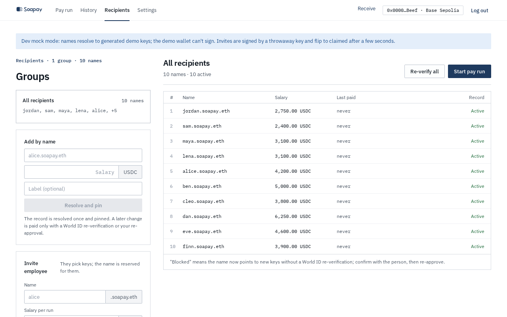
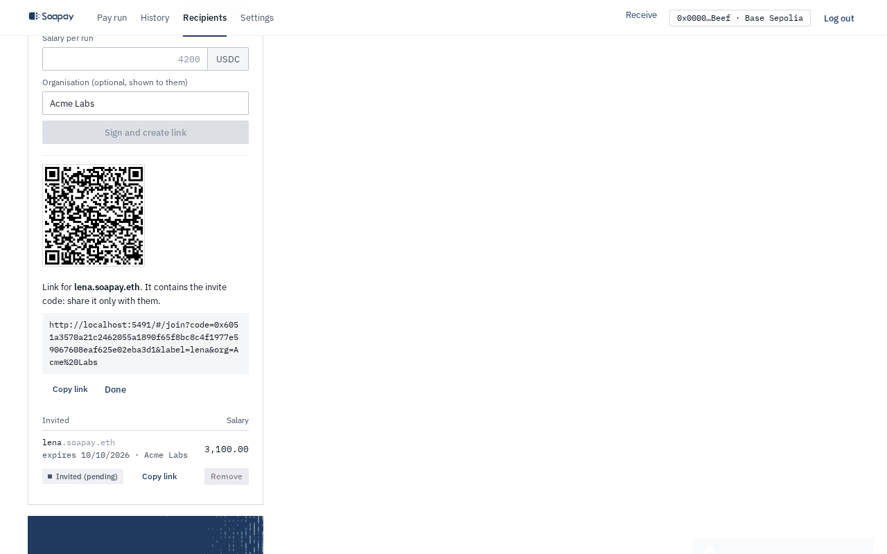
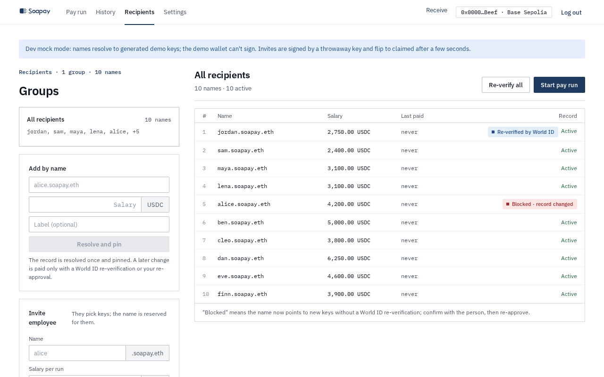
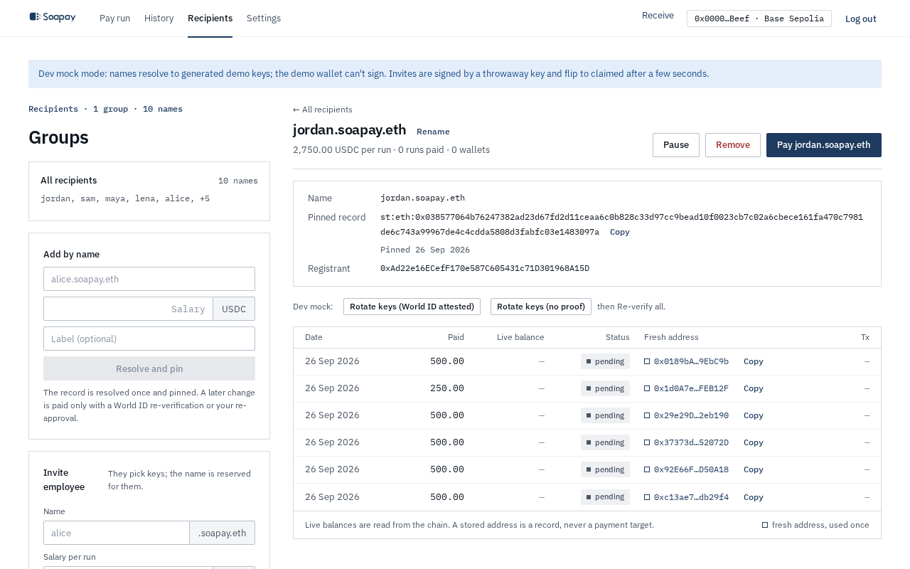

import { Aside, Steps } from "@astrojs/starlight/components";

The **Recipients** page is the company's local roster. A recipient is an ENS name with a salary and a pinned stealth meta-address. A fresh payment address is derived for every line of every run. Past addresses remain audit records and are never reused as payment targets.

## Add someone by name

Under **Add by name**, enter a full name such as `alice.soapay.eth`, a **Salary** in USDC, and an optional **Label**. Select **Resolve and pin**. The app resolves the name, cross-checks its ENS and ERC-6538 records, and stores the approved meta-address in your encrypted vault.

The roster shows the name, salary, last payment, and record state. Use **Re-verify all** before a run if you want to check every pin from the roster. **Start pay run** opens the current active recipients in the pay-run table.

## Invite an employee

An invite reserves a `soapay.eth` label while the employee creates their own keys.

<Steps>

1. In **Invite employee**, enter the **Name** label, **Salary per run**, and optional **Organisation (optional, shown to them)**.

2. Select **Sign and create link**. The connected wallet signs the invite. Smart wallets can validate that signature through ERC-1271.

3. Share the QR code or select **Copy link**. The link has this shape: `/#/join?code=...&label=...&org=...`.

4. Send the link only to that employee. It contains the secret invite code. The row remains **Invited (pending)** until the employee claims the reserved name.

5. When the claim lands, the company app resolves and pins the name through the same checks as **Add by name**. If the records are not readable yet, the row says **Claimed, waiting to verify** and the app tries again.

</Steps>

The code is 32 random bytes. Only the encrypted company vault and the employee's link hold it. The API receives its `keccak256` hash. An invite normally expires after 14 days, and the service permits at most 30 days. An expired row offers **Re-invite**, which creates a new code and signature. **Remove** deletes the local invite row.

<Aside type="caution" title="Treat the link as private">
  The label and organisation in the URL are display hints. The API response is the source of truth, and the secret code is what permits the reserved label to be claimed.
</Aside>

## Understand a rotation

The app resolves every name again before payment and compares it with the pinned record. A new meta-address has two possible outcomes:

- With a valid rotation attestation signed by the attester pinned in Settings, the change is accepted and the row shows **Re-verified by World ID**.
- Without that attestation, the row shows **Blocked · record changed**. Confirm the change with the employee on another channel, then select **Re-approve** or **Re-approve new record**.

This is the difference between an attested self-service rotation and a manual rotation. The app does not assume that any changed record is safe.

## Open recipient detail

Select a roster row to see the recipient detail. It includes the full name, salary per run, number of runs and wallets, the pinned record, the registrant, and pin history. You can **Rename** the local display label, **Pause**, **Resume**, **Remove**, or **Pay** that recipient.

The wallet table lists every fresh address used for this recipient, the amount paid, live balance, spend state, and transaction link. Its footer states that balances come from chain and stored addresses are never reused as payment targets.

Learn why pins matter in [Names](/docs/concepts/names/) and [Key rotation and recovery](/docs/concepts/key-rotation-and-recovery/).

Next: [Prepare a pay run](/docs/company-app/pay-run/).
