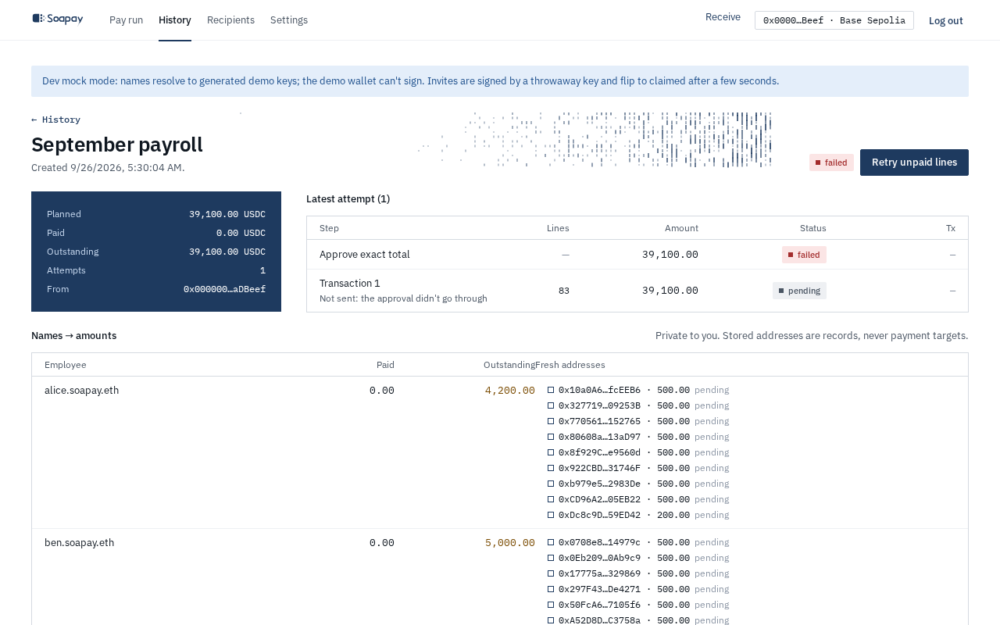

import { Aside, Steps } from "@astrojs/starlight/components";

The review page is the final checkpoint before money moves. It shows the exact total, recipient count, number of fresh addresses, transaction count, estimated gas, network, and payer. **What each person receives** lists the private name-to-amount mapping that remains in your encrypted history.

## How the app chooses a path

Soapay checks the connected account and its wallet capabilities. It does not use a non-atomic sequence of separate announce and transfer transactions.

### Plain account: StealthDisperse

If the wallet does not report EIP-5792 atomic batching and StealthDisperse is configured and deployed, the page says **Approve the exact total, then N StealthDisperse payments**. Select **Approve and send**.

The first transaction approves only this run's total, never an unlimited allowance. If the existing allowance already equals that total, the approval step is skipped. Each following transaction calls StealthDisperse for one chunk, and each line is paid and announced atomically.

### Smart account: EIP-5792 atomic batches

If the wallet reports atomic batching as supported or ready, each chunk becomes one `wallet_sendCalls` batch of paired USDC transfers and announcements. An account reported as ready can first be upgraded through EIP-7702. The page says **N atomic batches, one signature each (EIP-5792)** and the action is **Sign and send**.

On Base Sepolia, a compatible wallet can use the Soapay API's paymaster service, so the employer pays no ETH gas for this path.

### Safe: Transaction Builder export

A Safe uses an export rather than signing through the page. Select **Paying from a Safe? Export instead**, enter the Safe address, then select **Export for Safe**. Download every part and import each file into Safe Transaction Builder.

Each exported Safe transaction delegates to `MultiSendCallOnly`, which executes plain calls from the Safe. Never replace it with `MultiSend`. Execute every exported part.

## Sign for the exact total

"Exact total" means the token approval equals the sum of the planned lines for this attempt. It is not a maximum approval and it does not authorise future payroll. The review headline and **Total** row are the values to compare with your wallet prompt.

Check warnings before signing. The page calls out small teams, distinctive remainder lines, line amounts that occur only once, a wallet on the wrong chain, and runs larger than the Base Sepolia welcome drop.

## If a transaction fails

<Steps>

1. The app sends chunks in order. After a failed or reverted chunk, later chunks are not sent.

2. Open the run from **History**. Landed chunks stay paid and are not included again.

3. Select **Retry unpaid lines**. The app re-verifies the affected recipients, derives new fresh addresses for only the unpaid obligations, sorts them globally, and creates a new attempt.

</Steps>

<Aside type="caution" title="Unknown is not failed">
  If the page reloads while a wallet prompt or confirmation is in flight, the step becomes **unknown**. Select **Recheck** before retrying. If an interrupted step has no transaction hash or batch ID and you verified that it never left the wallet, select **I checked: never sent**. This prevents a retry from silently paying twice.
</Aside>

The run page records **Approve exact total**, every transaction, its state, its transaction link when known, and each attempt. See [What the chain sees](/docs/concepts/what-the-chain-sees/) for the public result.

Next: [Read run history](/docs/company-app/history/).
