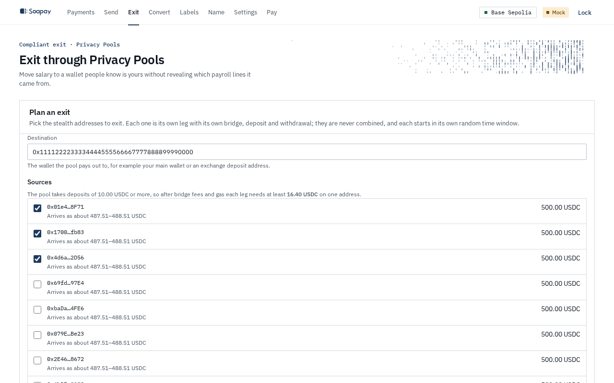
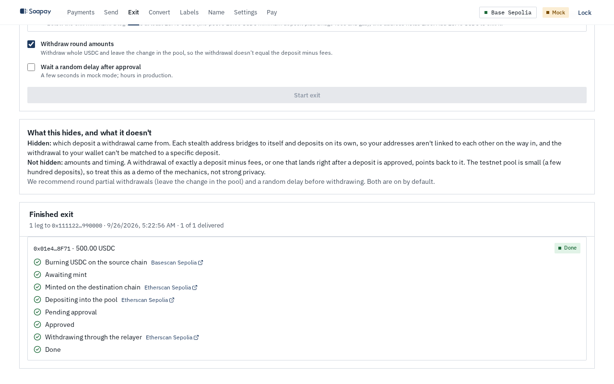

import { Aside, Steps } from "@astrojs/starlight/components";

The compliant exit moves USDC to an identifiable wallet without revealing which payroll line was yours. Each stealth address travels as its own leg through Circle CCTP and a screened Privacy Pool. Legs are never combined before the pool.

<Aside type="caution" title="Hidden on Base Sepolia">
  The public Base Sepolia employee app has no **Exit** tab, route, or guard offer. That demo pays in Soapay's mock USDC, while CCTP bridges Circle USDC. The screenshots below show the implemented planning and completion states, not a control exposed in the current Base Sepolia app.
</Aside>

## When to use it

Use Exit when the destination is your main wallet, an exchange deposit, or another address that identifies you. A direct Send to that address would link a payroll stealth address to your identity. The guard offers the compliant route where a supported Circle USDC exit is configured.

For a destination that does not identify you, ordinary [Send](/docs/employee-app/send/) is simpler. Exit adds bridge, pool, screening, withdrawal, and fee steps.

## Plan the exit

<Steps>

1. Enter the **Destination** wallet.

2. Under **Sources**, select eligible stealth addresses. Each address becomes an independent leg with its own bridge, deposit, and withdrawal.

3. Choose between the relayer and **Withdraw directly (your destination wallet pays a little ETH gas)**. Direct withdrawal avoids the relayer fee but requires the destination wallet to send one transaction.

4. Leave **Withdraw round amounts** and **Wait a random delay after approval** on when possible. Rounded withdrawal amounts and a 2 to 24 hour delay reduce amount and timing matches.

5. Read the complete fee summary and select **Start exit**. Multiple legs enter separate random start windows. **Start now** trades away that timing separation.

</Steps>

The plan shows bridge fees, paymaster gas on both chains, the 1% pool entry fee, the relayer charge when used, total fees, any change left in the pool, and **You receive** at the destination. Live Circle, relayer, and Sepolia gas quotes are used when available; otherwise the route estimates are shown.

## Fees and minimums

The pool itself accepts deposits of at least 10 USDC. A leg needs more because bridge and gas costs are paid before the deposit. For the documented testnet route, fallback figures are:

| Item | Approximate testnet figure |
| --- | --- |
| CCTP and Circle forwarding | About 2.2 USDC per leg |
| Destination-chain deposit gas estimate | 5.8 USDC before the SDK's planning headroom |
| Pool entry fee | 1% |
| Relayer | 0.1% plus about 21.5 USDC fixed gas cost |
| Smallest direct-withdrawal leg | About 18.6 USDC on one stealth address |
| Smallest relayed leg | About 81.3 USDC on one stealth address |

The direct destination wallet pays about 0.001 Sepolia ETH. Fund that ETH from a public faucet, exchange, or another source not linked to you. Funding it from your own known wallet creates the link you are trying to avoid. Actual minimums are derived from the current quotes and displayed in the planner.

## Follow a leg to completion

Each leg records burn, forwarded mint, pool deposit, screening, and withdrawal. The app saves each on-chain step before sending it, so a reload can resume without blindly submitting it twice. If screening declines the deposit, **ragequit** returns it to the same stealth address and nothing reaches the destination.

The exit hides which approved deposit funded a withdrawal. It does not hide amounts or timing, and a small pool has a weak anonymity set. Read the full limits in [Compliant exit](/docs/concepts/compliant-exit/).

Next: [Rotate your pay name to new keys](/docs/employee-app/rotation/).
