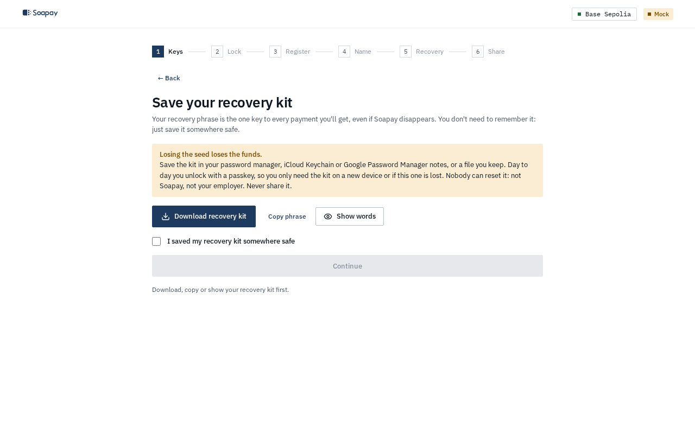
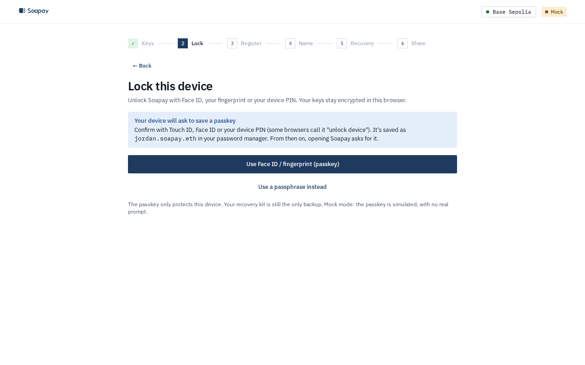
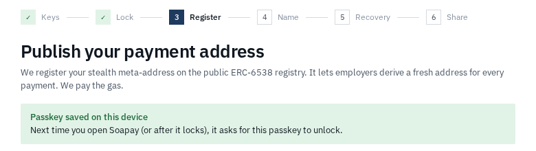

import { Aside, Steps } from "@astrojs/starlight/components";

Your recovery phrase is the root of your Soapay account. It recreates the keys that find and spend every payment, including payments received before a key rotation. Soapay presents the phrase as a recovery kit so you can save it instead of memorising it.

## Save the recovery kit

On **Save your recovery kit**, choose at least one action:

- **Download recovery kit** creates a small text file in your browser. It contains the phrase, the reserved pay name when an invite supplied one, the date, and restore instructions.
- **Copy phrase** lets you place it in a password-manager note.
- **Show words** lets you write the phrase on paper.

Then tick **I saved my recovery kit somewhere safe** and select **Continue**. There is no word quiz. The phrase appears on this screen only. If you return from the next step, the app shows **Recovery kit saved** rather than displaying it again.

<Aside type="danger" title="Anyone with the phrase can spend your funds">
  Nobody can reset or revoke the phrase. Do not send it to Soapay, your employer, or support. Save it in a password manager, a secure cloud-keychain note, or a file you keep safe.
</Aside>

## Use a passkey to unlock

The default lock uses a passkey protected by Face ID, a fingerprint, or your device PIN. Select **Use Face ID / fingerprint (passkey)** and approve the device prompt. The passkey encrypts and unlocks the local vault; it does not replace the recovery kit.

If the browser cannot use the required passkey feature, select **Use a passphrase instead**. The app asks for a passphrase of at least 10 characters and encrypts the same local vault. A synced passkey in iCloud Keychain or Google Password Manager can be a useful second backup, but it must never be the only backup.

## Recover after device loss

<Steps>

1. Open the employee app on the new device and select **Restore from recovery phrase**.

2. Select **Open recovery kit** for the saved text file, or enter the 12 or 24 words under **Recovery phrase**.

3. Create a new passkey or passphrase for this browser.

4. Let the app rescan the chain. The same phrase derives the same viewing and spending keys, so every earlier payment can be found again.

</Steps>

A lost device does not require key rotation if the phrase remained secret. If a passkey stops working on a device, **Passkey not working? Restore from your recovery phrase or wallet** lets you delete that browser's encrypted vault and restore.

## Respond to a leaked phrase

A leaked phrase is different from a lost device. Assume the old stealth addresses can be spent by the person who has the phrase.

1. Open **Name** and select **Rotate to new keys**.
2. Complete the World ID Proof of Human step if a recovery session is already linked. Otherwise rotate manually and tell your employer to approve the changed record.
3. Move funds from the old addresses promptly. World ID protects future salary routing, not money already controlled by the leaked phrase.

Older key generations remain scanned and spendable in your app. Rotation changes where future payments go. Learn the full employer check in [Key rotation and recovery](/docs/concepts/key-rotation-and-recovery/).

Next: [Walk through onboarding](/docs/employee-app/onboarding/).
