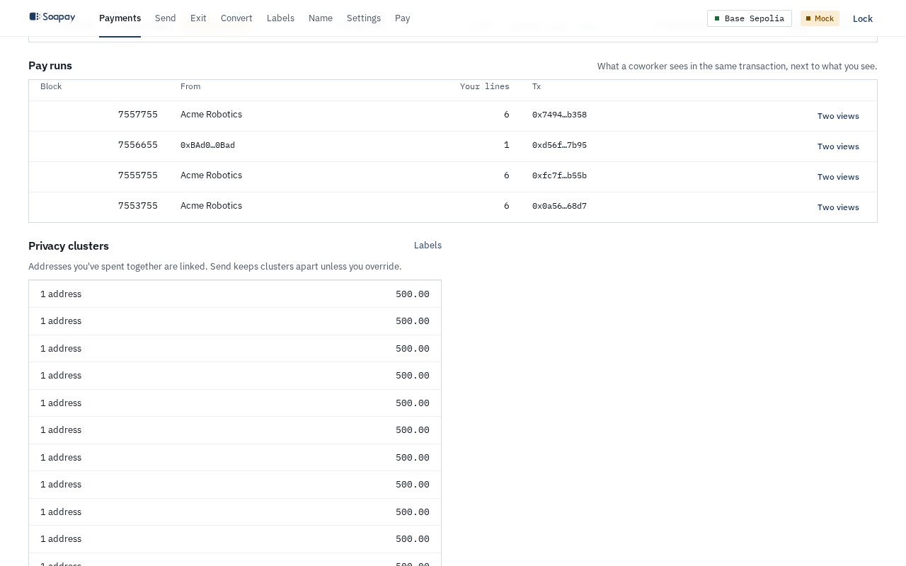
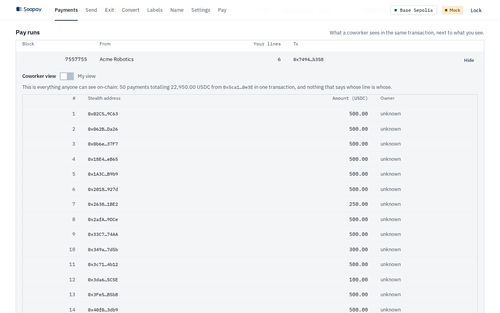
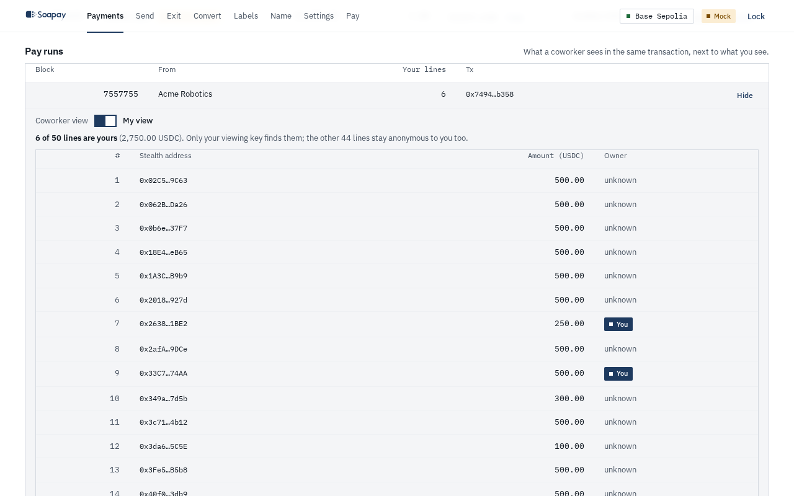
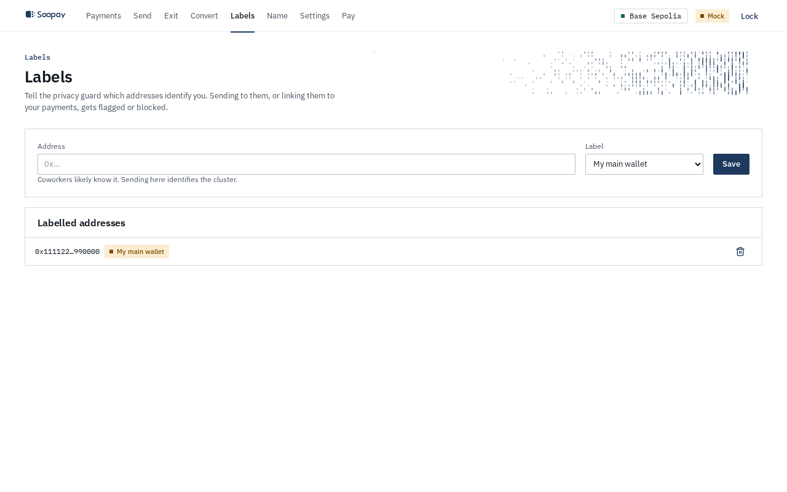

import { Aside } from "@astrojs/starlight/components";

The **Payments** screen is your local view of public ERC-5564 announcements. The app tests announcements with your viewing keys, keeps the matches, and reads the token balance of each matched stealth address.

## Scan for payments

Select **Rescan** to continue from the last scanned block. Select **Rescan from start** to rebuild the result from the beginning. During a scan, the app reports its phase. When it finishes, the summary shows how many announcements were checked, how long the scan took, how many workers ran, and how many new payments were found.

The headline is the sum of live USDC balances across matched addresses. The ledger shows **Block**, **From**, **Announced**, **Live balance**, **Address**, and **Tx**.

<Aside type="note" title="Trust the live balance">
  **Announced** is an untrusted hint supplied by whoever made the announcement. **Live balance** is read from the token contract and is what you can spend. The app also checks the token and amount hints against chain data.
</Aside>

## Read row state and flags

A newly matched payment appears as its own stealth-address row. If its live balance is positive, it is available to **Send**. As funds leave that address, the live balance falls; a zero balance remains in the ledger as history. Open **Details** to see announcement data and the guard reminder for that address.

Rows can show these flags:

- **Unknown payer** when the announcing address is not in **Known payers**.
- **Duplicate announcement** when the same payment was announced more than once.
- **No metadata**, **Token mismatch**, or **Amount mismatch** when an announcement hint is missing or disagrees with chain data.
- **Balance unavailable** when the balance read did not complete.

These flags do not replace the live balance. They explain why an announcement needs attention.

## Compare two views of a pay run

Under **Pay runs**, select **Two views** for a transaction.

**Coworker view** shows every payment in the transaction, the payer, total, fresh addresses, and amounts. It does not say which line belongs to anyone.

**My view** shows the same public list and marks only the lines your viewing key matched as **You**. The other lines remain **unknown** to you. This is why a recipient can prove what they received without learning colleagues' ownership.

## Label addresses for the guard

Open **Labels** before sending to wallets people may recognise. Add an address and choose:

- **My main wallet**, identifiable to coworkers.
- **Exchange deposit**, tied to your KYC identity.
- **Known to coworkers**, any address a colleague could recognise.
- **Other**, tracked without being treated as identifying.

The privacy graph groups addresses that have been spent together. **Privacy clusters** marks a cluster as **Identified** when it touches an identifying label. The Send screen uses these labels and clusters to warn or block a new link.

Next: [Send without accidental consolidation](/docs/employee-app/send/).
