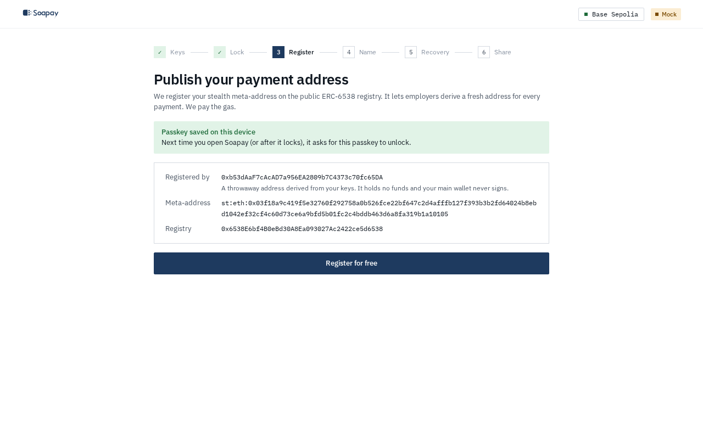
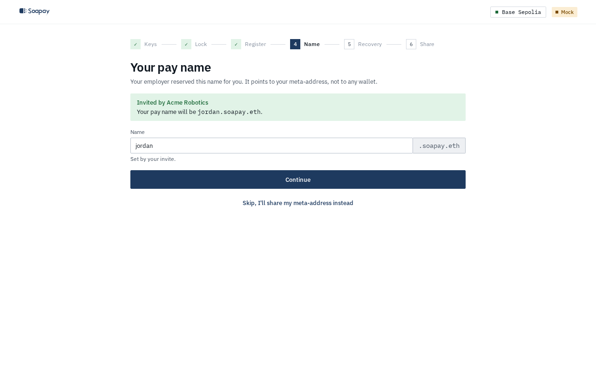
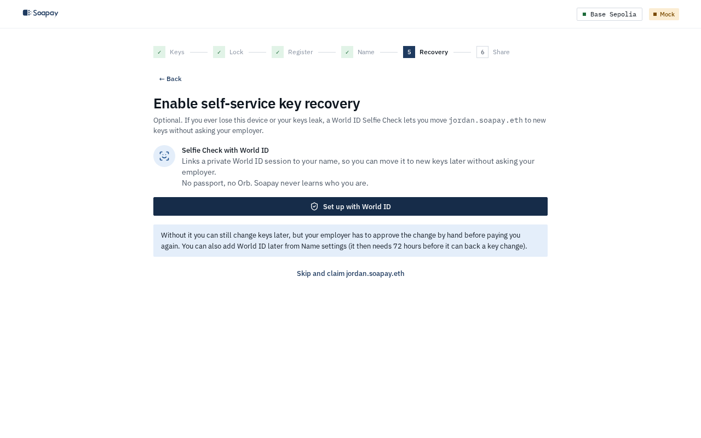
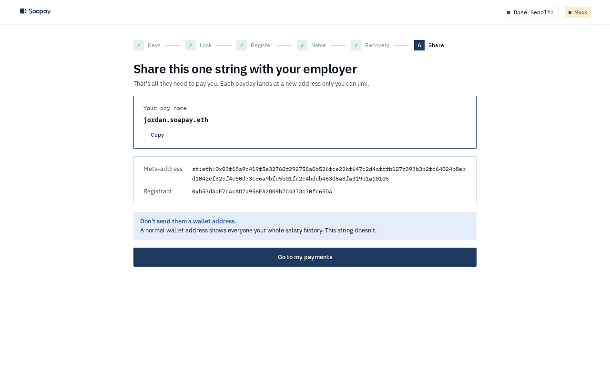

import { Aside, Steps } from "@astrojs/starlight/components";

You can start from an employer invite or open the [employee app](/app/) directly. You do not need a wallet or gas for a new recovery-phrase account.

## Complete the setup

<Steps>

1. **Start.** On **Get paid without broadcasting your balance**, select **Create a new account**. If you already have a recovery kit, select **Restore from recovery phrase** instead. An invite shows **Invited by** the organisation and the reserved `soapay.eth` name.

   

2. **Save your recovery kit.** Use **Download recovery kit**, **Copy phrase**, or **Show words**. Tick **I saved my recovery kit somewhere safe**, then select **Continue**. The phrase is the only secret that can recover all your payments.

3. **Lock this device.** Select **Use Face ID / fingerprint (passkey)** and approve the prompt. If passkeys are unavailable, select **Use a passphrase instead**, enter the passphrase twice, and select **Encrypt and continue**.

4. **Publish your payment address.** Select **Register for free**. The app signs with a throwaway registrant derived from your keys and relays an ERC-6538 registry update. The registrant holds no funds, your main wallet never signs, and Soapay pays the gas.

   

5. **Choose your pay name.** An invite locks the name its employer reserved. Without an invite, enter a label under **Pick your pay name** and select **Continue** when it is available. The name points to your meta-address, not a normal wallet, and does not show your balance. You can select **Skip, I'll share my meta-address instead**, but a name is easier to type and can later move to new keys.

   

6. **Enable self-service key recovery.** This step is optional. Select **Set up with World ID** and approve the **Proof of Human with World ID** flow. The session lets you move the name to new keys later without asking your employer. Select **Skip and claim** if you prefer manual employer approval for future rotations.

   

7. **Share one string.** On **Share this one string with your employer**, select **Copy**, then **Go to my payments**. Share the pay name when you claimed one. Do not send a normal wallet address.

   

</Steps>

## What an invite changes

An invite URL has the shape `/#/join?code=...&label=...&org=...`. The label is prefilled and locked, and the page shows the organisation. After the name claim succeeds, the inviting employer is added to **Known payers**, so its announcements are not flagged as **Unknown payer**.

An expired, claimed, or unknown invite shows a clear message and continues with normal name selection. If you already have an onboarded vault but no name, the app asks you to unlock and then opens the claim flow.

<Aside type="tip" title="Link World ID during sign-up">
  A Proof of Human session created during name setup can support rotation immediately. A session attached later from **Name** has a 72-hour wait before it can attest a key change (the public testnet demo sets this wait to zero).
</Aside>

## What registration publishes

The public registry receives your stealth meta-address under the throwaway registrant. A name claim then points the ENS `stealth` record at the same meta-address. Employers derive a new payment address from that public record for each line. Your recovery phrase, viewing key, and spending key remain in your browser.

Next: [Find payments in the ledger](/docs/employee-app/ledger/).
