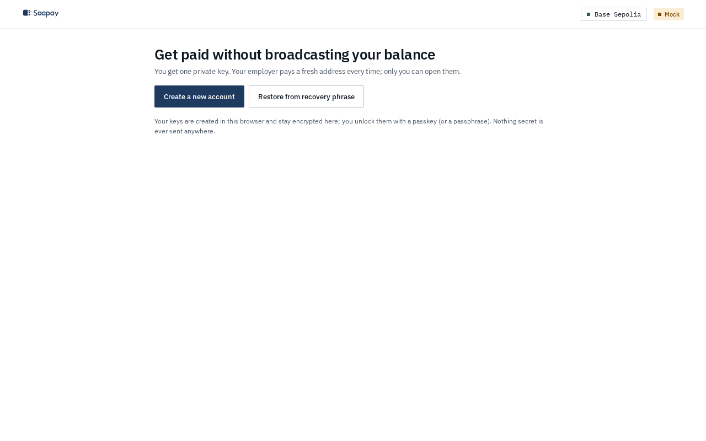

import { Aside } from "@astrojs/starlight/components";

The [employee app](/app/) creates your receiving keys, registers a stealth meta-address, and finds payments that belong to you. You share one `soapay.eth` name or meta-address. Each payment lands on a fresh address that only your viewing key can recognise and your spending key can use.

## What stays private

Your recovery phrase and spending keys stay on the client. The browser encrypts them with a passkey or passphrase, and unlocks them only for local work such as scanning and signing a spend. Spending keys never leave the client.

Soapay has no telemetry that can link addresses without explicit opt-in. The scanner receives public announcements and tests them locally with your viewing key. The API can serve the public announcement set, but it does not receive your viewing key and cannot tell which results match you.

<Aside type="caution" title="Your browser is not your backup">
  The encrypted vault is convenient local storage. Your recovery kit is what restores every key and payment on a new device. Save it during onboarding and never share it.
</Aside>

## Screens at a glance

| Screen | What you do there |
| --- | --- |
| **Payments** | Rescan public announcements, see live balances, inspect one payment, and compare **Coworker view** with **My view** for a pay run. |
| **Send** | Choose a destination and amount, review source addresses and fees, then follow the consolidation guard. Multi-address sends are queued to reduce timing links. |
| **Exit** | Use a screened Privacy Pools route to reach an identifiable wallet without exposing which payroll line was yours. This screen is hidden on Base Sepolia. |
| **Labels** | Mark your main wallet, exchange deposit, coworker-known address, or another address so the privacy guard can recognise risky destinations. |
| **Name** | View the current key generation, link World ID for self-service recovery, and rotate the name to new keys. |
| **Settings** | Configure network services, known payers, scan source, spend window, device lock, encrypted backup, and advanced recovery. |

The top bar also contains **Pay**, which opens the company app, and **Lock**, which closes the local vault. On the Base Sepolia demo, **Exit** is absent because the mock test USDC cannot travel through Circle CCTP.

## How the app opens

The app follows a simple gate:

1. With no vault, it opens onboarding.
2. With an unfinished profile, it resumes onboarding.
3. With a locked vault, it shows **Unlock Soapay**.
4. With an unlocked, onboarded vault, it opens **Payments** and starts the scanner services.

An invite link is carried through the same gate. A new user sees the employer and reserved name during onboarding. An existing user unlocks first and can claim the invite if the account has no name.

## What is public

The ERC-6538 registry holds your public stealth meta-address, and your ENS name points to it. Pay-run announcements, payment addresses, amounts, and transactions are public. The private fact is which fresh addresses belong to you. See [Stealth addresses](/docs/concepts/stealth-addresses/) and [What the chain sees](/docs/concepts/what-the-chain-sees/).

Next: [Protect your keys and recovery kit](/docs/employee-app/keys-and-recovery/).
