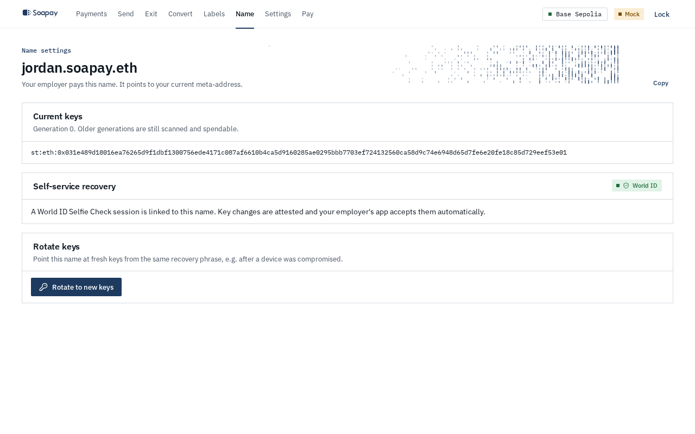
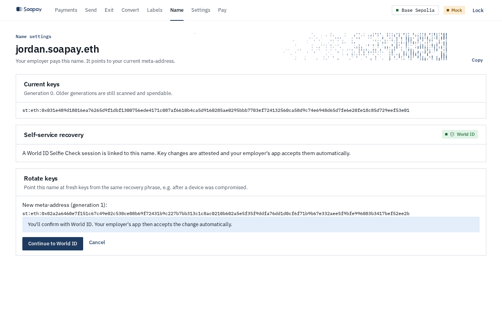
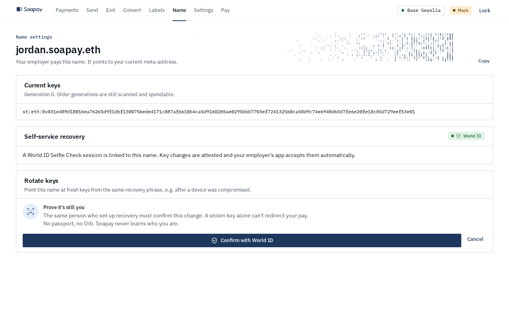
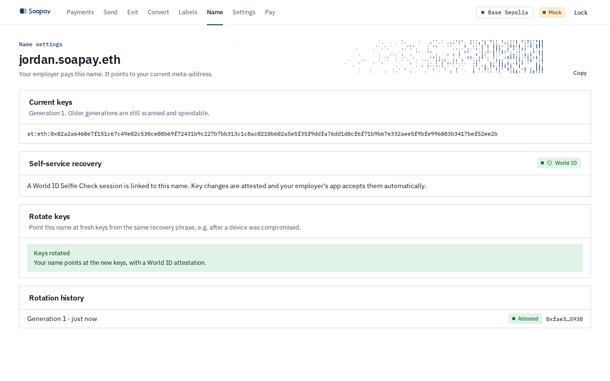

import { Aside, Steps } from "@astrojs/starlight/components";

Key rotation changes the meta-address behind your pay name. Use it after a device compromise or recovery-phrase leak, or whenever the current receiving keys should no longer receive future payments. Older generations remain scanned and spendable.

## Check your recovery path

Open **Name** and read **Self-service recovery**:

- **World ID** means a Proof of Human session is linked and ready. The resulting rotation is attested, and the employer's app can accept it automatically.
- **Employer approval** means no ready session is linked. You can still rotate, but the employer must approve the new record by hand before paying again.

If you attach World ID after claiming the name, the page shows **World ID linked, waiting period running**. The session needs 72 hours before it can attest a rotation (the public testnet demo sets this wait to zero). This prevents someone with a stolen key from attaching their own session and immediately redirecting pay.

## Rotate the name

<Steps>

1. Select **Rotate to new keys**. The app derives the next key generation from the recovery phrase and shows the new meta-address.

2. Review the path. An attested rotation says the employer will accept it automatically and offers **Continue to World ID**. A manual rotation warns **Your employer must approve this** and offers **Rotate anyway**.

   

3. For the attested path, complete **Prove it's still you** with the same World ID Proof of Human session linked to this name.

   

4. The app signs the rotation, submits the proof, relays the new ERC-6538 registration without gas from you, and updates the ENS `stealth` record on Sepolia.

5. On **Keys rotated**, tell the employer only if the page says manual approval is required.

   

</Steps>

If the registry update succeeds but the ENS write does not, **A rotation is half done** appears with **Finish it**. Use it to resume the existing change instead of creating another generation.

## What the employer sees

Before every pay run, the company app compares the name with its pin.

- An attested change shows **Re-verified by World ID** and becomes the new approved pin.
- A manual change shows **Blocked · record changed**. The employer confirms with you on another channel, then selects **Re-approve new record**.

Until one of those checks succeeds, the changed line is not payable. The attestation covers the exact old and new meta-addresses and must be signed by the attester pinned in the company app.

## After a stolen phrase

<Aside type="danger" title="Rotation protects future pay, not old balances">
  Someone with the old phrase can still spend funds already held by older stealth addresses. Rotate the name and move those funds promptly.
</Aside>

If World ID is unavailable or was never linked, take the manual path and contact the employer. The security boundary is the same: the company app blocks the changed record until either a valid attestation or an explicit employer approval exists.

Accounts created with the older wallet-signature flow must first select **Create recovery phrase** and **Use this phrase for my new keys**. Their old addresses remain in the ledger and spendable while the name moves to the new phrase-derived generation.

Next: review [Key rotation and recovery](/docs/concepts/key-rotation-and-recovery/) for the full threat model.
