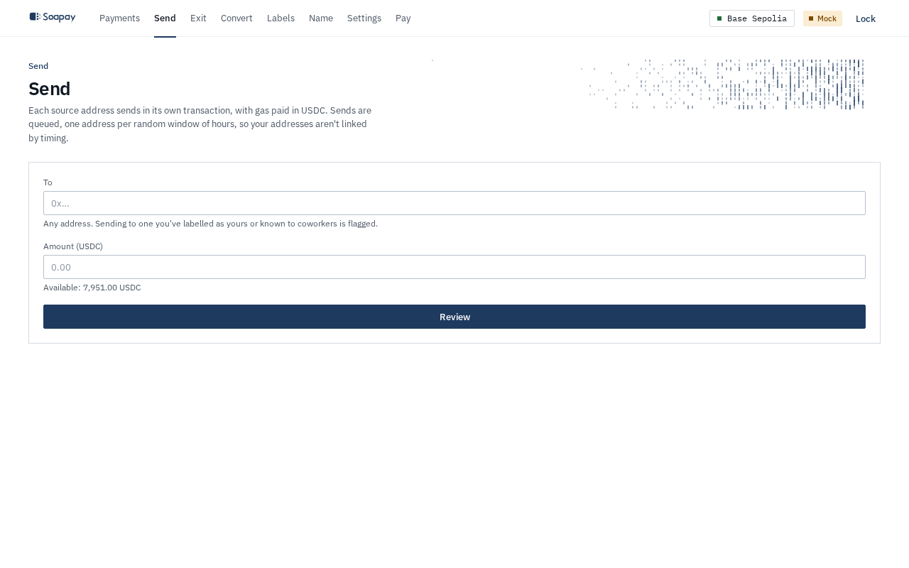
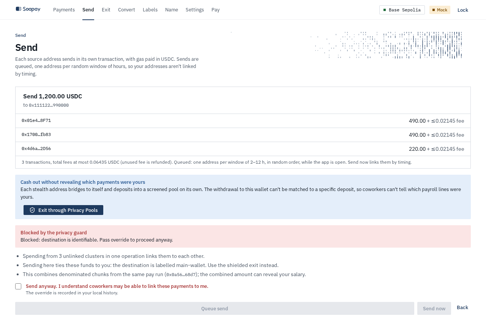
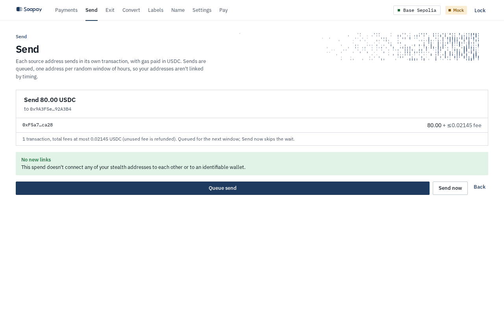
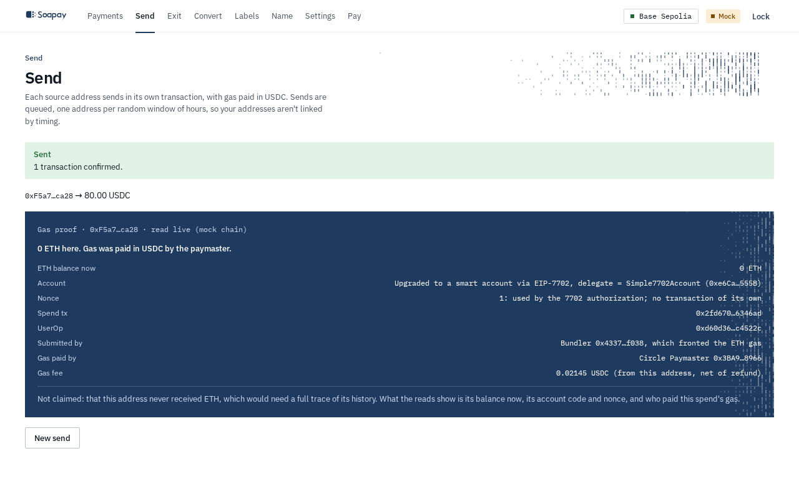

import { Aside, Steps } from "@astrojs/starlight/components";

**Send** moves USDC from one or more stealth addresses. The app chooses sources, quotes fees, and checks the resulting links before anything is queued or submitted.

## Prepare a send

Enter a `0x` address under **To**, enter **Amount (USDC)**, and select **Review**. A destination you labelled as yours or known to coworkers is recognised by the guard. The review lists each source address, its amount, its maximum fee, the number of transactions, and total fee cap. Unused fee is refunded.

Each source sends in its own transaction. On Base Sepolia, gas is sponsored. On mainnet, the Circle paymaster takes the gas fee in USDC.

## Understand the consolidation guard

The guard evaluates the source clusters, destination, labels, and pay-run history.

| Result | Meaning |
| --- | --- |
| **No new links** | This spend does not connect your stealth addresses to each other or to an identifiable wallet. |
| **Privacy warning** | The send merges clusters, reuses a destination, or combines denominated chunks whose total may reveal your salary. Sending remains available. |
| **Blocked by the privacy guard** | The destination is identifiable and this send would connect new stealth funds to it. |

When a plan is blocked, **Queue send** and **Send now** remain unavailable until you tick **Send anyway. I understand coworkers may be able to link these payments to me.** The app replans the spend as an explicit override and records that choice in local history. On a chain where a compliant exit is offered, the review also offers **Exit through Privacy Pools**.

<Aside type="caution" title="Combining chunks can reveal a salary">
  Several same-run chunks that were previously unrelated become one visible cluster when they fund the same action. Their sum can reveal your salary even when the employer used denominations.
</Aside>

## Queue or send now

<Steps>

1. Select **Queue send** for the privacy-preserving default. Sources are released in random order, one address per random window of 2 to 12 hours, while the app is open.

2. Keep the app open, or return later. The queue shows **Queued**, the next window, and per-item **Cancel** or **Retry** actions.

3. Select **Send now** only when speed matters more than timing privacy. It sends the sources within about a minute, so a coworker watching the chain can link them by timing.

</Steps>

## How gas-sponsored spending works

For each source, the app derives the spending key only in memory. The address is upgraded to a smart account through EIP-7702 and submits a UserOperation through the bundler. The paymaster covers gas on Base Sepolia. No ETH needs to be sent to the stealth address.

After confirmation, **Gas proof** reads the address and transaction live. It shows the current ETH balance, the EIP-7702 delegate, nonce, spend transaction, UserOperation, bundler, paymaster, and gas fee. It does not claim the address never held ETH, because that would require a full history trace.

## Review the result

A successful immediate send shows **Sent** and the confirmed transaction count. A partial result says **Partly sent**, identifies the failed source, and explains that only addresses that actually sent became linked. Rescan, then send the remainder again.

Next: [Use the compliant exit](/docs/employee-app/exit/).
