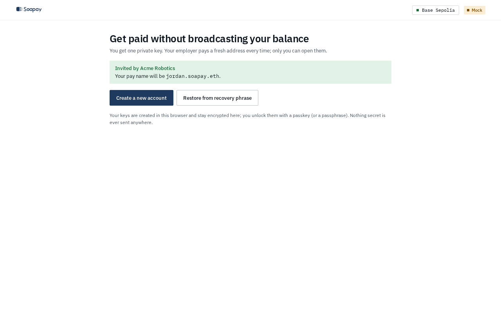

import { Aside, Steps } from "@astrojs/starlight/components";

This guide takes you from your employer's invite to your first payment. You need no wallet and no gas: your keys are created in your browser, and Soapay pays the gas to register them.

## What you need

- An invite link from your employer, or the [employee app](/app/) if you want to pick your own name.
- A browser. Your keys are created and kept in it, encrypted, and unlocked with a passkey (Face ID, a fingerprint or a device PIN) or a passphrase.
- Somewhere safe to keep a recovery kit: a password manager, iCloud Keychain or Google Password Manager notes, or a file you keep.
- Optional: the World App with a Proof of Human credential, for self-service key recovery.

## Set up in six steps

<Steps>

1. **Open the invite.** The app shows "Invited by" your organisation and "Your pay name will be" your reserved name, such as `alex-demo.soapay.eth`. Click **Create a new account**. Without an invite, open the app and pick a name in step 5.

   

2. **Save your recovery kit.** Your recovery phrase is the one key to every payment you will ever get, even if Soapay disappears. You do not need to remember it: click **Download recovery kit** for a small file with the phrase and restore instructions, **Copy phrase** for a password-manager note, or **Show words** for paper. Tick "I saved my recovery kit somewhere safe" and click **Continue**. The phrase is shown on this screen only.

3. **Lock this device.** Click **Use Face ID / fingerprint (passkey)** and confirm with your device. If your browser cannot use a passkey, choose **Use a passphrase instead**. The passkey also encrypts a backup of your vault that the app keeps on the Soapay API, so **Unlock with passkey** brings it back on a new device; the recovery kit is still the root of everything.

4. **Publish your payment address.** Click **Register for free**. The app registers your stealth meta-address on the public ERC-6538 registry through a throwaway address derived from your keys. Your main wallet never signs, and Soapay pays the gas.

5. **Claim your name.** With an invite, the name is set for you: click **Continue**. Without one, type a name under **Pick your pay name** and click **Continue**. The name points to your meta-address, not to any wallet, and never shows your balance. You can also click **Skip, I'll share my meta-address instead**.

6. **Enable self-service key recovery (optional).** Click **Set up with World ID** and approve Proof of Human in the World App. If you ever lose this device or your keys leak, this lets you move your name to new keys without asking your employer. Or click **Skip and claim** your name. Then, on **Share this one string with your employer**, copy your pay name and click **Go to my payments**.

</Steps>

<Aside type="tip" title="Link World ID now if you can">
  A World ID session added later from Name settings needs a 72-hour wait before it can back a key change (the public testnet demo sets this wait to zero). Linking it during sign-up avoids the wait.
</Aside>

## Your first payment

Your employer pays your name. Each payday lands at a new address that only you can link. Open **Payments** and click **Rescan**: the app checks every public announcement, keeps the ones your viewing key matches, and reads the real balance of each address. The headline shows your total across all addresses, and the ledger lists each payment with its block, payer, live balance and address.

Under **Pay runs**, click **Two views** on any run. **Coworker view** is everything anyone can see on chain: every payment in that transaction and nothing that says whose line is whose. **My view** highlights only your lines.

To spend, click **Send** on a row. Sends are gasless, and a privacy guard warns before two of your addresses get linked. See [Send](/docs/employee-app/send/).

## What to keep safe

- **The recovery phrase.** Losing it loses the funds. Nobody can reset it: not Soapay, not your employer. Never share it.
- **The passkey restores the vault, not the phrase.** A passkey synced through iCloud Keychain or Google Password Manager brings your vault back on a new device through its encrypted backup, but if the passkey is gone, only the recovery kit recovers your keys.
- **If the phrase leaks,** rotate to new keys and move your funds promptly. World ID protects future pay; funds already received are protected only by keeping the phrase secret. See [Key rotation and recovery](/docs/concepts/key-rotation-and-recovery/).

Next: the [Employee app guide](/docs/employee-app/overview/).
