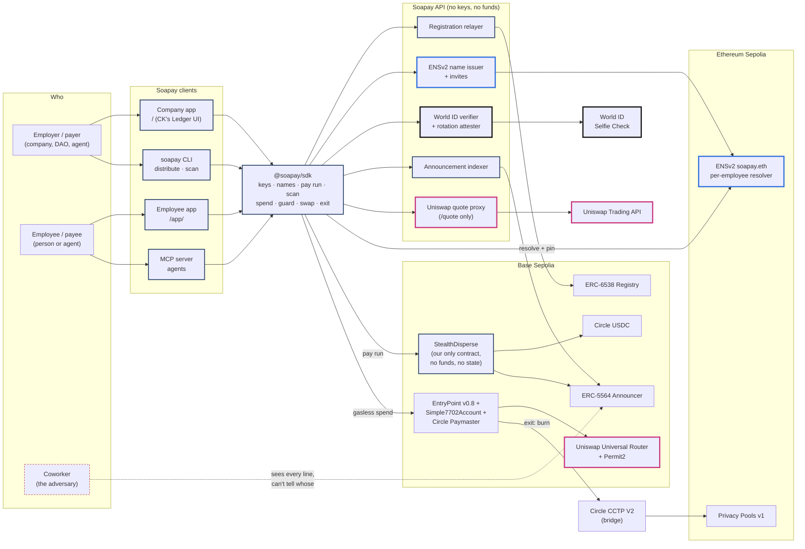
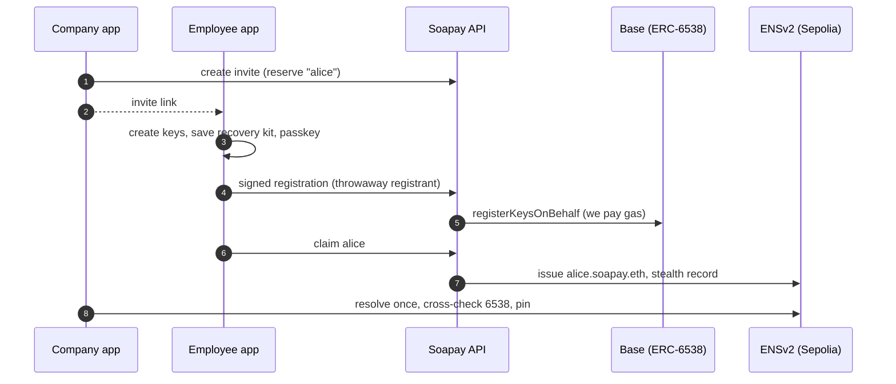
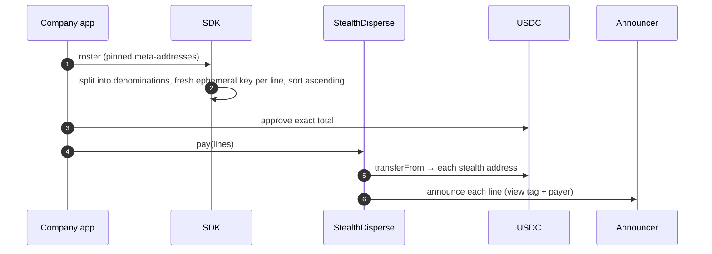
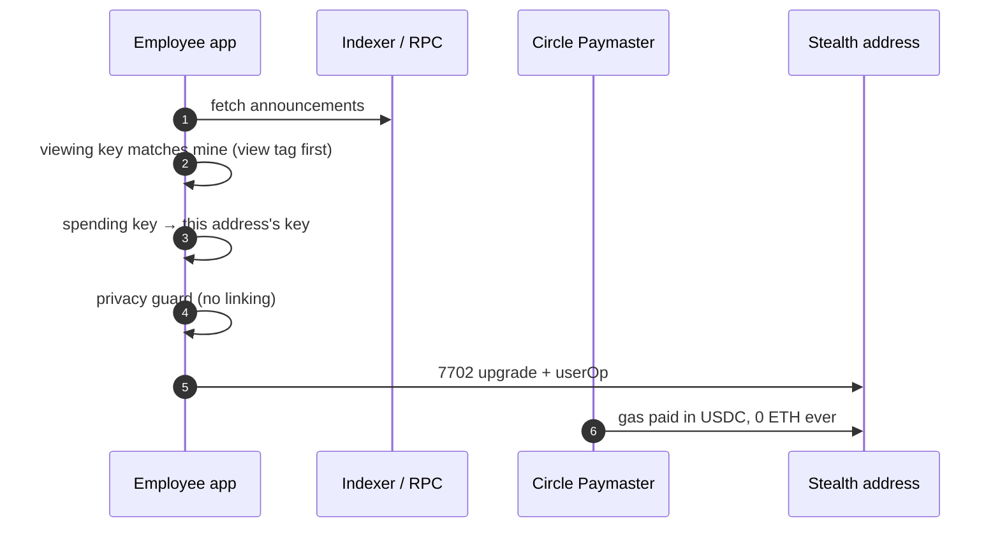
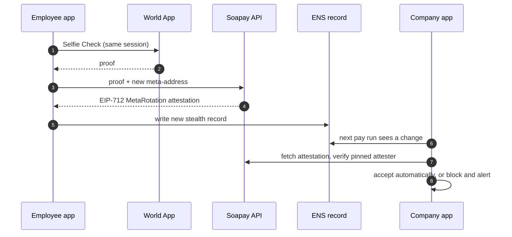
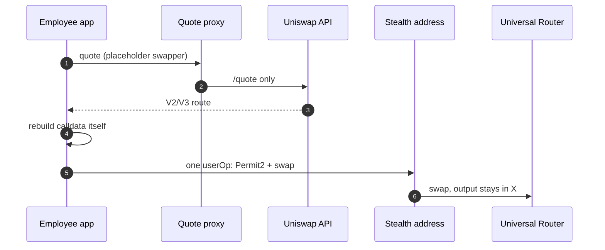
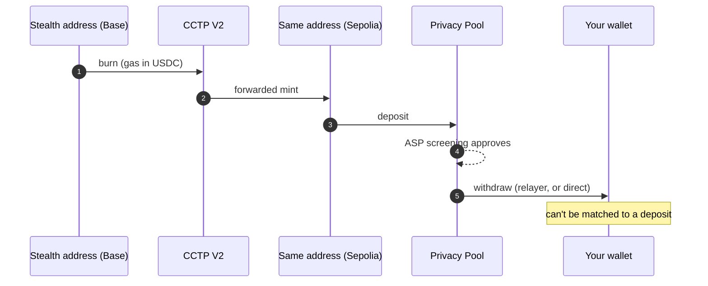

# Architecture

How the apps, the SDK, the API and the contracts fit together, and where the ENS, World ID and Uniswap integrations sit in the product. Everything protocol-related lives in `@soapay/sdk`. The company app, the employee app, the CLI and the MCP server are thin shells on top of it, so a payer can be a company, a script or an agent, and a payee can be a person or an agent. The API only relays, issues names and verifies World ID; it never holds keys or funds.

Network: Base Sepolia for payments and spending, Ethereum Sepolia for ENSv2 and the Privacy Pools exit.

## The whole system

Blue borders are ENS, black World ID, pink Uniswap, navy our own code. The dashed red node is the adversary.



## The three integrations

### ENS (ENSv2): your name is the one thing you share

- **What we built:** on-chain ENSv2 subnames under `soapay.eth` on Sepolia, each with its own Permissioned Resolver. Access control scopes the `stealth` text record so only the employee can write it. `addr` is deliberately unset, so a plain wallet can't pay one static, linkable address (D-02, D-12).
- **In the product:** the employer sends an invite link with a reserved name. The employee opens it, their keys are registered through our relayer, and `alice.soapay.eth` is issued. The company app resolves the name once, cross-checks it against the ERC-6538 registry and pins the meta-address. A later change alerts the employer before any money moves.
- **Agents too:** agents get `*.soapay.eth` names with ENSIP-26 agent records through the MCP server, and are paid in the same batch as people (D-22, D-43).
- **Proof:** [name issuance on Sepolia](https://sepolia.etherscan.io/tx/0x4b11d38050ef0020f5de0e4a269ed278f206ee0f0d5b61f84aa4e9b56db2e255). Code: `packages/sdk/src/ensv2.ts`, `names.ts`, `apps/api`.

### World ID (IDKit): changing where your salary goes needs proof it's still you

- **What we built:** World ID 4.0 through IDKit with a **Selfie Check session**. The employee can attach a session when claiming their name, or later. Rotating keys proves it's the same human; the API verifies the proof and signs an EIP-712 `MetaRotation` attestation (D-13, D-16).
- **In the product:** the company app (and the CLI) accepts a changed meta-address automatically only with that attestation, from the attester it pinned. Without it, the line is blocked and the employer re-approves by hand.
- **Why it's central:** ENS decides where salaries go, so a stolen key that rewrites the record is the real risk. It matters most for pseudonymous contributors (a DAO paying a handle), where there's no phone number to call. Details: [docs/worldid.md](worldid.md).
- **Code:** `packages/worldid-react`, `packages/sdk/src/rotation.ts`, `pins.ts`, `apps/api` World ID routes.

### Uniswap (Trading API): convert your salary without breaking your privacy

- **What we built:** swap in place. One EIP-7702 userOp from the stealth address does Permit2 plus the Universal Router swap, gas is paid in USDC by the paymaster, and the output stays at the same address (D-20).
- **Privacy detail:** quotes come from the Trading API with a placeholder swapper, through a proxy that forwards `/quote` only. The SDK rebuilds the V2/V3 route itself, so neither Uniswap nor our server sees the stealth address (D-27, D-32, D-33). On Base Sepolia it falls back to the on-chain QuoterV2.
- **Proof:** [live swap on Base Sepolia](https://sepolia.basescan.org/tx/0x2bf66ce2b28b118becdd5aba49d612a444bcffaa006c33b09b92165b5ec55c81). Code: `packages/sdk/src/swap.ts`. Feedback: [FEEDBACK.md](../FEEDBACK.md).

## The flows

### 1. Onboarding from an invite (ENS)



### 2. Pay run (one transaction, fresh addresses)



Smart-account, 7702 and Safe employers send the same lines as an EIP-5792 batch instead of going through `StealthDisperse`.

### 3. Find and spend, gasless



### 4. Key rotation (World ID)



### 5. Convert in place (Uniswap)



### 6. Compliant exit (Privacy Pools + CCTP)



Fees are roughly fixed per leg, so the Exit screen shows the whole cost and "you receive ≈ X of Y" before starting (D-48). On testnet the relayer charges about 21.5 USDC per withdrawal, so small exits withdraw directly, with the destination paying a little Sepolia ETH.

## What each piece stores, and why

### An employee's ENS name (`alice.soapay.eth`, ENSv2 on Sepolia)

Live example, read from Sepolia on 2026-09-26:

| Record | Example value | Who can write it | Why |
| --- | --- | --- | --- |
| `stealth` (text) | `st:eth:0x02d7882e…` (141 characters) | **Only the employee's registrant key**: Enhanced Access Control grants it `ROLE_SET_TEXT` on the `keccak256("stealth")` resource of its own resolver, and nothing else. The company (parent owner) can also rewrite it, because the employer is trusted | The employee's **stealth meta-address** in ERC-5564 URI form: `st:eth:0x` followed by two compressed secp256k1 public keys, the 33-byte **spending** key and the 33-byte **viewing** key. It's all a payer needs to create a fresh address per payment, and it reveals nothing about any payment. It's public keys only |
| `soapay:registrant` (text) | `0xFC24…C143` | Set once at issuance; **nobody** can change it afterwards except the parent owner | The **throwaway registrant address** derived from the employee's keys. It holds the `stealth` writer role and is the key under which the meta-address is registered in the ERC-6538 registry on Base, so a payer can cross-check "ENS says X" against "the registry says X" before pinning |
| `addr` | **not set** (resolves to `null`) | Nobody (the registrant has no role for it) | Deliberate. A plain wallet paying `alice.soapay.eth` would send every payment to one static, linkable address. With no `addr`, only a stealth-aware sender can pay the name |
| `agent-context`, `agent-endpoint[<protocol>]` (agents only, ENSIP-26) | `{"name":"invoice-agent.soapay.eth","description":"Sends invoices and gets paid privately in USDC.",…}` | Set once at issuance (immutable afterwards) | What the agent does and where to reach it, so agents are discoverable by name with their own identity and permissions |

How the name itself is set up:

- **Our own subname registry.** `soapay.eth` points at its own ENSv2 `UserRegistry` (a PermissionedRegistry), deployed through the ENS VerifiableFactory. The API's issuer key holds `ROLE_REGISTRAR` there and nothing else: it can register new labels, but not change or revoke existing ones.
- **One Permissioned Resolver per employee.** EAC text roles are scoped per resolver, so if two employees shared a resolver, the `stealth` role would let each overwrite the other's record. Each name gets its own resolver proxy, and the records are written *before* the name is registered, so it's never visible half-configured.
- **Non-transferable, revocable, never expiring.** The employee owns the name's token but has no transfer, resolver or subregistry role. Expiry is `2^64 - 1`, and the company revokes by unregistering (for example, when someone leaves).
- **No resolver on the parent.** A parent resolver could answer for a revoked subname through wildcard resolution, so `soapay.eth` deliberately has none.
- **Resolution** uses viem's standard Universal Resolver, so any ENS-aware tool can read these records.

Full role table and calls: [contracts/ENSV2.md](../contracts/ENSV2.md).

### The ERC-6538 registry entry (Base Sepolia)

`registrant → (scheme 1, meta-address)`, written by our relayer with `registerKeysOnBehalf` using the registrant's signature, so the employee never needs gas or a funded wallet. It's the canonical, chain-local copy of the same meta-address, and the payer's cross-check source.

### What the payer's app keeps (the pin)

The first time a name is paid, the company app stores `name → meta-address` locally (the **pin**). Every later run re-resolves the name. If the record changed, it pays only if a valid World ID attestation from the attester it pinned covers exactly *pinned → current*; otherwise the line is blocked until the employer approves by hand. The CLI does the same in `.soapay/pins.json`.

### The World ID pieces

| Piece | Contents | Why |
| --- | --- | --- |
| Session signal (link World ID) | `soapay:session:<label>:<registrant>` | Binds the Selfie Check session to this exact name and key, so a proof can't be replayed for another name |
| Rotation signal | `soapay:rotate:<label>:<new meta-address>:<deadline>` | Binds the proof to this exact change and a deadline |
| What the API stores | per name: the `session_id`, when and how it was attached; globally: used session nullifiers and RP nonces | Continuity check and replay protection. **No identity data** is stored or seen |
| `MetaRotation` attestation (EIP-712, signed by the API's attester) | `label`, `oldMeta`, `newMeta`, `verifiedAt` | What the payer's app verifies before accepting a changed record. It covers one exact change, from one pinned attester |
| `RotationClaim` (EIP-712, signed by the employee's registrant key) | `label`, `oldMeta`, `newMeta`, `deadline` | Proves the key holder asked for this change, alongside the World ID proof that it's the same person |

### Each payment line on-chain

- **USDC transfer** from the employer to a fresh stealth address (through `StealthDisperse`, or an EIP-5792 batch).
- **ERC-5564 announcement** on the canonical Announcer: scheme `1`, the stealth address, the one-time ephemeral public key, and metadata `viewTag (1 byte) | transfer selector (4) | token (20) | amount (32) | payer (20)`. The view tag lets a scanner skip ~255 of 256 announcements cheaply. The payer is appended because the announcement's `caller` is always the contract. Scanners recompute the address and read the real balance; they never trust the metadata amount or token.
- Lines in a batch are **strictly ascending by address** (enforced on-chain), so the order says nothing about names.

## Why EIP-7702 for spending (and not a contract per address)

**Before any spend, a stealth address is a plain account.** ERC-5564 gives you a private key, and so an ordinary externally owned account: no contract, no code, just an address USDC can be sent to like any wallet. That's deliberate. Any sender, including a plain disperse tool, can pay it with a normal transfer, and on a block explorer it looks like every other fresh address.

| Pay day | First spend | After |
| --- | --- | --- |
| Stealth EOA, no code, 500 USDC, key derived by you | One type-4 transaction from the bundler: the address signs a 7702 authorization (chain, Simple7702Account, nonce), then `EntryPoint.handleOps` (1) sets the code pointer, (2) validates the userOp against the address's own ECDSA signature, (3) the Circle Paymaster takes gas in USDC (a permit verified through ERC-1271), (4) executes `USDC.transfer` | Code `0xef0100 ‖ Simple7702Account`, 499.99 USDC, key still yours |

**A first spend, step by step.** Two things make it work: 7702 lets the address borrow a contract's code while keeping its own address, key and balance, and 4337 lets someone else pay the ETH for gas and be repaid in USDC from that same address. Example: send 300 USDC from stealth address `0xD259` (500 USDC, 0 ETH, no code).

```text
YOUR DEVICE                                         ON-CHAIN (Base)
recovery phrase
 └ spending key
    └ stealth key for 0xD259                        0xD259: 500 USDC, 0 ETH, no code
        signs 3 things:
        ① authorization  "0xD259's code = Simple7702Account"
        ② userOp         "transfer 300 USDC to 0xBEEF"
        ③ USDC permit    "paymaster may take up to 0.01 USDC from 0xD259"
             │
bundler (Pimlico) wraps ①②③ in one type-4 tx,       pays the ETH gas up front
             │
EntryPoint v0.8
  a. applies ①: 0xD259 now runs Simple7702Account   0xD259: code → Simple7702Account
  b. 0xD259 validates ② by checking its own signature
  c. Circle Paymaster uses ③ to pull 0.0057 USDC     paymaster +0.0057 USDC,
     and repays the bundler's ETH                    bundler repaid in ETH
  d. executes ② from 0xD259                          0xBEEF +300 USDC
                                                    0xD259 after: 199.9943 USDC, 0 ETH,
                                                    same address, still your key
```

What doesn't happen: no new address, no contract deployed, no ETH sent to `0xD259`, no hop through anything you'd have to fund. The only outgoing transfers are the 300 USDC and the fraction of a cent the paymaster charged. Later spends from `0xD259` skip ① because the pointer is already set. Each other stealth address goes through the same first-spend flow on its own, so a send that draws from three addresses is three user operations in one bundle, and that's the moment the privacy guard warns that those three become visibly linked.

**What 7702 does.** Since Pectra (May 2025) an EOA can sign a small authorization saying "my code is whatever lives at this implementation address". A type-4 transaction carrying it writes a 23-byte pointer into the account. From then on, calls to the address run the implementation's code with the address's own storage and balance, so it behaves like a smart account while the private key still controls it. Nothing is deployed: `Simple7702Account` was deployed once by the 4337 team, and every delegated account points at the same bytes.

**Soapay does this lazily.** On the first spend from an address, the employee app signs the authorization and hands it to the bundler together with a 4337 user operation. EntryPoint v0.8 understands that combination, so delegation and the spend land in one transaction, and the Circle Paymaster takes gas from the USDC already sitting there. That's why a stealth address never needs ETH, which would otherwise link it to whoever sent the ETH. It cost about 0.0057 USDC per spend on Base Sepolia.

**Could we deploy a contract per address instead?** Yes, and Fluidkey does: a counterfactual Safe per stealth address (CREATE2 from the stealth key as owner), deployed by a factory on first spend. We chose 7702 for four reasons:

1. **Receiving and spending stay ordinary.** A counterfactual Safe has no code before the spend either, but the factory call and the Safe proxy bytecode then tag the address as a "stealth Safe". A 7702 EOA pointing at the reference account looks like any of the many ordinary wallets that adopted 7702.
2. **No deploy gas.** A Safe deployment is roughly 200k gas on top of the spend; the 7702 pointer costs a few thousand.
3. **One audited implementation, zero custom contracts.** The repo rule is that nothing custom holds funds. `Simple7702Account` is the reference implementation, and there's no factory of ours in the path.
4. **Reversible.** The EOA can re-delegate or clear its code later; a deployed proxy is forever.

**The trade-off.** Every Soapay stealth address ends up pointing at the same implementation, which is a mild shared fingerprint. It's the same fingerprint as every other 7702 wallet using that implementation, so it groups you with the crowd rather than with your coworkers, but it isn't zero.

**Why the paymaster works.** The Circle Paymaster needs a USDC permit signed by the account. Once the EOA has code, USDC verifies that signature through ERC-1271 by asking the account, and `Simple7702Account` answers by recovering the ECDSA signer and checking it equals itself. We verified this on a Base fork (`packages/sdk/test/fork.e2e.test.ts`) after an earlier note wrongly said it would fail; the spend path relies on it.

## Against each sponsor's full brief

Beyond the qualification checklist in [docs/bounty-integrations.md](bounty-integrations.md), this is how we use what each sponsor's brief highlights.

**ENS: "Best Use of ENSv2".** The brief asks teams to explore the hierarchical registry, Enhanced Access Control, per-subname Permissioned Resolvers and subname setups, with bonus points for agents as namespaces.

| Brief highlights | Soapay |
| --- | --- |
| Deploy your own subname registry and manage subnames under your own rules | ✅ `soapay.eth` → our own `UserRegistry`; an issuer key that can only register |
| Enhanced Access Control: "letting an account edit only certain text records" | ✅ Exactly our core rule: the employee's key can write the `stealth` record and nothing else |
| Give subnames their own Permissioned Resolver so they fully own their data | ✅ One resolver per employee (required for the rule above to be safe) |
| Expiring, revocable, non-transferable vs transferable, forever names | ✅ Non-transferable and revocable; no expiry |
| Wildcard resolution off a parent's resolver; record or namespace aliasing | ➖ Deliberately not used: a parent resolver could answer for revoked names |
| Bonus: agents as namespaces, each with their own identity and permissions | ✅ Agents get `*.soapay.eth` with ENSIP-26 `agent-context`/`agent-endpoint` records, the same `stealth` rule, and are paid in the same batch as people |

**World: "Best Use of IDKit".** The brief rewards "the best decision about which credential is needed", and lists "recovery or protection of an important account action" as a strong example.

| Brief highlights | Soapay |
| --- | --- |
| A real trust moment | ✅ Changing where future salary goes (key rotation) |
| The proportionate credential, and why | ✅ Selfie Check through a **session**: the question is continuity ("same person who set up this name?"), not uniqueness, so Proof of Human (an Orb visit) or Passport would ask for more than the moment needs |
| Selfie Check "now live with Sybil score" | ➖ We verify the full result, including the score, through the Developer Portal but don't gate on it: a score measures sybil risk, and rotation asks about continuity. Noted as a possible extra signal |
| A workflow that becomes safer or simpler | ✅ Safer: a stolen key can't redirect pay. Simpler: no call to HR to approve a key change. Essential for pseudonymous contributors paid by a DAO |

We don't enter "World ID for Agents". Our agents are payees, and no agent action there needs a human's approval.

**Uniswap: "Best Uniswap Stack Contribution".** The brief is "build on or integrate any part of the Uniswap stack, including the Uniswap API, the Uniswap AMM (v2, v3, or v4)". ✅ We use the **Uniswap API** for quotes and execute on **v2/v3 pools** through the Universal Router and Permit2, so both named parts are covered, plus a `FEEDBACK.md` with live findings.

## Who sees what

| Party | Sees | Can't see |
| --- | --- | --- |
| Coworker | The whole pay run on-chain: every line, every amount | Which line is whose. Lines are fresh, sorted by address and split into standard chunks |
| Employer | Everything (trusted by design): name → address → amount | The employee's keys |
| Soapay API | Registrations, names, World ID proofs, public announcements | Stealth addresses in swaps (quote-only), keys, funds |
| Uniswap | A quote's pair and amount | The address that swaps |
| Employee | Only their own lines, found with their viewing key | Other people's lines |

More detail: [docs/privacy-model.md](privacy-model.md). Every decision referenced here (D-xx) is in [docs/decision-log.md](decision-log.md).
