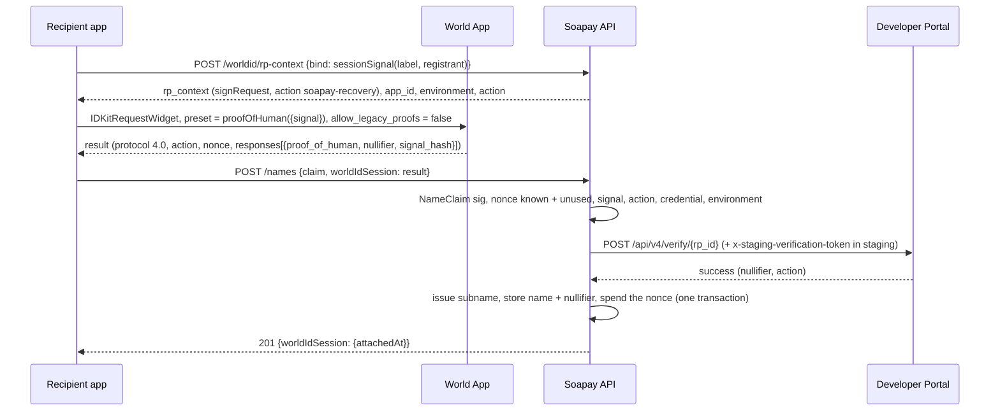
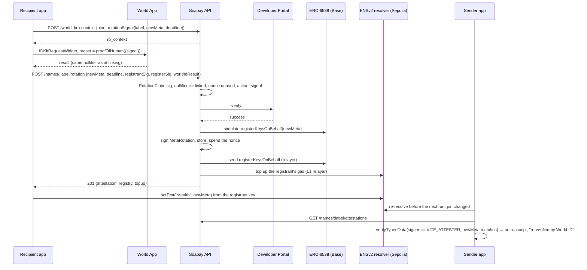
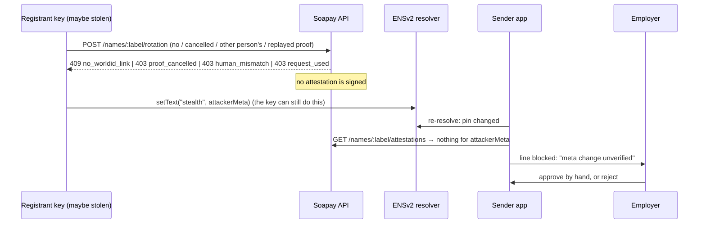

# World ID in Soapay

Soapay uses World ID 4.0 (IDKit 4.3) at **one trust moment: account recovery (key rotation)**, with the **Proof of Human** credential, as **one-time requests on the action `soapay-recovery`**. A name's meta-address decides where future salary goes. When an employee changes it, World ID lets the payer's app accept the change automatically, because the same person who set up the name has confirmed it.

Spec: `docs/mvp-spec.md` §2.1 (rotation, formats) and §5 (World ID). Code: `apps/api/src/worldid/`, `apps/api/src/routes/rotation.ts`, `packages/sdk/src/rotation.ts`, `packages/worldid-react`. Decisions: D-13, D-16, D-54, D-57, **D-58** (the current mechanism).

## How it works now (D-58)

- **Every proof is the same kind of request:** `IDKit.request({ app_id, action: "soapay-recovery", rp_context, allow_legacy_proofs: false, environment }).preset(proofOfHuman({ signal }))`, rendered with IDKit's own `IDKitRequestWidget`. The API signs each RP context with `signRequest({ action, ttl })` and stores its single-use nonce with the signal it's for (`bind`, D-57).
- **Link = the first verified proof's nullifier.** At enrollment (`POST /names` with `worldIdSession`) or later (`POST /names/:label/session`, signed `AttachWorldId` over the nullifier), the API verifies a proof with `signal = sessionSignal(label, registrant)` and stores its **nullifier** as the name's World ID link. The same human may link several names.
- **Recovery = a matching nullifier.** A rotation (`POST /names/:label/rotation`) needs a verified proof with `signal = rotationSignal(label, newMeta, deadline)` whose nullifier **equals the stored one**. Another person's proof has a different nullifier and is refused (`403 human_mismatch`).
- **Replays** are stopped by the single-use RP nonce: a proof can be used once, then its nonce is spent (`request_used`).

This is a first-class World ID pattern. A World ID 4.0 nullifier is stable per (human, RP, action), and World allows repeat proofs on the same action: two proofs by the same identity on `soapay-recovery` both verified at the Developer Portal (HTTP 200) with the **same nullifier** (checked live, 2026-09-26). The nullifier is scoped to our RP and this action, so it reveals nothing about the person and can't be linked to their activity in any other app.

**Why not sessions any more.** D-16/D-57 used World ID *sessions* (`createSession` / `proveSession`), which answer "same person" directly. Live, session requests fail for our app and RP (`rp_3ede5fe1cab9af48`): the production World App hangs, and the staging simulator returns `bad_request` even for a minimal `createSession(...).constraints(CredentialRequest("proof_of_human", {}))` signed correctly. World's own example app can create sessions; ours can't, and the Developer Portal has no setting for it. One-time requests on a dedicated action give the same continuity guarantee through the nullifier, and they work.

## The trust moment

Under option A, the registrant key controls the ENSv2 `stealth` record, and the sender app pins the meta-address it resolved at enrollment. When the record changes, the sender app has to decide: pay the new meta-address, or block the line until someone checks.

A stolen registrant key (a phished seed, malware) can change the record. On its own, it can't get paid:

- **With World ID:** the change is auto-accepted only with a `MetaRotation` attestation, and the API signs one only after a Proof of Human proof whose nullifier matches the one linked to the name. The thief isn't the same human, so their nullifier differs.
- **Without it:** the line is blocked until the employer approves the change by hand.

There is **no enrollment gate**. Onboarding doesn't need World ID, and relayer abuse is handled with rate limits. The employee *may* link World ID when claiming the name, or later.

## Why Proof of Human is the proportionate credential

The trust moment is **account recovery**: an employee's key leaked or their device is gone, and they move their name to new keys. That decides where **all future salary** goes, so it is the highest-stakes action in the product. The question it asks is *"is this the same person who set up this name?"*

- **The nullifier answers "same person".** It is linked once, when the name is claimed (or later), and every rotation must come with the same nullifier. A thief with the old key can rewrite the ENS record, but can't produce a proof with the employee's nullifier, so the payer's app won't follow the change.
- **Proof of Human is the proportionate strength.** World describes Selfie Check as *"a medium-assurance signal"*. For an action that redirects someone's pay, "probably the same person" isn't enough; Proof of Human is World's strongest human credential. We tried Selfie Check first (the lightest option) and moved up because medium assurance doesn't match what's at stake (D-54).
- **Nothing stronger is needed.** Passport or identity attributes would collect real-world identity the product doesn't need: the employer already knows its employees, and a DAO's contributors may deliberately stay pseudonymous. Proof of Human proves a unique, same human without revealing who they are.
- **It's also the smoother flow.** No selfie capture at the moment of recovery; the World App confirms in a tap. The trade-off: the employee needs a World ID with Proof of Human. Without one, recovery still works, but the employer approves the key change by hand (the fallback below).

## Where it's essential: pseudonymous contributors

For a known employee, HR can phone them and confirm a change, so World ID saves a manual step. For a **DAO contributor known only by a handle**, the payer has no out-of-band channel. There's no phone number and no face on file. The World ID link is then the *only* continuity signal available, and it keeps the contributor pseudonymous: the DAO learns "the same person as before", never who they are.

## Fallback

Every refusal ends the same way: no attestation, so the sender app blocks the line and shows "meta change unverified". The employer (or DAO payer) then approves or rejects by hand. This covers:

- a name with no World ID link (`no_worldid_link`; it was `no_session` before D-58), including a name whose only link is a pre-D-58 session;
- a link made after the claim that is still in its 72-hour cooldown (`session_cooldown`);
- a cancelled or failed World App flow (`proof_cancelled`), or no proof at all (`proof_missing`);
- an expired RP context or deadline (`request_expired`, `expired`);
- a different person, i.e. another nullifier (`human_mismatch`);
- a replayed proof (`request_used`) or one we never requested (`unknown_request`);
- a proof for another action (`action_mismatch`), from another environment (`environment_mismatch`), with the wrong credential (`wrong_credential`), a session proof (`proof_malformed`), or one the Developer Portal rejects (`proof_invalid`);
- World ID being unreachable (`worldid_unavailable`) or disabled (`WORLD_ID_DISABLED=true`).

Nothing in Soapay depends on World ID being available. It only decides whether a change needs a human in the loop.

### Threat demo

`scripts/demo-attacker.ts` (D-55) plays the thief with a stolen recovery phrase. It derives the victim's registrant key, rewrites the victim's `stealth` record on its own PermissionedResolver (and the ERC-6538 entry on Base, so the name still resolves cleanly), then asks `POST /names/:label/rotation` for an attestation with a valid `RotationClaim` signature but no World ID proof. The API refuses (`409 no_worldid_link` for a name without a link; `403 proof_missing` for one with a link; a proof from the thief's own World ID gets `403 human_mismatch`), so the sender app's pin check blocks the line. `scripts/demo-recovery-check.ts` asserts the whole path live: pin → attack → **blocked, attestation `missing`** (SDK `checkMetaPin`) and `soapay distribute` exit 3 → restore. Run on 2026-09-26 (before D-58, when the code was `no_session`): docs/testnet-deployment.md, "Recovery beat". Stage steps: docs/demo-flow.md, section 7 ("Recovery: the real World ID moment").

What it shows, and what it doesn't: World ID protects **future** salary, because the payer follows a record change only with the same human's proof. A stolen phrase still controls funds already received; the recovery kit's safety (keep the phrase offline, move funds and rotate on any suspicion) covers that.

## Sequences

### Enrollment, with an optional World ID link

If the user cancels, the app claims the name without `worldIdSession` and can link World ID later with `POST /names/:label/session` (registrant-signed `AttachWorldId(label, nullifier, deadline)`). A link made later can back a rotation only after `WORLD_ATTACH_COOLDOWN_SECONDS` (72 h by default), so someone holding a stolen key can't link their own World ID and rotate immediately. A name never replaces its link through the API.

### Rotation, accepted

### Rotation, denied

## Developer Portal setup

- App: `app_0cc7167efe114ac2e0ef7d9827098353` ("Soapay"), World ID 4.0.
- RP: `rp_3ede5fe1cab9af48`, registered on-chain for staging and production. The signer address is `0xCaf38A54bA7B0C15Eb253cb513f0B0A93AAA349D`; its private key lives only in the operator's `apps/api/.env` as `WORLD_RP_SIGNING_KEY` and is never committed.
- Action **`soapay-recovery`** (World ID 4.0), in staging and production: every link and rotation proof is for it (`WORLD_ACTION`, default `soapay-recovery`). Never change it for a running deployment: nullifiers are per action, so existing links would stop matching.
- Action `soapay-enroll` exists in staging and production but is **unused** (the enrollment gate it was made for was dropped).
- `WORLD_ENV=production` on the live demo since 2026-09-26 (D-51): the real World App, no extra header. `staging` uses the simulator, and **staging verification needs `x-staging-verification-token`**: set `WORLD_STAGING_VERIFY_TOKEN` (secret, never logged; the API sends it only when `WORLD_ENV=staging`).
- Server: `apps/api/.env` from `apps/api/.env.example`, then `WORLD_RP_SIGNING_KEY` and `ATTESTER_PRIVATE_KEY` (and `WORLD_STAGING_VERIFY_TOKEN` for staging). `GET /worldid/config` shows what the API runs with.

## What we store

Per name: the World ID **nullifier** of the linking proof (decimal), when it was linked, and how (`enroll` or `attach`), in `name_sessions` (the table keeps its name; migration 6 added `nullifier` and dropped `session_id`'s uniqueness, since one human may link several names). Globally: every RP nonce we signed, its `bind` signal and when a proof used it (pruned a day after expiry). Per rotation: the attestation, with the spent nonce. We never store or see identity, and the nullifier is never served by public routes. Rows linked with a pre-D-58 session keep their `session_id` but no nullifier; they count as unlinked and can be linked again.

## Integration debrief

**Time to first success:** one-time Proof of Human requests verified at the Developer Portal on the first try once we moved off sessions (2026-09-26); sessions never succeeded for our RP.

**The one improvement with the greatest impact:** make World ID sessions fail loudly and document their prerequisites. For our RP, session requests hang in the production World App and come back as a bare `bad_request` from the staging simulator, with nothing in the docs or the Developer Portal to say why or how to enable them. A specific error code (or a portal switch) would have saved us most of a day; we ended up on one-time requests with nullifier matching instead (D-58).

What went well:

- The Developer Portal verify endpoint takes the IDKit result unchanged, which kept the server small: local checks first (nonce, action, credential, signal or bound request, environment, nullifier match), then one Portal call.
- `signRequest` from `@worldcoin/idkit-server` made the RP context a five-line route, and the single-use nonce doubled as our replay guard.
- **The nullifier is exactly the continuity signal recovery needs.** It's stable per (human, RP, action), repeat proofs are allowed, and it's scoped to our RP and action, so it links nothing across apps. `IDKitRequestWidget` with `preset={proofOfHuman({ signal })}` worked as the integration guide shows.

Friction, honestly:

- **Sessions unavailable for our RP, with no explanation.** Production World App hangs on session requests; the staging simulator returns `bad_request` even for a minimal, correctly signed `createSession(...).constraints(CredentialRequest("proof_of_human", {}))`. World's example app can do sessions, ours can't, and there is no portal setting and no documentation about why. We switched to one-time requests (D-58).
- **The staging verification token isn't in the integration guide.** Staging proofs verify at `POST /api/v4/verify/{rp_id}` only with an `x-staging-verification-token` header (and within the staging verification window set in the Developer Portal). Neither is mentioned in the integration guide; we found it by trial.
- **Session requests with a signal stalled in World App** (before D-58). World's own session example sends no signal; we bound each proof to its purpose on our server instead (the RP context is issued for one signal and stored with its single-use nonce, D-57). That binding is still in place as a second layer.
- **Sessions take `constraints`, not `preset`.** The session-proofs page shows `IDKitSessionWidget` with `preset={selfieCheck()}`, but in IDKit 4.3 `IDKitSessionWidgetProps` only accepts `constraints`, and a hand-built Selfie Check constraint made the production World App answer `generic_error`.
- **The design changed under us.** We first built a two-moment design with Proof of Human (uniqueness at enrollment plus rotation), then Selfie Check sessions (continuity), then Proof of Human sessions (D-54), and now one-time Proof of Human requests matched by nullifier (D-58). Each step made the code smaller.
- **Environments.** Proof results, the Portal response and the IDKit config each carry an environment, and the Portal defaults it to production. We refuse a mismatch at both checkpoints. It's easy to get this wrong silently.
- **What our tests cover:** they mock the Developer Portal (`apps/api/test/worldid.test.ts`): link then rotate with the same nullifier, a different nullifier, replayed nonces, the wrong action, and the staging header. The live checks (repeat proofs, same nullifier, HTTP 200) were done by hand on 2026-09-26.
