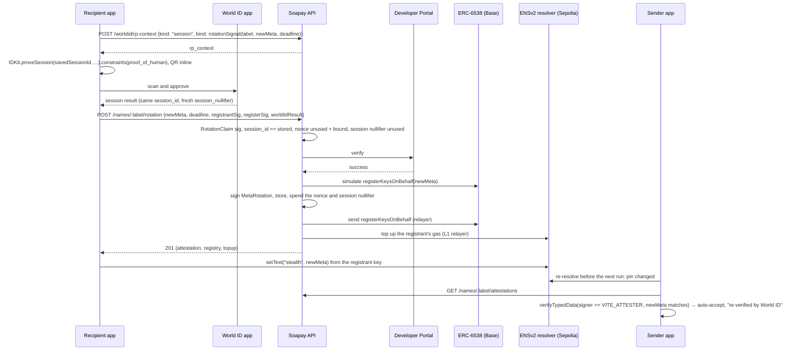

# World ID in Soapay

Soapay uses World ID 4.0 (IDKit 4.3) at **one trust moment: account recovery (key rotation)**, with the **Proof of Human** credential, in a **World ID session**. A name's meta-address decides where future salary goes. When an employee changes it, World ID lets the payer's app accept the change automatically, because the same person who set up the name has confirmed it.

Spec: `docs/mvp-spec.md` §2.1 (rotation, formats) and §5 (World ID). Code: `apps/api/src/worldid/`, `apps/api/src/routes/rotation.ts`, `packages/sdk/src/rotation.ts`, `packages/worldid-react`. Decisions: D-13, D-16, D-54, D-57, D-58 (a detour, superseded), **D-59** (the current mechanism).

## How it works (D-59)

- **Link = a new session.** At enrollment (`POST /names` with `worldIdSession`) or later (`POST /names/:label/session`, with a registrant-signed `AttachSession(label, sessionId, deadline)`), the app runs `IDKit.createSession({ app_id, rp_context, environment }).constraints(CredentialRequest("proof_of_human", {}))`. The API verifies the result and stores its **`session_id`** for the name.
- **Recovery = proving that session.** A rotation (`POST /names/:label/rotation`) needs `IDKit.proveSession(sessionId, { ... })` with the same constraint. The API accepts it only if the result's `session_id` is the one stored for the name; a different session is refused (`403 session_mismatch`). A session can be proved again and again, which is what recovery needs.
- **Purpose binding (D-57).** Session requests go to World App **without a signal** (they stalled with one). Instead, the app asks for the RP context with `bind` = the Soapay signal (`sessionSignal(label, registrant)` to link, `rotationSignal(label, newMeta, deadline)` to rotate), and the API stores it with the RP context's single-use nonce. A proof is accepted only if it answers a request issued for exactly that signal (or carries the signal's hash itself).
- **Replays** are stopped twice: the RP nonce is single-use (`request_used`), and each proof's `session_nullifier` can be used once (`session_replayed`).
- **No action.** Session requests take none, so the API signs each RP context with `signRequest({ signingKeyHex, ttl })` and nothing else. The `soapay-recovery` action from D-58 is no longer used.
- **The QR is inline.** `@soapay/worldid-react` builds the request with IDKit core and renders its connector URI as a QR inside the app's own panel, with "On this phone? Open the World ID app", a status line and Cancel. If World App returns an error, the panel shows IDKit's debug report with "Copy details". There is no IDKit pop-up.
- **One session, several names.** The same session may back several names (one person testing several demo names with one World ID). Each rotation still needs a fresh proof of that session, bound to that name's exact change. A name keeps its first session; the API never replaces it.

## Why sessions, and the D-58 detour

Recovery asks *"is this the same person who set up this name?"*, possibly many times over the name's life. World ID answers that in two ways:

- **Sessions** (`createSession` / `proveSession`): a session is created once and proved as often as needed.
- **One-time (uniqueness) requests** on an action: the nullifier is stable per (human, RP, action), so "same nullifier" means "same human". But **production enforces one uniqueness proof per person per action**: the second proof is refused in the World ID app with `nullifier_replayed`.

D-16/D-57 used sessions. On our first app and RP (`app_0cc7…` / `rp_3ede5fe1cab9af48`) every session request failed: the production World ID app answered `verification_rejected`, the staging simulator `bad_request`, even for a minimal, correctly signed `createSession(...).constraints(CredentialRequest("proof_of_human", {}))`. D-58 switched to one-time requests matched by nullifier, after two repeat proofs verified in staging with the same nullifier. In production that design can link a name but can never recover it, because the recovery proof is the person's second proof on the action. **D-58 was wrong for production.**

A **freshly created app and RP** (`app_c47a43da4fea435146d14ae5e9f503ea` / `rp_25e1826d2548c1d9`) ran the minimal production session request with the owner's real World ID, and the result verified at `POST /api/v4/verify/{rp_id}` (HTTP 200). The first RP simply didn't support sessions. D-59 restores the session design on the new RP. The app and RP ids come only from the environment (`WORLD_APP_ID`, `WORLD_RP_ID`); nothing in the code defaults them.

## The trust moment

Under option A, the registrant key controls the ENSv2 `stealth` record, and the sender app pins the meta-address it resolved at enrollment. When the record changes, the sender app has to decide: pay the new meta-address, or block the line until someone checks.

A stolen registrant key (a phished seed, malware) can change the record. On its own, it can't get paid:

- **With World ID:** the change is auto-accepted only with a `MetaRotation` attestation, and the API signs one only after a proof of the session linked to the name. The thief can't prove the employee's session from their own World ID.
- **Without it:** the line is blocked until the employer approves the change by hand.

There is **no enrollment gate**. Onboarding doesn't need World ID, and relayer abuse is handled with rate limits. The employee *may* link World ID when claiming the name, or later.

## Why Proof of Human is the proportionate credential

The trust moment is **account recovery**: an employee's key leaked or their device is gone, and they move their name to new keys. That decides where **all future salary** goes, so it is the highest-stakes action in the product.

- **The session answers "same person".** It is created once, when the name is claimed (or later), and every rotation must prove that same session. A thief with the old key can rewrite the ENS record, but can't prove the employee's session, so the payer's app won't follow the change.
- **Proof of Human is the proportionate strength.** World describes Selfie Check as *"a medium-assurance signal"*. For an action that redirects someone's pay, "probably the same person" isn't enough; Proof of Human is World's strongest human credential. We tried Selfie Check first (the lightest option) and moved up because medium assurance doesn't match what's at stake (D-54).
- **Nothing stronger is needed.** Passport or identity attributes would collect real-world identity the product doesn't need: the employer already knows its employees, and a DAO's contributors may deliberately stay pseudonymous. Proof of Human proves a unique, same human without revealing who they are.
- **It's also the smoother flow.** No selfie capture at the moment of recovery; the World ID app confirms in a tap. The trade-off: the employee needs a World ID with Proof of Human. Without one, recovery still works, but the employer approves the key change by hand (the fallback below).

## Where it's essential: pseudonymous contributors

For a known employee, HR can phone them and confirm a change, so World ID saves a manual step. For a **DAO contributor known only by a handle**, the payer has no out-of-band channel. There's no phone number and no face on file. The World ID session is then the *only* continuity signal available, and it keeps the contributor pseudonymous: the DAO learns "the same person as before", never who they are.

## Fallback

Every refusal ends the same way: no attestation, so the sender app blocks the line and shows "meta change unverified". The employer (or DAO payer) then approves or rejects by hand. This covers:

- a name with no World ID session (`no_session`), including a name linked under D-58 (a nullifier only), which counts as unlinked and can be linked again;
- a session linked after the claim that is still in its 72-hour cooldown (`session_cooldown`);
- a cancelled or failed World ID app flow (`proof_cancelled`), or no proof at all (`proof_missing`);
- an expired RP context or deadline (`request_expired`, `expired`);
- another World ID session (`session_mismatch`);
- a replayed proof (`session_replayed`, `request_used`) or one we never requested (`unknown_request`);
- a proof for another change (`signal_mismatch`), from another environment (`environment_mismatch`), with the wrong credential (`wrong_credential`), not a session proof (`proof_malformed`), or one the Developer Portal rejects (`proof_invalid`);
- World ID being unreachable (`worldid_unavailable`) or disabled (`WORLD_ID_DISABLED=true`).

Nothing in Soapay depends on World ID being available. It only decides whether a change needs a human in the loop.

### Threat demo

`scripts/demo-attacker.ts` (D-55) plays the thief with a stolen recovery phrase. It derives the victim's registrant key, rewrites the victim's `stealth` record on its own PermissionedResolver (and the ERC-6538 entry on Base, so the name still resolves cleanly), then asks `POST /names/:label/rotation` for an attestation with a valid `RotationClaim` signature but no World ID proof. The API refuses (`409 no_session` for a name without a session; `403 proof_missing` for one with a session; a proof of the thief's own session gets `403 session_mismatch`), so the sender app's pin check blocks the line. `scripts/demo-recovery-check.ts` asserts the whole path live: pin → attack → **blocked, attestation `missing`** (SDK `checkMetaPin`) and `soapay distribute` exit 3 → restore. Run on 2026-09-26: docs/testnet-deployment.md, "Recovery beat". Stage steps: docs/demo-flow.md, section 7 ("Recovery: the real World ID moment").

What it shows, and what it doesn't: World ID protects **future** salary, because the payer follows a record change only with the same person's session proof. A stolen phrase still controls funds already received; the recovery kit's safety (keep the phrase offline, move funds and rotate on any suspicion) covers that.

## Sequences

### Enrollment, with an optional World ID session

```mermaid
sequenceDiagram
  participant R as Recipient app
  participant W as World ID app
  participant A as Soapay API
  participant P as Developer Portal
  R->>A: POST /worldid/rp-context {kind: "session", bind: sessionSignal(label, registrant)}
  A-->>R: rp_context (signRequest, no action), app_id, environment
  R->>R: IDKit.createSession(...).constraints(CredentialRequest("proof_of_human", {})), QR inline
  R->>W: scan the QR (or open the app on the same phone)
  W-->>R: session result (protocol 4.0, nonce, session_id, responses[{proof_of_human, session_nullifier}])
  R->>A: POST /names {claim, worldIdSession: result}
  A->>A: NameClaim sig, nonce known + unused + bound to this signal, credential, environment, session nullifier unused
  A->>P: POST /api/v4/verify/{rp_id} (result unchanged; + x-staging-verification-token in staging)
  P-->>A: success
  A->>A: issue subname, store name + session_id, spend the nonce and session nullifier (one transaction)
  A-->>R: 201 {worldIdSession: {attachedAt}}
```

If the user cancels, the app claims the name without `worldIdSession` and can link a session later with `POST /names/:label/session` (registrant-signed `AttachSession(label, sessionId, deadline)`). A session linked later can back a rotation only after `WORLD_ATTACH_COOLDOWN_SECONDS` (72 h by default), so someone holding a stolen key can't link their own World ID and rotate immediately. A name never replaces its session through the API.

### Rotation, accepted



### Rotation, denied


## Developer Portal setup

- App and RP: set in the API's environment only (`WORLD_APP_ID`, `WORLD_RP_ID`, `WORLD_RP_SIGNING_KEY`); the code has no defaults. Since D-59 the live API runs on the app `app_c47a43da4fea435146d14ae5e9f503ea` and the RP `rp_25e1826d2548c1d9`, created fresh because the first RP didn't accept session requests. The RP signing key lives only in the deployment's secrets (Railway) or the operator's `apps/api/.env`, never in git.
- The RP must support **sessions**. Check with a minimal `createSession(...).constraints(CredentialRequest("proof_of_human", {}))` in production before relying on it.
- No action is needed: session requests take none. The old app's `soapay-recovery` and `soapay-enroll` actions are unused.
- `WORLD_ENV=production` on the live demo (D-51): the real World ID app, no extra header. `staging` uses the simulator, and **staging verification needs `x-staging-verification-token`**: set `WORLD_STAGING_VERIFY_TOKEN` (secret, never logged; the API sends it only when `WORLD_ENV=staging`), within the staging verification window set in the Developer Portal.
- `GET /worldid/config` shows what the API runs with (never the signing key).

## What we store

Per name: the World ID **`session_id`** it's linked to, when, and how (`enroll` or `attach`), in `name_sessions`. The table still has D-58's `nullifier` column (migrations are append-only); it's unused, and a row with only a nullifier counts as unlinked. Per proof: its `session_nullifier`, so it can't be replayed. Globally: every RP nonce we signed, its `bind` signal and when a proof used it (pruned a day after expiry). Per rotation: the attestation, with the proof's session nullifier. We never store or see identity, and the session id is never served by `GET /names/:label`.

## Integration debrief

**Time to first success:** a World ID session verified at the Developer Portal on the first try on a freshly created RP (2026-09-26). On our first RP, sessions never succeeded.

**The one improvement with the greatest impact:** make an RP that doesn't support sessions fail loudly. Our first RP, created in the Developer Portal like any other, silently didn't support sessions: the production World ID app answered `verification_rejected`, the staging simulator a bare `bad_request`, and the portal showed nothing to explain it (the RP's registration reported `synced: false`, with no error or hint about what that meant). A specific error code, or a portal status that says "sessions unavailable for this RP, here's why", would have saved us most of a day and a wrong redesign.

What went well:

- The Developer Portal verify endpoint takes the IDKit result unchanged, which kept the server small: local checks first (nonce, binding, credential, environment, session id, session nullifier), then one Portal call.
- `signRequest` from `@worldcoin/idkit-server` made the RP context a five-line route, and the single-use nonce doubled as our replay guard and our purpose binding.
- Sessions are exactly the continuity signal recovery needs: create once, prove as often as needed, and the session reveals nothing about the person.
- IDKit core's builder gave us the connector URI, so we could draw the QR inside our own screen and keep IDKit's debug report for error reports.

Friction, honestly:

- **An RP that silently doesn't support sessions.** See above. We spent the time on a wrong theory (sessions don't work for us) instead of the real cause (this RP doesn't support them), and a fresh RP fixed it.
- **Production allows one uniqueness proof per person per action.** Our fallback design (D-58: one-time requests on a recovery action, matched by nullifier) passed in staging, where repeat proofs verified with the same nullifier, and failed in production with `nullifier_replayed` on the second proof. That's the right rule for sybil resistance, but staging and production behaving differently here is easy to miss; it's why "same human, repeatedly" has to be a session.
- **The staging verification token isn't in the integration guide.** Staging proofs verify at `POST /api/v4/verify/{rp_id}` only with an `x-staging-verification-token` header, and only within the staging verification window set in the Developer Portal. Neither is mentioned in the integration guide; we found both by trial.
- **Session requests with a signal stalled in World App.** World's own session example sends no signal; we bind each proof to its purpose on our server instead (the RP context is issued for one signal and stored with its single-use nonce, D-57).
- **Sessions take `constraints`, not `preset`.** The session-proofs page shows `preset={selfieCheck()}`, but IDKit 4.3 rejects presets for session requests ("Use .constraints() instead"), and a hand-built Selfie Check constraint made the production World App answer `generic_error`.
- **The design changed under us.** A two-moment design with Proof of Human (uniqueness at enrollment plus rotation), then Selfie Check sessions (continuity), then Proof of Human sessions (D-54), a detour through one-time requests matched by nullifier (D-58), and back to Proof of Human sessions on a fresh RP (D-59).
- **Environments.** Proof results, the Portal response and the IDKit config each carry an environment, and the Portal defaults it to production. We refuse a mismatch at both checkpoints. It's easy to get this wrong silently.
- **What our tests cover:** they mock the Developer Portal (`apps/api/test/worldid.test.ts`): link then rotate with the same session, another session (`session_mismatch`), replayed session nullifiers and nonces, binding mismatches, one session backing several names, D-58 links counting as unlinked, and the staging header; `apps/recipient/test/worldid-human-check.test.tsx` checks the client builds `createSession` / `proveSession` with the Proof of Human constraint and no signal, and shows the QR inline. The live check (a production session verified at HTTP 200 on the new RP) was done by hand on 2026-09-26.
