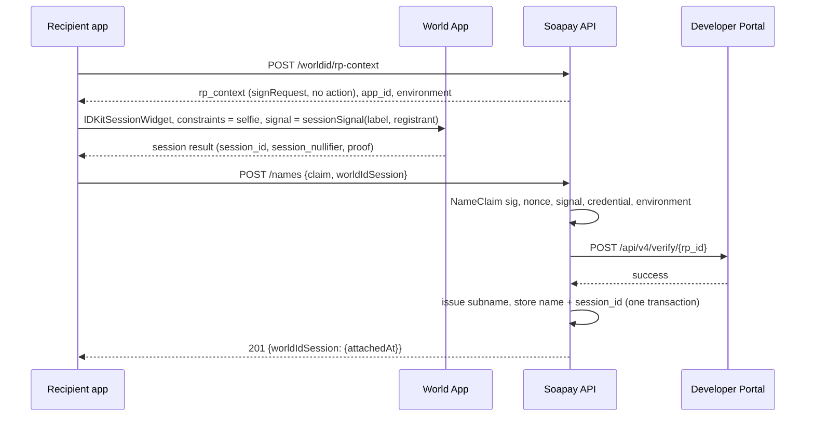
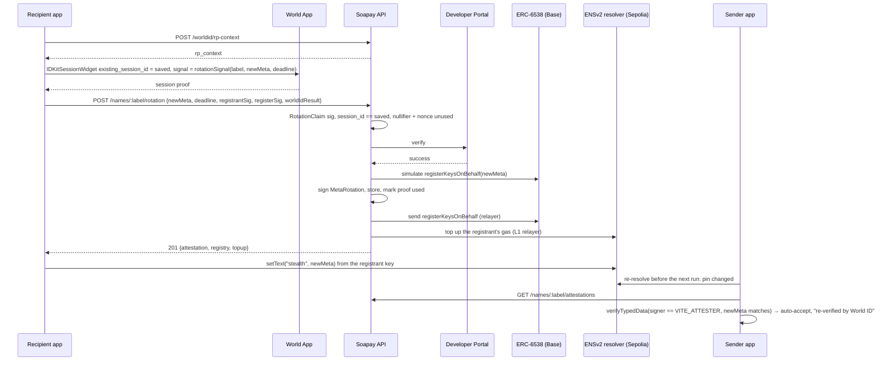

# World ID in Soapay

Soapay uses World ID 4.0 (IDKit 4.3) at **one trust moment: key rotation**. A name's meta-address decides where future salary goes. When an employee changes it, World ID lets the payer's app accept the change automatically, because the same person who set up the name has confirmed it.

Spec: `docs/mvp-spec.md` §2.1 (rotation, formats) and §5 (World ID). Code: `apps/api/src/worldid/`, `apps/api/src/routes/rotation.ts`, `packages/sdk/src/rotation.ts`, `packages/worldid-react`.

## The trust moment

Under option A, the registrant key controls the ENSv2 `stealth` record, and the sender app pins the meta-address it resolved at enrollment. When the record changes, the sender app has to decide: pay the new meta-address, or block the line until someone checks.

A stolen registrant key (a phished seed, malware) can change the record. On its own, it can't get paid:

- **With World ID:** the change is auto-accepted only with a `MetaRotation` attestation, and the API signs one only after a `proveSession` for the session saved with the name. The thief doesn't have the employee's face.
- **Without it:** the line is blocked until the employer approves the change by hand.

There is **no enrollment gate**. Onboarding doesn't need World ID, and relayer abuse is handled with rate limits. The employee *may* create a World ID session when claiming the name, or attach one later.

## Why Selfie Check is the minimum sufficient assurance

Rotation asks one question: *is this the same person who set up this name?* That is **continuity**, not **uniqueness**.

- **Sessions answer continuity.** A World ID session is created once, and later proofs show the same holder is back. The World docs recommend sessions for exactly this repeated-verification case, and Selfie Check is the credential they pair with it. We store the `session_id` per name and reject reused `session_nullifier`s. We never learn who the person is.
- **Proof of Human would add an Orb visit without answering the question any better.** Its value is uniqueness ("one human, one action"). Rotation doesn't care whether someone has two accounts elsewhere, only whether the person rotating is the person who enrolled. Requiring the Orb would exclude most employees and contributors, and gain nothing for this check.
- **Anything stronger (passport, identity attributes) would collect identity we don't need.** The employer already knows its employees, and a DAO's contributors may deliberately stay pseudonymous.

Selfie Check is therefore the weakest credential that still ties rotation to a person rather than a key, and the strongest we can justify asking for.

## Where it's essential: pseudonymous contributors

For a known employee, HR can phone them and confirm a change, so World ID saves a manual step. For a **DAO contributor known only by a handle**, the payer has no out-of-band channel. There's no phone number and no face on file. A World ID session is then the *only* continuity signal available, and it keeps the contributor pseudonymous: the DAO learns "the same person as before", never who they are.

## Fallback

Every refusal ends the same way: no attestation, so the sender app blocks the line and shows "meta change unverified". The employer (or DAO payer) then approves or rejects by hand. This covers:

- a name with no session (`no_session`);
- a cancelled or failed World App flow (`proof_cancelled`), or no proof at all (`proof_missing`);
- an expired RP context or deadline (`request_expired`, `expired`);
- a different person (`session_mismatch`);
- a replayed proof (`session_replayed`, `request_used`);
- a proof from another environment (`environment_mismatch`), the wrong credential (`wrong_credential`), or one the Developer Portal rejects (`proof_invalid`);
- World ID being unreachable (`worldid_unavailable`) or disabled (`WORLD_ID_DISABLED=true`).

Nothing in Soapay depends on World ID being available. It only decides whether a change needs a human in the loop.

## Sequences

### Enrollment, with an optional session

If the user cancels, the app claims the name without `worldIdSession` and can attach one later with `POST /names/:label/session` (signed `AttachSession`). A session attached later can back a rotation only after `WORLD_ATTACH_COOLDOWN_SECONDS` (72 h by default), so someone holding a stolen key can't attach their own session and rotate immediately. A name never replaces its session through the API.

### Rotation, accepted

### Rotation, denied

## Developer Portal setup

- App: `app_0cc7167efe114ac2e0ef7d9827098353` ("Soapay"), World ID 4.0.
- RP: `rp_3ede5fe1cab9af48`, registered on-chain for staging and production. The signer address is `0xCaf38A54bA7B0C15Eb253cb513f0B0A93AAA349D`; its private key lives only in the operator's `apps/api/.env` as `WORLD_RP_SIGNING_KEY` and is never committed.
- Action `soapay-enroll` exists in staging and production but is **unused**: sessions take no action, and the enrollment gate it was made for was dropped.
- `WORLD_ENV=production` on the live demo since 2026-09-26 (D-51): the real World App. `staging` uses the simulator. Selfie Check testing in the World docs runs in the **sandbox** environment (`WORLD_ENV=sandbox`), so use that if the staging simulator doesn't offer the Selfie Check credential.
- Server: `apps/api/.env` from `apps/api/.env.example`, then `WORLD_RP_SIGNING_KEY` and `ATTESTER_PRIVATE_KEY`. `GET /worldid/config` shows what the API runs with.

## What we store

Per name: its `session_id`, when it was attached, and how (`enroll` or `attach`). Globally: every used `session_nullifier` and every RP nonce we signed (pruned a day after expiry). Per rotation: the attestation. We never store or see identity, and the session id is never served by public routes.

## Integration debrief

**Time to first success:** *(fill in after the first live World App run)*.

**The one improvement with the greatest impact:** let `IDKitSessionWidget` accept `preset={selfieCheck()}` (today it only takes `constraints`, and a hand-built Selfie Check constraint fails in the production World App with `generic_error`), and return a specific error code instead of `generic_error` so the cause is visible. That single fix would have saved us the most time.

What went well:

- The Developer Portal verify endpoint takes the IDKit result unchanged, which kept the server small: local checks first (nonce, session id, signal hash, credential, environment, replay), then one Portal call.
- `signRequest` from `@worldcoin/idkit-server` made the RP context a five-line route, and the single-use nonce doubled as our replay guard.
- The `session_id` / `session_nullifier` split maps directly onto "bind to the account" and "reject replays".

Friction, honestly:

- **Sessions take `constraints`, not `preset`.** The session-proofs page shows `IDKitSessionWidget` with `preset={selfieCheck()}`, but in IDKit 4.3 `IDKitSessionWidgetProps` only accepts `constraints` (the request widget accepts either). We use `CredentialRequest("selfie", { signal })`. This cost a round of type errors, and the docs should say so. **Update 2026-09-26:** on the first run with a real World App (production), the widget's hand-built `CredentialRequest("selfie")` constraint made World App answer `generic_error`. We switched to IDKit core's `createSession` / `proveSession(...).preset(selfieCheck({ signal }))`, as the session docs show, and render the QR code and poll ourselves (`packages/worldid-react`).
- **The design changed under us.** We first built a two-moment design with Proof of Human (uniqueness at enrollment plus rotation). Re-reading the session docs made it clear that rotation is a continuity question, so the enrollment gate and the uniqueness action went, and Selfie Check sessions replaced Proof of Human. The code got simpler.
- **Environments.** Proof results, the Portal response and the IDKit config each carry an environment, and the Portal defaults it to production. We refuse a mismatch at both checkpoints. It's easy to get this wrong silently.
- **What we did not do:** our tests mock the Developer Portal (`apps/api/test/worldid.test.ts`). We haven't yet run a Selfie Check session end to end against the simulator or a real World App, so the exact shape of a live Selfie Check session result (for example whether `signal_hash` is always present) is checked only against the IDKit 4.3 type definitions. That's the first thing to do before a demo.
